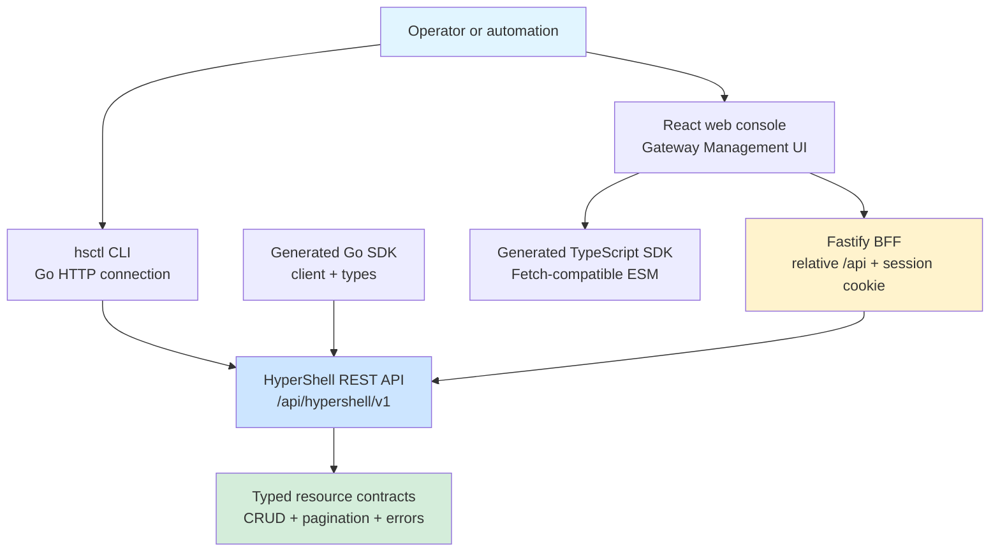

# Clients and SDKs

HyperShell exposes the same management API to the Go CLI, Go SDK, TypeScript SDK, and browser-facing web console while keeping transport and authentication boundaries explicit.

Authoritative source: components/cli/; components/sdk-go/; components/sdk-typescript/; specs/web-console/architecture.spec.md

### Client surfaces converge on the versioned REST API. The web console uses the generated TypeScript SDK only through its host adapter; the BFF owns browser authentication.

