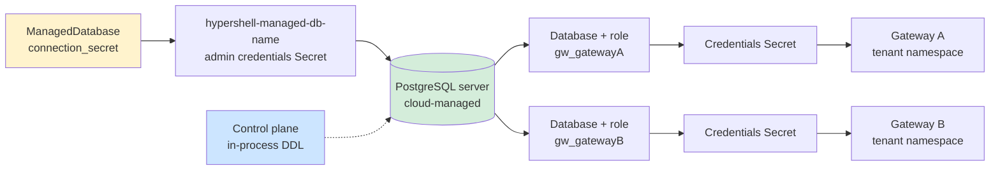
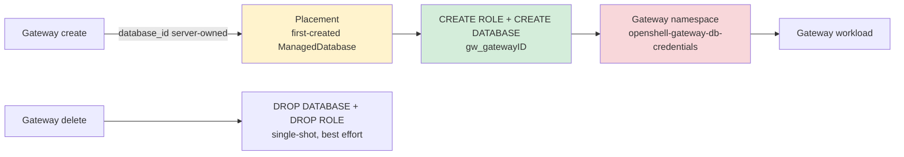

# Database architecture

ManagedDatabase registers an externally provisioned PostgreSQL server. HyperShell never creates, resizes or deletes that server; the control plane provisions one database and one login role per gateway inside it.

Authoritative source: specs/platform/openshell-gateway-database.spec.md

### One registered server can back many gateways, each with an isolated database and role.

### Placement and cleanup

No PostgreSQL workload runs in the cluster: the gateway namespace holds only the credentials Secret.
