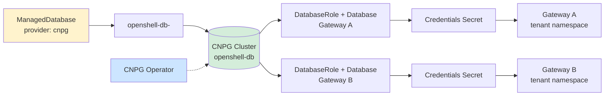
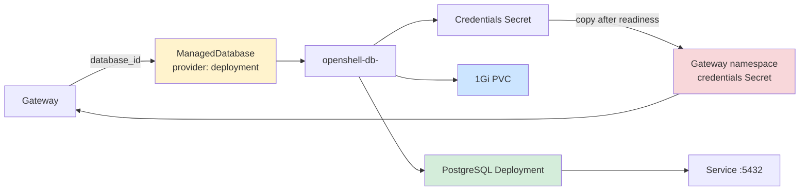

# Database architecture

ManagedDatabase is the indirection between a Gateway and PostgreSQL. The provider selects either a standalone Deployment or CNPG-managed PostgreSQL.

Authoritative source: docs/cnpg-architecture.md; specs/platform/openshell-gateway-database.spec.md

### CNPG mode: one ManagedDatabase cluster can serve multiple gateways, each with an isolated logical database and role.

### Deployment mode: the API server auto-creates a dedicated ManagedDatabase for each Gateway.

