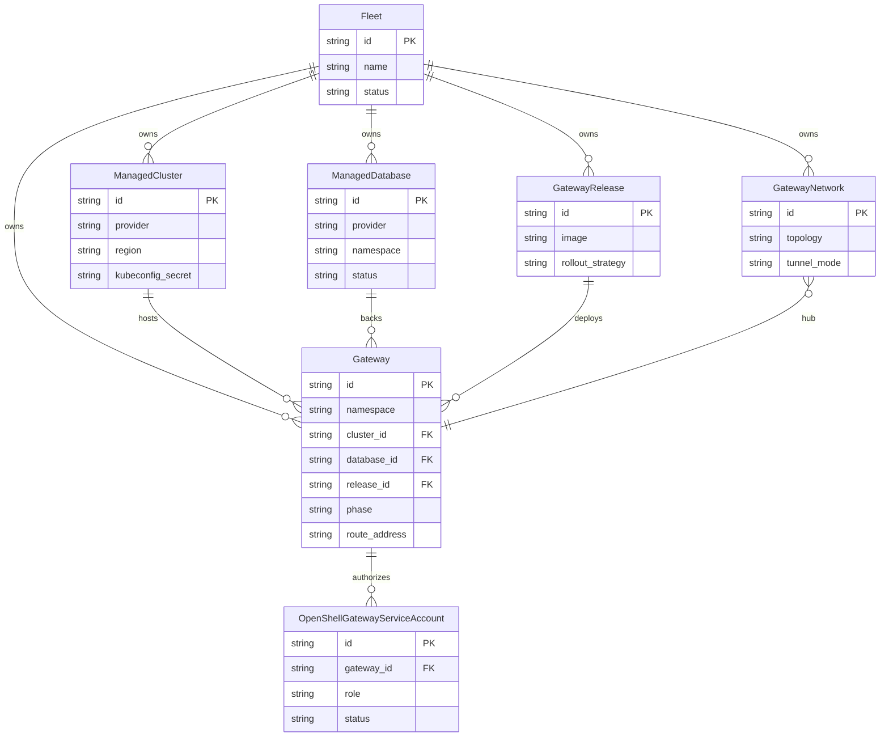

# Domain model

The API models fleets, placements, releases, databases, gateways, networks, and gateway-scoped automation identities as first-class resources.

Authoritative source: specs/platform/data-model.spec.md

### Current API relationships. Fleet is the present organizational scope; the specification notes a future simplification to top-level resources.

