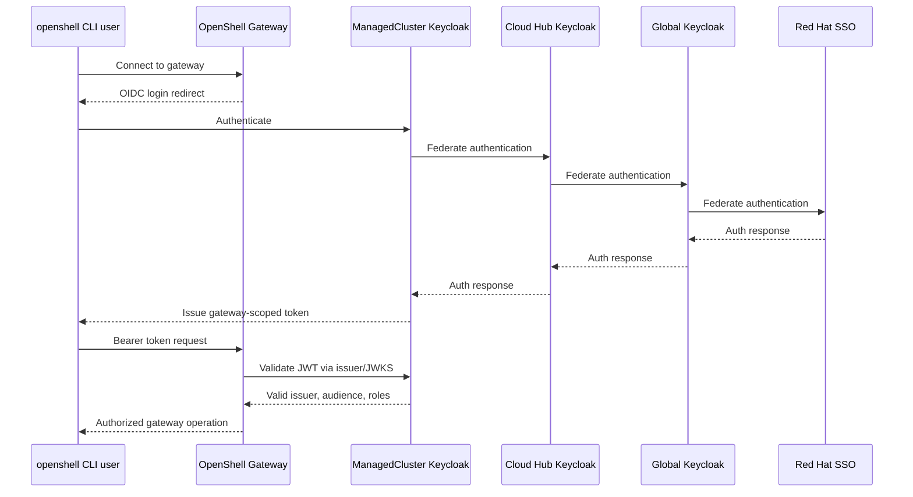
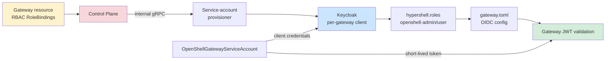

# Identity and access

OIDC is the production authentication mechanism. Keycloak federation carries identity down the tiers, while the gateway validates issuer, audience, signature, expiry, and roles.

Authoritative source: specs/platform/global-architecture.spec.md; specs/platform/openshell-gateway-oidc.spec.md; specs/platform/openshell-gateway-keycloak.spec.md

### Interactive CLI authentication follows the federated Keycloak chain; tokens are issued by the ManagedCluster Keycloak client for that Gateway.

### The control plane provisions per-Gateway Keycloak clients and bridges HyperShell RBAC to gateway roles.

