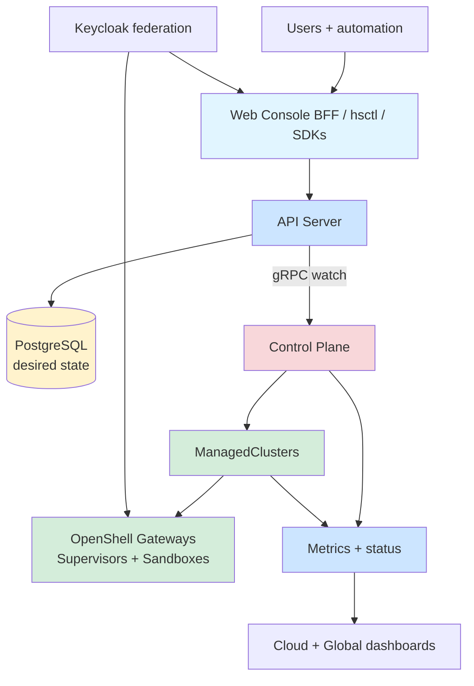

# HyperShell architecture atlas

A navigable set of architectural drawings for the HyperShell platform, from the global topology to the tenant Gateway runtime.

Last mapped from the active architecture specifications in this repository. Read the project README and the linked sources for implementation details.

### End-to-end view: clients enter through the web/API surfaces, desired state is persisted by the API server, and the control plane reconciles OpenShell Gateways into ManagedClusters.

