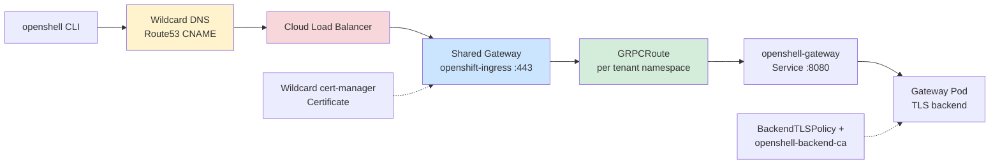
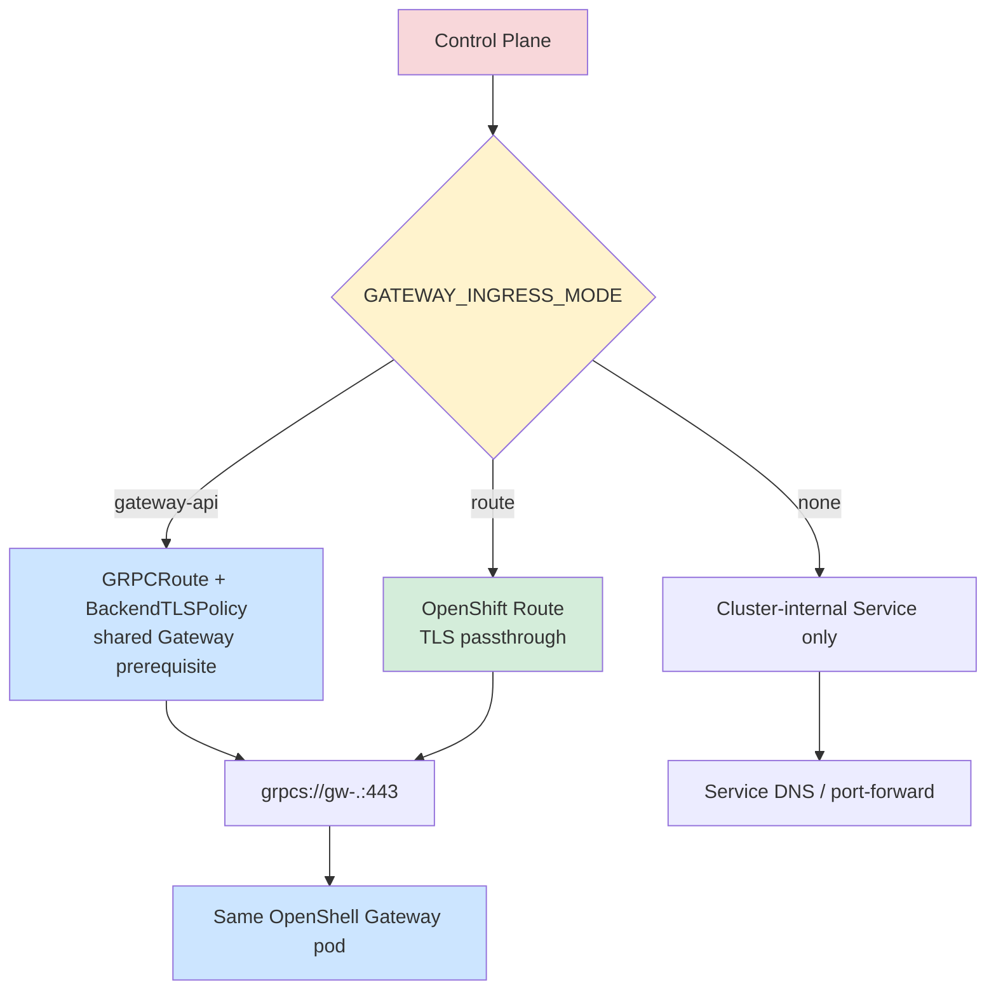

# Gateway ingress

External gRPC exposure is configuration-driven. AWS uses the shared Gateway API path; environments without a functional Gateway API use OpenShift Route passthrough.

Authoritative source: specs/platform/global-architecture.spec.md; specs/platform/openshell-gateway-routing.spec.md

### Reference gateway-api mode: one shared Gateway and load balancer serve many tenant GRPCRoutes.

### Environment-adaptive routing: both modes converge on the same tenant workload and route address contract.

