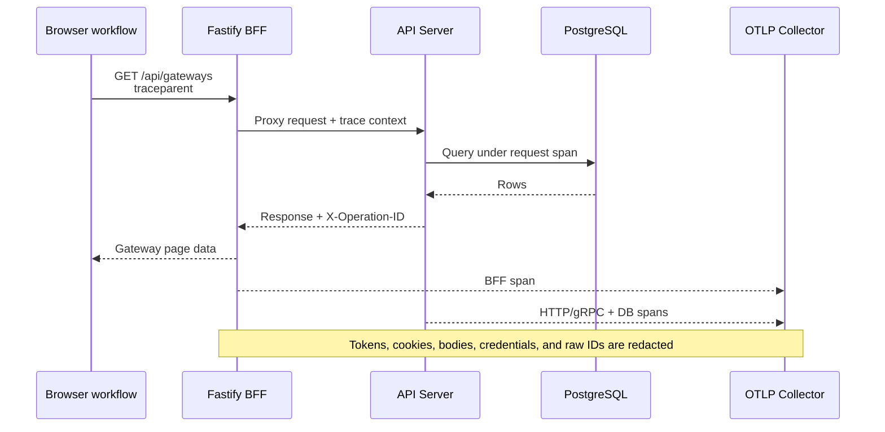
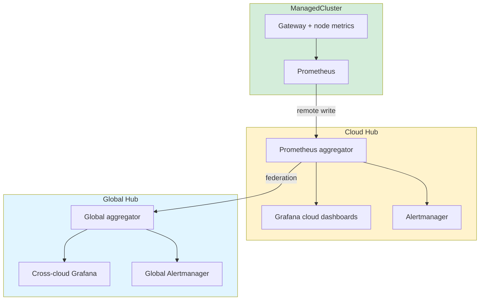

# Observability

Metrics, traces, and domain probes make a user workflow observable from the browser through the BFF and API server to PostgreSQL and the control plane.

Authoritative source: specs/platform/api-server-observability.spec.md; specs/web-console/tracing.spec.md; specs/standards/ui/domain-observability.spec.md

### One request trace crosses the web console, BFF, API server, and database. W3C Trace Context is propagated; sensitive values stay out of telemetry.

### Metrics hierarchy: local workload signals roll up to cloud and global dashboards.

