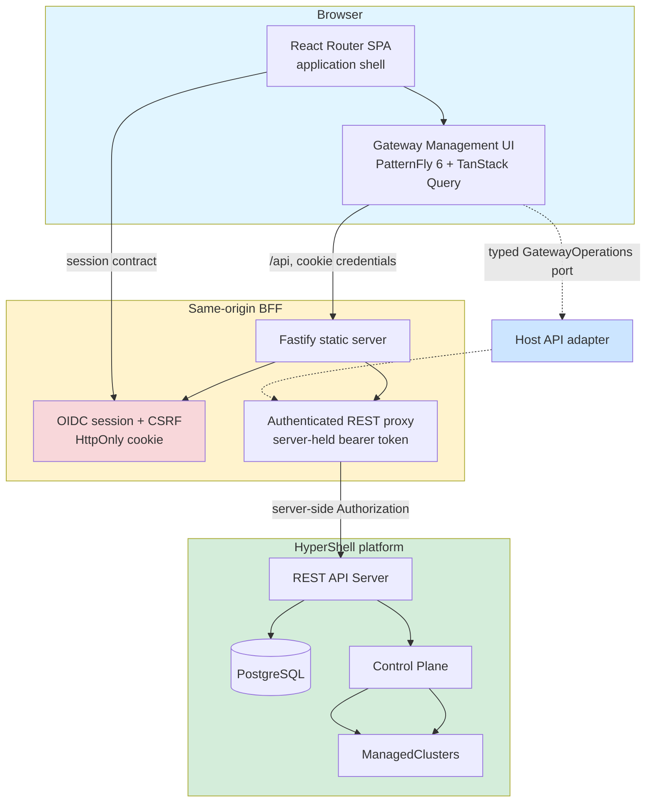

# Web console

The console is a React SPA hosted by a Fastify Backend-for-Frontend. The reusable Gateway Management UI package owns gateway workflows while the host owns routing, session, providers, and adapters.

Authoritative source: specs/web-console/architecture.spec.md; components/web-console/README.md; packages/gateway-management-ui/README.md

### Hexagonal boundary and trust flow: browser code never receives bearer tokens and never imports the generated SDK directly.

