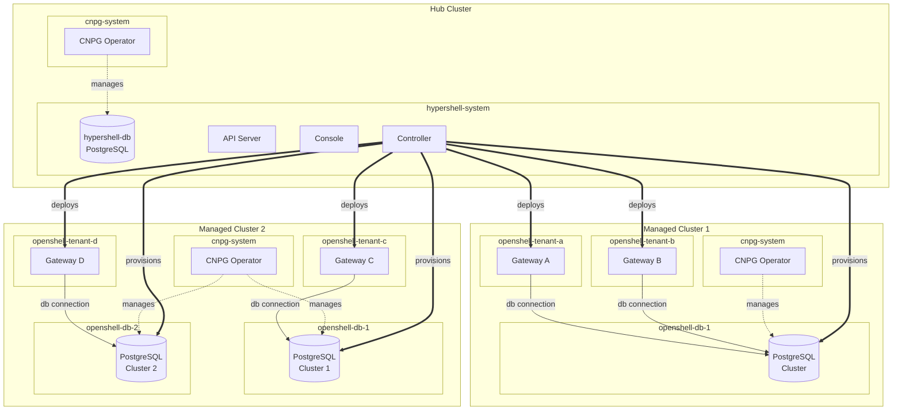

# CNPG Integration Architecture

This document describes the architectural changes introduced by the CloudNativePG (CNPG) integration, covering both the hub API server database and per-gateway tenant databases.

## Overview

The platform previously deployed standalone PostgreSQL containers (plain Deployments with emptyDir or PVC storage) for both the hub API server and each gateway tenant. This approach required the control plane to manage pod lifecycle, storage, networking, credentials, and connect directly to PostgreSQL to execute DDL statements.

The new architecture delegates all PostgreSQL lifecycle management to the CNPG operator. The control plane interacts exclusively through Kubernetes CRDs -- it never opens a direct SQL connection. The `lib/pq` driver dependency is removed entirely from the control plane.

## Architecture

There are two distinct CNPG Clusters:

- **Hub database** (`hypershell-db` in `hypershell-system`) -- backs the API server. Deployed as a static CNPG Cluster CR alongside the application manifests.
- **Gateway databases** -- dynamic CNPG Clusters, one per ManagedDatabase resource. Each lives in its own namespace (`openshell-db-<hex>`). Multiple gateways can share a single CNPG Cluster, each receiving an isolated PostgreSQL database and role via CNPG's `Database` and `DatabaseRole` CRDs.

### Domain Model

A new **ManagedDatabase** resource represents a CNPG Cluster that gateways can use. Key properties:

- **`provider`**: must be `"cnpg"`.
- **`namespace`**: auto-assigned from the resource ID. Determines where the CNPG Cluster CR is created.
When a gateway is created without an explicit `database_id` and the fleet has exactly one ManagedDatabase, it is auto-assigned. If the fleet has zero or more than one, the API server rejects the request.

The creation workflow becomes: **Fleet -> ManagedDatabase -> Gateway**.

### Reconciliation

Two reconcilers handle database provisioning at different layers:

**ManagedDatabaseReconciler** watches ManagedDatabase events via the gRPC stream. When a new ManagedDatabase arrives, it creates a dedicated namespace and a CNPG `Cluster` CR, then waits for the cluster to become healthy. On deletion, it removes the CNPG Cluster and its namespace.

**GatewayReconciler** provisions per-tenant resources within the shared CNPG Cluster. For each gateway, it creates a password Secret, a `DatabaseRole` CR, and a `Database` CR -- then waits for CNPG to report them as ready before proceeding with the gateway deployment. The gateway workload only starts after its database is confirmed available.

### Credential Flow

1. The control plane generates a random password and stores it in a `basic-auth` Secret in the CNPG Cluster namespace, labeled for CNPG reload.
2. A `DatabaseRole` CR references that Secret. CNPG creates the PostgreSQL role.
3. A `Database` CR is created with that role as owner. CNPG creates the PostgreSQL database.
4. Once ready, the control plane writes a gateway credentials Secret in the tenant namespace containing the full connection URI (`sslmode=require`). The gateway Deployment reads `OPENSHELL_DB_URL` from this Secret.

Credential rotation is triggered by annotating the Gateway resource. The control plane updates the password Secret and the tenant credentials Secret; CNPG applies the password change to PostgreSQL. A config-hash annotation on the Deployment triggers a rolling restart.

### CNPG Operator Interaction

All PostgreSQL operations go through CNPG CRDs using the Kubernetes dynamic client. The control plane does not import CNPG Go types and does not connect to PostgreSQL directly. This keeps the dependency surface minimal and ensures all database state is represented as Kubernetes resources.

CNPG resources use `reclaimPolicy: delete`, so removing a `DatabaseRole` or `Database` CR also drops the corresponding PostgreSQL object.

## Infrastructure vs. Runtime

### Infrastructure (provisioned once per cluster, before the application)

| Resource | Purpose |
|----------|---------|
| CNPG operator | Manages PostgreSQL clusters via CRDs |
| Gateway API CRDs | Kubernetes Gateway API support |
| cert-manager | TLS certificate automation |
| Keycloak | OIDC identity provider |

These are cluster-scoped prerequisites. In local development (Kind), the `up.sh` script installs them and waits for readiness before deploying the application.

### Runtime (managed by the application once it is running)

| Resource | Created by | Scope |
|----------|-----------|-------|
| Hub CNPG Cluster (`hypershell-db`) | Kustomize manifests | One per installation |
| Gateway CNPG Cluster | ManagedDatabaseReconciler | One per ManagedDatabase |
| CNPG `DatabaseRole` + `Database` | GatewayReconciler | One per gateway |
| Password Secret (CNPG namespace) | GatewayReconciler | One per gateway |
| Credentials Secret (tenant namespace) | GatewayReconciler | One per gateway |
| Gateway workload (Deployment, Service, ConfigMap, RBAC) | GatewayReconciler | One per gateway |

## Key Decisions

**CNPG over standalone PostgreSQL** -- eliminates manual management of PVCs, Deployments, Services, and NetworkPolicies for database containers. CNPG handles pod lifecycle, storage, and failover.

**Declarative database management via CRDs** -- no direct SQL from the control plane. Password changes go through Secret updates and CNPG reconciliation, not `ALTER ROLE` statements.

**Per-ManagedDatabase CNPG Cluster** -- enables isolation boundaries at the database cluster level. Multiple gateways share a cluster but get separate databases and roles.

**Dynamic client** -- CNPG CRDs are accessed via `k8s.io/client-go/dynamic` rather than importing CNPG Go types, keeping the dependency tree small.

**Fleet-default auto-assignment** -- gateways without an explicit `database_id` automatically receive the fleet's default ManagedDatabase, simplifying the common case while still allowing explicit assignment for advanced topologies.

## What Is Missing

### Rotation Annotation Not Wired

The `RotateDBCredentials` field exists on the reconciler's options struct and the rotation logic is implemented, but the Gateway proto/gRPC schema has no annotations field. There is no mechanism to pass the `hypershell.redhat.io/rotate-db-credentials` annotation value from the API server to the control plane. Until this is added, database password rotation is unreachable at runtime.

### Password Rotation

Rotation is manual only -- triggered by annotating the Gateway resource. There is no scheduled or periodic automatic rotation. A future rotation controller could watch for credential age and trigger rotation on a configurable cadence.

### Backups

CNPG supports continuous backup to object storage (S3, GCS, Azure Blob) via `ScheduledBackup` CRs, but no backup policy is configured for either the hub database or gateway databases. Point-in-time recovery is not enabled.

### High Availability

CNPG Cluster instances are hardcoded to 1. There is no multi-instance, failover, or read-replica configuration. Increasing `spec.instances` and configuring affinity rules would enable HA.

### TLS Verification

Connections use `sslmode=require` (traffic is encrypted but the server certificate is not verified). Upgrading to `sslmode=verify-ca` with CNPG's generated CA certificate mounted into gateway pods is a future hardening step.

### Bootstrap Configuration

Dynamic CNPG Clusters do not set `spec.bootstrap.initdb.database` or `spec.bootstrap.initdb.owner`. CNPG defaults to creating a database named `app` owned by `app`. This works because per-gateway databases are provisioned as separate CNPG `Database` CRs, but the default `app` database is unused and could be confusing during debugging. A future improvement could set `initdb` to create a named database matching the ManagedDatabase resource.

### CPU Resource Requests

Dynamic CNPG Clusters set memory requests/limits but not CPU. Adding `cpu: 100m` (request) and `cpu: 500m` (limit) would improve scheduling predictability and prevent noisy-neighbor effects.

### Legacy Environment Variables

The `CNPG_CLUSTER_NAME` and `CNPG_CLUSTER_NAMESPACE` environment variables have been removed from the control plane. Each gateway's CNPG target is now resolved from its ManagedDatabase resource. A gateway without a `database_id` will fail with an explicit error rather than falling back to global defaults.

### Resource Scaling

Storage (1Gi), CPU, and memory limits are hardcoded defaults. There is no mechanism to configure these per ManagedDatabase through the API.

### Monitoring and Alerting

No Prometheus rules, PodMonitors, or alerting is configured for CNPG Cluster health. CNPG exposes metrics natively, but they are not yet wired into the platform's observability stack.

### KEK Rotation

Deferred to day-2 operations. The control plane cannot decrypt credentials stored within a gateway's own database, so KEK rotation requires a dedicated re-encryption API on the gateway side.

### ManagedDatabase Lifecycle

Beyond create and delete, there is no update path for changing storage size, instance count, or PostgreSQL version on an existing ManagedDatabase. Database migration between CNPG Clusters (moving a gateway from one ManagedDatabase to another) is also not supported.
