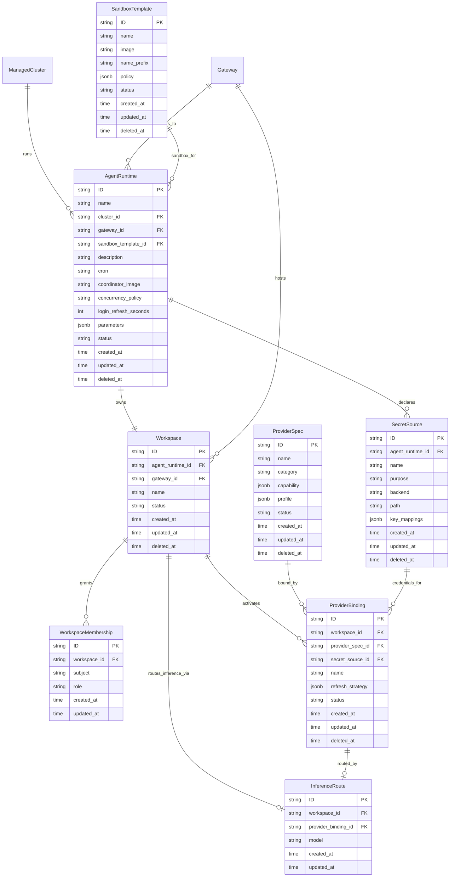

# Agent Declarative Lifecycle Configuration

**Date:** 2026-10-06
**Status:** Draft

## Overview

The HyperShell platform hosts autonomous AI agents: background processes that perform engineering work (code review, labeling, feature specification, build coordination) by opening sandboxed sessions on HyperShell gateways and invoking LLM inference and external tools within those sessions.

Each agent is currently configured as a GitOps Kustomize overlay — a Kubernetes CronJob, ExternalSecrets, a Namespace, a NetworkPolicy, and an imperative bootstrap Job that provisions the gateway-side workspace, providers, and inference route. This configuration is expressive but requires operator knowledge of both Kubernetes resource structure and gateway-specific CLI conventions.

The Agent Declarative Lifecycle Configuration (ADLC) introduces a structured data model that:

1. Makes the agent runtime a first-class HyperShell API resource, not a raw GitOps artifact.
2. Separates **what** a runtime needs (capabilities, sandbox policy, secrets, schedule) from **how** the controller provisions it (ManifestWork delivery, ExternalSecret generation, bootstrap Job execution).
3. Keeps the API gateway-agnostic: no OpenShell CLI flags, provider driver names, or credential env var conventions appear in the data model. The controller translates these from the abstract spec to whatever gateway backend is in use.

Agent runtimes are composed from reusable building blocks: a `SandboxTemplate` (OCI image + policy) and `ProviderSpec` (capability definition) may be shared across multiple `AgentRuntime` instances. The `Workspace`, `WorkspaceMembership`, `ProviderBinding`, and `InferenceRoute` are workspace-scoped sub-resources owned by a single `AgentRuntime`.

## Entity Relationship Diagram

## Requirements

### Requirement: AgentRuntime as a Top-Level Resource

`AgentRuntime` SHALL be a top-level HyperShell API resource. It references a `ManagedCluster` (where its scheduling resources run), a `Gateway` (which it connects to), and a `SandboxTemplate` (the worker execution environment). It owns exactly one `Workspace` and one or more `SecretSource` declarations. Schedule configuration (cron expression, coordinator image, concurrency policy, login refresh interval) is embedded directly on `AgentRuntime`.

An `AgentRuntime` SHALL NOT embed gateway-backend-specific fields such as OpenShell CLI flags, provider driver names, or credential environment variable names. Those are translation concerns of the controller.

#### Scenario: Create AgentRuntime

- GIVEN a valid `cluster_id`, `gateway_id`, and `sandbox_template_id`
- AND a valid `cron` expression and `coordinator_image`
- WHEN a POST request is made to `/api/hypershell/v1/agent-runtimes`
- THEN a new `AgentRuntime` is created with status `Pending`
- AND the controller begins reconciliation: generates a `ManifestWork` targeting the cluster and provisions the `Workspace` on the gateway

#### Scenario: Parameters Map Is Bounded

- GIVEN an `AgentRuntime` create request with `parameters`
- WHEN the API server validates the request
- THEN `parameters` SHALL NOT contain keys that collide with the controller's reserved env var namespace (`GATEWAY_*`, `OIDC_*`, `OPENSHELL_*`)
- AND the API server SHALL reject the request with 400 if any reserved key is present

---

### Requirement: Workspace Isolation

Each `AgentRuntime` SHALL own exactly one `Workspace`. The Workspace is the gateway-side isolation boundary: all provider bindings, inference routes, and sandbox sessions for this agent are scoped to it. The `Workspace.name` SHALL be unique within the `Gateway`.

The controller provisions the gateway-side workspace after delivering the scheduling resources to the cluster. Workspace provisioning is idempotent: re-running the bootstrap Job when a workspace already exists SHALL succeed without error.

#### Scenario: Workspace Is Created Alongside AgentRuntime

- GIVEN an `AgentRuntime` in status `Pending`
- WHEN the controller has delivered scheduling resources to the cluster
- AND the bootstrap Job has completed successfully
- THEN the `Workspace` status SHALL transition to `Provisioned`
- AND the `AgentRuntime` status SHALL transition to `Running`

#### Scenario: Workspace Name Collision

- GIVEN a `Workspace` already exists on the target `Gateway` with name `amber-reviews`
- WHEN an `AgentRuntime` is created with `workspace.name = amber-reviews` on the same gateway
- THEN the API server SHALL reject the request with 409
- AND no `AgentRuntime` or `Workspace` record SHALL be persisted

---

### Requirement: WorkspaceMembership

A `Workspace` SHALL have one or more `WorkspaceMembership` records, each binding an OIDC subject to a role. The subject is the UUID from the subject claim of the OIDC identity the agent uses to connect to the gateway.

Valid roles are `admin` and `member`. An agent whose `ProviderBinding` requires credential rotation at runtime (for example, `refresh_strategy.type = service-account-jwt` or `app-installation-token`) SHALL have an `admin` membership, because the gateway restricts provider credential updates to workspace administrators.

#### Scenario: Admin Role Required for Credential Refresh

- GIVEN a `Workspace` with a `ProviderBinding` whose `refresh_strategy` is non-empty
- WHEN the API server creates or updates the `WorkspaceMembership`
- THEN the API server SHALL validate that at least one `WorkspaceMembership` has `role = admin`
- AND SHALL return 422 if no admin membership is present

---

### Requirement: ProviderSpec Reusability

`ProviderSpec` SHALL be a standalone, top-level resource that can be referenced by multiple `ProviderBinding` records across different workspaces and agent runtimes. It defines the capability type and access rules without any workspace-specific credential wiring.

`ProviderSpec.category` SHALL be one of:
- `inference` — LLM API access
- `source_control` — VCS and code review APIs
- `knowledge` — wiki, documentation, or search APIs

`ProviderSpec.capability` is a category-discriminated JSON object that describes the capability in gateway-agnostic terms. It SHALL NOT contain gateway backend implementation details.

For `inference`, capability fields are:

| Field | Type | Description |
|---|---|---|
| `refresh_strategy` | string | Abstract credential refresh strategy: `service-account-jwt`, `oauth2-client-credentials`, `static-token` |
| `config` | map | Non-secret, provider-type-specific configuration (e.g., `projectId`, `region`) |

For `source_control` and `knowledge`, capability fields are:

| Field | Type | Description |
|---|---|---|
| `host` | string | Primary hostname for this provider |
| `auth_method` | string | Abstract authentication method: `app-installation-token`, `bearer`, `api-key` |
| `allowed_operations` | array | List of `{methods[], paths[]}` rules defining what HTTP operations are permitted |
| `allowed_graphql` | object | Optional `{queries[], mutations[]}` allow lists for GraphQL providers |
| `binaries` | string[] | Executables in the sandbox that may call this provider |

`ProviderSpec.profile` is an optional opaque JSON document passed through to the gateway provider registration step. Its schema is determined by the gateway backend; the HyperShell API treats it as an uninterpreted blob.

#### Scenario: ProviderSpec Referenced by Multiple Bindings

- GIVEN a `ProviderSpec` named `github-app-openshift-online`
- WHEN two `AgentRuntime` instances each create a `ProviderBinding` referencing it
- THEN both bindings SHALL reference the same `ProviderSpec` record
- AND deleting one `ProviderBinding` SHALL NOT delete the `ProviderSpec`
- AND the `ProviderSpec` SHALL only be deletable when no `ProviderBinding` references it

#### Scenario: ProviderSpec Category Immutable After Binding

- GIVEN a `ProviderSpec` with `category = inference`
- AND one or more `ProviderBinding` records referencing it
- WHEN a PATCH request attempts to change `category` to `source_control`
- THEN the API server SHALL reject the request with 422

---

### Requirement: ProviderBinding

A `ProviderBinding` wires a `ProviderSpec` into a `Workspace` with workspace-specific credential and refresh configuration. It references a `SecretSource` as its credential source. The controller uses the `SecretSource.purpose` to determine which field from the resolved secret carries the bearer token.

`ProviderBinding.refresh_strategy` is an optional embedded object:

| Field | Type | Description |
|---|---|---|
| `type` | string | Matches the `ProviderSpec.capability.refresh_strategy` (e.g., `service-account-jwt`) |
| `material` | map | Non-secret parameters for the refresh strategy (e.g., `client_email`) |
| `secret_material` | array | `{key, secret_source_id}` pairs for secret-valued refresh parameters (e.g., RSA private key) |

The controller translates `refresh_strategy` to the gateway backend's refresh configuration. No backend-specific field names appear in this model.

#### Scenario: ProviderBinding Created with Credential Reference

- GIVEN a `ProviderSpec` with `category = inference`
- AND a `SecretSource` with `purpose = service-account-key`
- WHEN a `ProviderBinding` is created referencing both
- THEN the controller generates an `ExternalSecret` from the `SecretSource`
- AND provisions the provider on the gateway using the resolved secret as the credential
- AND registers the `refresh_strategy` on the gateway for automatic token rotation

---

### Requirement: InferenceRoute

A `Workspace` SHALL have at most one `InferenceRoute`, which designates the active `ProviderBinding` and model alias for all LLM inference calls made by sandboxes in that workspace. Changing the `InferenceRoute` redirects inference traffic without restarting any running sandboxes.

`model` is a string alias that the gateway resolves to a model identifier on the bound provider. The HyperShell API does not validate model names; validation is deferred to the gateway at provisioning time.

#### Scenario: One InferenceRoute Per Workspace

- GIVEN a `Workspace` with an existing `InferenceRoute`
- WHEN a second `InferenceRoute` is created for the same workspace
- THEN the API server SHALL reject the request with 409

#### Scenario: InferenceRoute Must Reference an Inference ProviderBinding

- GIVEN a `ProviderBinding` referencing a `ProviderSpec` with `category = source_control`
- WHEN an `InferenceRoute` is created referencing that binding
- THEN the API server SHALL reject the request with 422

---

### Requirement: SandboxTemplate Reusability

`SandboxTemplate` SHALL be a standalone, top-level resource reusable across `AgentRuntime` instances. It defines the ephemeral worker execution environment: an OCI image reference and a `SandboxPolicy`.

`SandboxTemplate.name_prefix` is the prefix the coordinator uses when naming ephemeral sandbox instances. Stale sandbox cleanup identifies and removes sandboxes whose names begin with this prefix.

`SandboxTemplate.policy` is an embedded JSON object with three sections:

**Filesystem policy:**

| Field | Type | Description |
|---|---|---|
| `read_only` | string[] | Absolute paths the sandbox process may read but not write |
| `read_write` | string[] | Absolute paths the sandbox process may read and write |
| `landlock` | string | Enforcement mode: `best_effort`, `strict`, or `disabled` |

**Network policy** — an ordered list of named network groups:

| Field | Type | Description |
|---|---|---|
| `name` | string | Semantic label for this group (e.g., `claude_code`, `github_rest_api`) |
| `hosts` | string[] | Allowed `hostname:port` pairs |
| `methods` | string[] | Allowed HTTP methods; omit to allow all |
| `paths` | string[] | Allowed URL path prefixes; omit to allow all paths on allowed hosts |
| `binaries` | string[] | Executables permitted to use this network group |

**Process policy:**

| Field | Type | Description |
|---|---|---|
| `user` | string | Unix user name the sandbox process runs as |
| `group` | string | Unix group name the sandbox process runs as |

The sandbox network policy and the `ProviderBinding.capability.allowed_operations` serve different enforcement layers. Sandbox network policy is enforced at the OS process level inside the sandbox; provider allowed operations are enforced by the gateway mediator before forwarding requests to the external provider. Both must permit an operation for it to succeed.

#### Scenario: SandboxTemplate Deletion Blocked by Active AgentRuntime

- GIVEN a `SandboxTemplate` referenced by an `AgentRuntime` with status `Running`
- WHEN a DELETE request is made for the `SandboxTemplate`
- THEN the API server SHALL reject the request with 409
- AND the response SHALL identify the blocking `AgentRuntime`

---

### Requirement: SecretSource

A `SecretSource` is an abstract reference to a secret in an external secret backend (Vault, AWS Secrets Manager, or a Kubernetes Secret). The controller generates an `ExternalSecret` or direct `SecretReference` from it when producing the agent's scheduling resources.

`SecretSource.purpose` is a semantic enum that drives both the generated `ExternalSecret` field mapping and the environment variable wiring in the bootstrap Job. Supported values:

| Purpose | Description | Controller-generated env vars |
|---|---|---|
| `gateway-identity` | Runtime gateway OIDC credential: endpoint, issuer, client_id, audience, client_secret | `GATEWAY_ENDPOINT`, `OIDC_ISSUER`, `OIDC_CLIENT_ID`, `OIDC_AUDIENCE`, `OPENSHELL_OIDC_CLIENT_SECRET` |
| `bootstrap-gateway` | Admin gateway OIDC credential used by the bootstrap Job | Same keys, prefixed `BOOTSTRAP_` |
| `service-account-key` | JSON key file for a cloud service account (e.g., GCP ADC JSON) | `SA_JSON_KEY_FILE` |
| `app-private-key` | PEM RSA private key for a GitHub App or similar | `APP_PRIVATE_KEY_FILE` |
| `api-key` | Single bearer token or API key | `API_KEY` |

`SecretSource.backend` is one of `vault`, `aws-secrets-manager`, or `kubernetes`.

`SecretSource.key_mappings` is an optional list of `{source_key, target_key}` pairs. When set, only the listed keys are extracted and renamed. When absent, all fields from the backend secret are extracted under their original names.

#### Scenario: Purpose Drives Env Var Wiring Without Operator Annotation

- GIVEN a `SecretSource` with `purpose = gateway-identity`
- WHEN the controller generates scheduling resources for the `AgentRuntime`
- THEN the generated `CronJob` SHALL include env vars `GATEWAY_ENDPOINT`, `OIDC_ISSUER`, `OIDC_CLIENT_ID`, `OIDC_AUDIENCE`, and `OPENSHELL_OIDC_CLIENT_SECRET` bound to the resolved `Secret`
- AND the operator SHALL NOT need to specify env var names explicitly

#### Scenario: Unknown Backend Path Fails at Provisioning, Not at Persist Time

- GIVEN a `SecretSource` with a valid `path` that does not exist in the backend
- WHEN the controller generates an `ExternalSecret`
- THEN the `ExternalSecret` SHALL be created on the cluster
- AND the `ExternalSecret` SHALL enter status `SecretSyncedError`
- AND the `AgentRuntime` status SHALL reflect the sync failure
- AND the `SecretSource` record itself SHALL remain in the database

---

### Requirement: ManifestWork Delivery

The controller SHALL deliver the agent's scheduling resources to the target cluster by creating or updating an OCM `ManifestWork` targeting the `AgentRuntime.cluster_id`. The `ManifestWork` SHALL wrap the following resources in order:

1. `Namespace` — the agent's Kubernetes namespace
2. `ServiceAccount` — with `automountServiceAccountToken: false`
3. `NetworkPolicy` — default-deny all ingress
4. `ExternalSecret` resources — one per `SecretSource`
5. `CronJob` — the coordinator (schedule from `AgentRuntime`, image from `coordinator_image`)
6. `Job` (PostSync) — the bootstrap Job that provisions gateway-side objects: Workspace, WorkspaceMemberships, ProviderBindings, and InferenceRoute via the gateway API

The bootstrap `Job` SHALL be idempotent. Re-running it when gateway-side objects already exist SHALL succeed without error and SHALL update mutable fields (e.g., credential refresh strategy, model alias).

When the `ManifestWork` is applied, the controller SHALL NOT interact directly with the target cluster's Kubernetes API. All cluster-side effects occur through OCM's ManifestWork delivery loop.

#### Scenario: ManifestWork Created on AgentRuntime Reconcile

- GIVEN a new `AgentRuntime` with status `Pending`
- WHEN the controller runs its reconcile loop
- THEN a `ManifestWork` SHALL be created or updated in the OCM hub namespace for cluster `cluster_id`
- AND the `ManifestWork` SHALL contain all six resource types listed above
- AND the `AgentRuntime` status SHALL transition to `Provisioning`

#### Scenario: ManifestWork Updated on AgentRuntime Change

- GIVEN an `AgentRuntime` with status `Running`
- WHEN the `cron` field is updated
- THEN the controller SHALL update the `ManifestWork`
- AND the `CronJob` on the target cluster SHALL reflect the new schedule after OCM applies the updated work

#### Scenario: AgentRuntime Deletion Removes ManifestWork

- GIVEN an `AgentRuntime` with status `Running`
- WHEN the `AgentRuntime` is deleted
- THEN the controller SHALL delete the `ManifestWork`
- AND OCM SHALL remove all scheduling resources from the target cluster
- AND the controller SHALL invoke the gateway API to delete the `Workspace` and its sub-resources
- AND the `Workspace`, `WorkspaceMembership`, `ProviderBinding`, and `InferenceRoute` records SHALL be deleted from the database

---

### Requirement: AgentRuntime Status Lifecycle

`AgentRuntime.status` SHALL progress through the following states:

| Status | Description |
|---|---|
| `Pending` | Created; reconciliation not yet started |
| `Provisioning` | ManifestWork created; bootstrap Job not yet complete |
| `Running` | Bootstrap Job completed; Workspace and providers provisioned; CronJob active |
| `Degraded` | One or more SecretSources failed to sync, or the bootstrap Job failed; CronJob may be running but agent cannot connect to the gateway |
| `Terminating` | Delete in progress; ManifestWork being removed, gateway-side cleanup in progress |

A `Degraded` `AgentRuntime` SHALL surface the failing `SecretSource` name and the gateway-side error in the status message.

#### Scenario: SecretSource Sync Failure Degrades AgentRuntime

- GIVEN an `AgentRuntime` with status `Running`
- WHEN a `SecretSource` backend path becomes unreachable and its `ExternalSecret` enters `SecretSyncedError`
- THEN the `AgentRuntime` status SHALL transition to `Degraded`
- AND the status message SHALL identify the failing `SecretSource` by name
- AND the `CronJob` SHALL continue to run but its scheduled executions SHALL fail at gateway login

## Design Decisions

| Decision | Rationale |
|---|---|
| Gateway-agnostic capability model | Provider driver names and credential env var conventions are implementation details of the gateway backend. Keeping them out of the API allows the controller to support multiple gateway implementations without API changes. |
| ProviderSpec as a reusable top-level resource | The same GitHub App or Vertex AI project configuration is shared by multiple agent types. Centralizing it avoids duplication and makes rotation (e.g., new App installation ID) a single change. |
| SandboxTemplate as a reusable top-level resource | Sandbox base image and policy evolve independently of which agents use them. Shared templates reduce blast radius when updating a sandbox image digest. |
| SecretSource purpose enum for env var wiring | Requiring operators to spell out every env var binding is error-prone and duplicates knowledge that the controller already has from the purpose. The enum collapses this to a single semantic declaration. |
| ManifestWork for cluster-side delivery | Direct cluster API calls from the HyperShell API server would require per-cluster credentials and a per-cluster network path. ManifestWork leverages the existing OCM delivery infrastructure and keeps the API server cluster-topology-agnostic. |
| Bootstrap Job for gateway-side provisioning | Gateway-side workspace, member, and provider objects are not Kubernetes resources and cannot be managed via ManifestWork. An idempotent Job co-located on the target cluster calls the gateway API with the resolved credentials and is the right boundary for this imperative work. |
| Workspace 1:1 with AgentRuntime | Workspaces are the gateway's isolation primitive. Sharing a workspace between agent types would mix their provider bindings and inference routes, defeating isolation. One-to-one ownership makes lifecycle management unambiguous. |
| InferenceRoute capped at one per Workspace | A workspace has one active LLM at a time. Multiple routes would require the sandbox to select one, introducing configuration the agent author must manage. The controller updates the route atomically on any model change. |
| login_refresh_seconds on AgentRuntime, not SandboxTemplate | Login renewal is a coordinator concern (CronJob lifecycle), not a sandbox policy concern. Embedding it on the AgentRuntime where the coordinator schedule lives keeps it co-located with the fields it relates to. |
