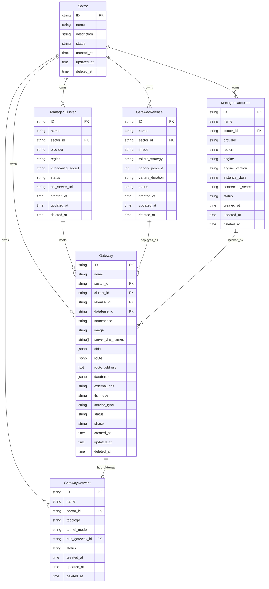

# Data Model

**Date:** 2026-08-03
**Status:** Active

## Overview

The HyperShell API server provides a control plane for deploying and managing distributed API gateways across multiple Kubernetes clusters and cloud providers. The model is organized around sectors:

- **Sector** — top-level organizational unit. Groups clusters, databases, releases, gateways, and networks. All resources belong to exactly one sector via `sector_id`.
- **ManagedCluster** — a Kubernetes cluster registered into a sector. Tracks provider, region, API server URL, and a kubeconfig secret reference.
- **ManagedDatabase** — a database instance provisioned for a sector. Tracks provider, region, engine type/version, instance class, and a connection secret reference.
- **GatewayRelease** — a versioned container image for gateway deployments within a sector. Supports rollout strategies with canary percent/duration controls.
- **Gateway** — an API gateway instance deployed onto a specific cluster, using a specific release and database, within a namespace. Tracks TLS mode, service type, external DNS, and lifecycle phase.
- **GatewayNetwork** — defines network connectivity topology between gateways in a sector. Supports tunnel modes and designates a hub gateway for hub-and-spoke or mesh networking.

## Entity Relationship Diagram

## Requirements

### Requirement: Sector Lifecycle

The system SHALL support creating, reading, updating, and deleting Sectors. A Sector SHALL have a unique name, optional description, and a status field.

#### Scenario: Create Sector
- GIVEN a valid sector name
- WHEN a POST request is made to `/api/hypershell/v1/sectors`
- THEN a new Sector is created with a KSUID
- AND the response includes the created Sector

### Requirement: Sector-Scoped Resources

All resources (ManagedCluster, ManagedDatabase, GatewayRelease, Gateway, GatewayNetwork) SHALL belong to exactly one Sector via `sector_id`.

#### Scenario: Create Gateway with Sector Reference
- GIVEN a valid sector_id, cluster_id, release_id, and database_id
- WHEN a POST request is made to `/api/hypershell/v1/gateways`
- THEN a new Gateway is created within the specified sector
- AND the Gateway references valid cluster, release, and database resources

### Requirement: Gateway Provisioning Fields

A Gateway SHALL include provisioning configuration fields that the control plane uses to deploy and configure the OpenShell gateway workload on a target cluster.

> **Relationship to fleet management fields:** The `image` field provides a direct image reference for the control plane reconciler, while `release_id` references a GatewayRelease for fleet-level rollout management (canary, rollback). When both are set, `release_id` takes precedence and the reconciler resolves it to an image. Similarly, `database` (JSONB) carries inline provisioning config for the reconciler, while `database_id` references a ManagedDatabase for fleet-level database lifecycle. When `database_id` is set, it takes precedence and the reconciler reads the connection details from the referenced ManagedDatabase.

| Field | Type | Description |
|---|---|---|
| `image` | string | Gateway container image reference (e.g., `ghcr.io/nvidia/openshell/gateway:21da343c9f838bd9ac85dc61bf44889de1a72873`) |
| `supervisor_image` | string | Supervisor sidecar container image (default: `ghcr.io/nvidia/openshell/supervisor:0.0.92`) |
| `server_dns_names` | string[] | DNS names for TLS certificate SANs |
| `oidc` | JSONB | OIDC authentication config: `{issuer, audience, jwks_ttl, roles_claim, admin_role, user_role, scopes_claim}` |
| `route` | JSONB | Route exposure config for GRPCRoute provisioning: `{host}` |
| `route_address` | text | Read-only external address populated by the control plane (e.g., `grpcs://hostname:443`) |
| `database` | JSONB | Database backend config: `{storageSize, image, externalSecretRef}` |

See [`openshell-gateway.spec.md`](./openshell-gateway.spec.md) and its sub-specs for full provisioning details.

### Requirement: Gateway Deployment Lifecycle

A Gateway SHALL track its deployment lifecycle through the `phase` field. The `status` field SHALL reflect operational health.

#### Scenario: Gateway Phase Progression
- GIVEN a Gateway in phase "Pending"
- WHEN the control plane provisions it on the target cluster
- THEN the phase SHALL transition to "Provisioning"
- AND upon successful deployment, to "Running"

### Requirement: Canary Release Strategy

A GatewayRelease SHALL support canary deployment via `rollout_strategy`, `canary_percent`, and `canary_duration` fields.

#### Scenario: Canary Rollout
- GIVEN a GatewayRelease with `rollout_strategy: canary`, `canary_percent: 10`, `canary_duration: 30m`
- WHEN the release is deployed
- THEN 10% of traffic SHALL route to the new version
- AND after 30 minutes, the rollout SHALL proceed to full deployment

### Requirement: Network Topology

A GatewayNetwork SHALL define how gateways within a sector communicate. The `topology` field indicates the network shape and `tunnel_mode` the encapsulation method.

#### Scenario: Hub-and-Spoke Network
- GIVEN a GatewayNetwork with `topology: hub-spoke` and a `hub_gateway_id`
- WHEN gateways join the network
- THEN all spoke gateways SHALL route through the hub gateway

## API Reference

All routes under `/api/hypershell/v1/`:

| Method | Path | Operation |
|--------|------|-----------|
| GET/POST | `/sectors` | List/Create |
| GET/PATCH/DELETE | `/sectors/{id}` | Get/Update/Delete |
| GET/POST | `/gateways` | List/Create |
| GET/PATCH/DELETE | `/gateways/{id}` | Get/Update/Delete |
| GET/POST | `/gateway_networks` | List/Create |
| GET/PATCH/DELETE | `/gateway_networks/{id}` | Get/Update/Delete |
| GET/POST | `/gateway_releases` | List/Create |
| GET/PATCH/DELETE | `/gateway_releases/{id}` | Get/Update/Delete |
| GET/POST | `/managed_clusters` | List/Create |
| GET/PATCH/DELETE | `/managed_clusters/{id}` | Get/Update/Delete |
| GET/POST | `/managed_databases` | List/Create |
| GET/PATCH/DELETE | `/managed_databases/{id}` | Get/Update/Delete |

## Design Decisions

| Decision | Rationale |
|----------|-----------|
| KSUID for all IDs | Sortable, globally unique, no coordination required |
| Sector as top-level scope | Natural tenant boundary for multi-team environments |
| Separate Release from Gateway | Decouples versioning from deployment; enables canary and rollback |
| GatewayNetwork as explicit entity | Makes network topology declarative and auditable |
| Secret references (not inline secrets) | Keeps secrets in K8s Secrets, not in the database |
