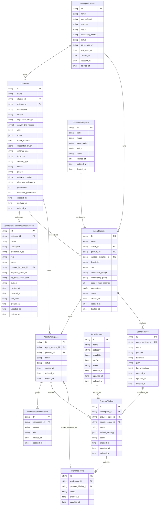

# Data Model

**Date:** 2026-08-03
**Status:** Active

## Overview

The HyperShell API server provides a control plane for deploying and managing distributed API gateways across multiple Kubernetes clusters and cloud providers.

Gateways, clusters, releases, and networks are **top-level resources**. An earlier model included a top-level "Sector" (later renamed "Fleet") organizational unit that grouped these resources via a `fleet_id`; that layer has been removed. There is no sectorization: all gateways belong to the same platform, and tenancy is enforced by RBAC (platform-level `gateway:creator`/`platform:admin` and per-gateway `gateway:owner`/`gateway:viewer`), not by a fleet grouping. See [`security/rbac-enforcement.spec.md`](../security/rbac-enforcement.spec.md).

Current model:

- **ManagedCluster** - a Kubernetes cluster whose control plane has registered into the platform (`oidc_subject`, `last_seen_at`; see [`managed-cluster-registration.spec.md`](./managed-cluster-registration.spec.md)). Also tracks provider, region, API server URL, and a kubeconfig secret reference, which are informational: no component consumes `kubeconfig_secret`, because each control plane reconciles its own cluster with in-cluster credentials.
- **Gateway** - an API gateway instance deployed onto a specific cluster within an API-assigned namespace. Its PostgreSQL database is not modelled in the API: the control plane provisions one database and login role per gateway on the platform's gateway database server (see [`openshell-gateway-database.spec.md`](./openshell-gateway-database.spec.md)). Tracks TLS mode, service type, external DNS, and lifecycle phase.
- **OpenShellGatewayServiceAccount** - a creator-bound automation identity for one Gateway. It stores an OpenShell role and non-secret Keycloak lifecycle metadata.
- **AgentRuntime** - a scheduled autonomous AI agent, referencing a ManagedCluster, Gateway, and SandboxTemplate. Owns exactly one AgentWorkspace and one or more SecretSources.
- **SandboxTemplate** - reusable OCI image + filesystem/network/process policy for agent worker sandboxes.
- **ProviderSpec** - reusable capability definition (inference, source_control, or knowledge) shared across ProviderBindings.
- **ProviderBinding** - wires a ProviderSpec into an AgentWorkspace with workspace-specific credential and refresh configuration.
- **InferenceRoute** - designates the active ProviderBinding and model alias for LLM inference within an AgentWorkspace. At most one per AgentWorkspace.
- **SecretSource** - abstract reference to a secret in an external backend (Vault, AWS Secrets Manager, Kubernetes). Owned by AgentRuntime; purpose enum drives controller-generated env var wiring.

## Entity Relationship Diagram


```mermaid
erDiagram

    ManagedCluster {
        string ID PK
        string name
        string oidc_subject
        string provider
        string region
        string kubeconfig_secret
        string status
        string api_server_url
        time last_seen_at
        time created_at
        time updated_at
        time deleted_at
    }

    Gateway {
        string ID PK
        string name
        string cluster_id FK
        string release_id FK
        string namespace
        string image
        string supervisor_image
        string[] server_dns_names
        jsonb oidc
        jsonb route
        text route_address
        jsonb credential_driver
        string external_dns
        string tls_mode
        string service_type
        string status
        string phase
        string gateway_version
        string observed_release_id
        int generation
        int observed_generation
        time created_at
        time updated_at
        time deleted_at
    }

    OpenShellGatewayServiceAccount {
        string ID PK
        string gateway_id FK
        string name
        string description
        string credential_type
        string role
        string status
        string created_by_user_id FK
        string keycloak_client_id
        string keycloak_client_uuid
        string subject
        time expires_at
        time revoked_at
        string last_error
        time created_at
        time updated_at
        time deleted_at
    }

    AgentRuntime {
        string ID PK
        string name
        string cluster_id FK
        string gateway_id FK
        string sandbox_template_id FK
        string description
        string cron
        string coordinator_image
        string concurrency_policy
        int login_refresh_seconds
        jsonb parameters
        string status
        time created_at
        time updated_at
        time deleted_at
    }


    AgentWorkspace {
        string ID PK
        string agent_runtime_id FK
        string gateway_id FK
        string name
        string status
        time created_at
        time updated_at
        time deleted_at
    }

    WorkspaceMembership {
        string ID PK
        string workspace_id FK
        string subject
        string role
        time created_at
        time updated_at
    }

    ProviderSpec {
        string ID PK
        string name
        string category
        jsonb capability
        jsonb profile
        string status
        time created_at
        time updated_at
        time deleted_at
    }

    ProviderBinding {
        string ID PK
        string workspace_id FK
        string provider_spec_id FK
        string secret_source_id FK
        string name
        jsonb refresh_strategy
        string status
        time created_at
        time updated_at
        time deleted_at
    }

    InferenceRoute {
        string ID PK
        string workspace_id FK
        string provider_binding_id FK
        string model
        time created_at
        time updated_at
    }

    SandboxTemplate {
        string ID PK
        string name
        string image
        string name_prefix
        jsonb policy
        string status
        time created_at
        time updated_at
        time deleted_at
    }

    SecretSource {
        string ID PK
        string agent_runtime_id FK
        string name
        string purpose
        string backend
        string path
        jsonb key_mappings
        time created_at
        time updated_at
        time deleted_at
    }

    ManagedCluster ||--o{ Gateway : "hosts"
    Gateway ||--o{ OpenShellGatewayServiceAccount : "authorizes"
    ManagedCluster ||--o{ AgentRuntime : "runs"
    Gateway ||--o{ AgentRuntime : "connects_to"
    SandboxTemplate ||--o{ AgentRuntime : "sandbox_for"
    AgentRuntime ||--|| AgentWorkspace : "owns"
    AgentRuntime ||--o{ SecretSource : "declares"
    Gateway ||--o{ AgentWorkspace : "hosts"
    AgentWorkspace ||--o{ WorkspaceMembership : "grants"
    AgentWorkspace ||--o{ ProviderBinding : "activates"
    AgentWorkspace ||--o| InferenceRoute : "routes_inference_via"
    ProviderSpec ||--o{ ProviderBinding : "bound_by"
    SecretSource ||--o{ ProviderBinding : "credentials_for"
    ProviderBinding ||--o| InferenceRoute : "routed_by"
```

## Requirements

### Requirement: Top-Level Resources

ManagedCluster, GatewayRelease, Gateway, and GatewayNetwork SHALL be top-level resources. They SHALL NOT be scoped by a fleet or sector grouping, and their create and update contracts SHALL NOT include a `fleet_id` field.

#### Scenario: Create Gateway Without a Fleet Reference
- GIVEN a valid cluster_id and release_id
- WHEN a POST request is made to `/api/hypershell/v1/gateways`
- THEN a new Gateway is created as a top-level resource
- AND the Gateway references valid cluster and release resources
- AND the request SHALL NOT require or accept a `fleet_id`

#### Scenario: Create Gateway With a Direct Image Reference and No Release

- GIVEN a valid cluster_id and database_id
- AND an `image` and `supervisor_image` set directly, with no `release_id`
- WHEN a POST request is made to `/api/hypershell/v1/gateways`
- THEN a new Gateway is created with `release_id` unset
- AND the control plane reconciler provisions the gateway workload from the
  given `image` and `supervisor_image` rather than resolving a GatewayRelease

### Requirement: Gateway Namespace Ownership

The API server SHALL assign each Gateway an immutable Kubernetes namespace before persistence and before publishing its creation event. The namespace SHALL be `openshell-<id-hex-8>`, where `id-hex-8` is the lowercase hexadecimal encoding of 8 bytes from the Gateway KSUID's random payload, producing a 26-character namespace (e.g., `openshell-a1b2c3d4e5f67890`). This is stable, collision-safe for realistic gateway counts (~1 in 10^9 at 1M gateways), and a valid Kubernetes DNS label. Namespace SHALL be read-only in the REST contract and SHALL be absent from REST and gRPC create and update inputs.

#### Scenario: Create Gateways Without a Namespace

- GIVEN two valid Gateway create requests that omit namespace
- WHEN the API server creates both Gateways
- THEN each response SHALL contain a non-empty namespace derived from its Gateway identifier
- AND the namespaces SHALL be distinct Kubernetes DNS labels
- AND each creation event SHALL contain the same namespace that was persisted

#### Scenario: Namespace Cannot Be Selected or Updated

- GIVEN the REST and gRPC Gateway contracts
- WHEN a client constructs a create or update request
- THEN namespace SHALL NOT be available as an input field
- AND the API-assigned namespace SHALL remain available on Gateway responses and events

### Requirement: Gateway Provisioning Fields

A Gateway SHALL include provisioning configuration fields that the control plane uses to deploy and configure the OpenShell gateway workload on a target cluster. `release_id` SHALL be optional on create and update: a Gateway MAY be created with `image` set and no `release_id` (for example, the branch-build workflow in [`openshell-branch-build.spec.md`](./openshell-branch-build.spec.md), which provisions a Gateway from a direct `image`/`supervisor_image` reference with no GatewayRelease behind it), in which case the reconciler uses `image` directly and no rollout management (canary, rollback) applies. The REST and gRPC create/update requests SHALL accept a Gateway with neither `release_id` nor `image` set, in which case the control-plane `GATEWAY_IMAGE`/`GATEWAY_SUPERVISOR_IMAGE` environment defaults apply (see [`openshell-gateway.spec.md`](./openshell-gateway.spec.md)).

> **Relationship to release and database management fields:** The `image` field provides a direct image reference for the control plane reconciler, while `release_id` references a GatewayRelease for rollout management (canary, rollback). When both are set, `release_id` takes precedence and the reconciler resolves it to an image. A Gateway carries no database configuration at all: the control plane provisions each gateway's database and login role on the platform's gateway database server using the admin credential Secret mounted into the controller (see [`openshell-gateway-database.spec.md`](./openshell-gateway-database.spec.md)).

All fields in the table below SHALL be part of the REST and gRPC Gateway create and update contract as optional inputs (except where marked read-only), exposed through the generated OpenAPI schema (`components/api-server/openapi/openapi.gateways.yaml`) and gRPC message the same way `image`, `supervisor_image`, and `credential_driver` already are, and SHALL be added to the `gateways` table via a schema migration. This applies in particular to `sandbox_image`, `dev_build`, and `dev_build_metadata`, which are new fields introduced by [`openshell-branch-build.spec.md`](./openshell-branch-build.spec.md) and are not yet present in the implemented schema or OpenAPI contract.

`sandbox_image` SHALL be a desired-spec field: a change to it SHALL cause the control plane to re-provision the gateway (Helm upgrade), the same as a change to `image` or `supervisor_image`. If the control plane uses a generation/`observed_generation` pair and a desired-state comparison to decide whether to re-provision, `sandbox_image` SHALL be included in that comparison. `dev_build` and `dev_build_metadata` SHALL also be included, because a change to either must be re-applied onto workload labels and annotations through Helm values.

| Field | Type | Description |
|---|---|---|
| `image` | string | Gateway container image reference (e.g., `quay.io/opendatahub/odh-openshell-gateway:v0.1.2-rhaiv.0@sha256:fd0090fbaf1f5aa9e05f7c66d1078b83acc247407ed51ec531a76e3af5a27775`) |
| `supervisor_image` | string | Supervisor sidecar container image (default supplied by `GATEWAY_SUPERVISOR_IMAGE` env var on the control-plane deployment; see `deploy/base/controller.yaml`) |
| `sandbox_image` | string | Sandbox base image the gateway uses when launching sandboxes (default: `ghcr.io/nvidia/openshell-community/sandboxes/base:latest`). Control plane passes the resolved value as Helm `server.sandboxImage`. See [`openshell-gateway.spec.md`](./openshell-gateway.spec.md) |
| `server_dns_names` | string[] | DNS names for TLS certificate SANs |
| `oidc` | JSONB | OIDC authentication config: `{issuer, audience, jwks_ttl, roles_claim, admin_role, user_role, scopes_claim}` |
| `route` | JSONB | Route exposure config for GRPCRoute provisioning: `{host}` |
| `route_address` | text | Read-only external address populated by the control plane (e.g., `grpcs://hostname:443`) |
| `gateway_version` | string | Read-only runtime version from the last successful gateway health response |
| `observed_release_id` | string | Read-only (control-plane-owned) release currently rolled out and observed healthy; advanced only after a new revision passes its health gates. Distinct from the desired `release_id`. See [`gateway-release-rollout.spec.md`](./gateway-release-rollout.spec.md) |
| `credential_driver` | JSONB | Credential storage driver config: `{type, kubernetes_secrets, vault}`. See [`openshell-gateway-credentials.spec.md`](./openshell-gateway-credentials.spec.md) |
| `dev_build` | boolean | Marks this Gateway as a dev/branch build (default: false). Control plane passes `hypershell.redhat.io/openshell-dev-build` via Helm `podLabels`. See [`openshell-branch-build.spec.md`](./openshell-branch-build.spec.md) |
| `dev_build_metadata` | JSONB | Dev build provenance: `{ref, sha, repo}`. Control plane passes these via Helm `podAnnotations`. See [`openshell-branch-build.spec.md`](./openshell-branch-build.spec.md) |

See [`openshell-gateway.spec.md`](./openshell-gateway.spec.md) and its sub-specs for full provisioning details.

### Requirement: Gateway Deployment Lifecycle

A Gateway SHALL track its deployment lifecycle through the `phase` field. The `status` field SHALL reflect operational health.

#### Scenario: Gateway Phase Progression
- GIVEN a Gateway in phase "Pending"
- WHEN the control plane provisions it on the target cluster
- THEN the phase SHALL transition to "Provisioning"
- AND upon successful deployment, to "Running"

### Requirement: Gateway Generation Tracking

A Gateway SHALL carry a monotonic `generation` and an `observed_generation`
that together let the control plane distinguish a genuine desired-state change
from a redundant reconciliation event.

The API server SHALL increment `generation` whenever any field of the Gateway's
desired spec changes, including `image`, `supervisor_image`, `server_dns_names`,
`oidc`, `route`, `database`, `credential_driver`, `external_dns`, `tls_mode`,
`service_type`, `release_id`, `database_id`, and `cluster_id`. It SHALL NOT
increment `generation` for changes to control-plane-owned observed fields
(`status`, `phase`, `route_address`, `observed_generation`).

On creation, a Gateway SHALL initialize with `generation = 1` and
`observed_generation = 0`, so that a newly created Gateway is never spuriously
*converged* (`observed_generation < generation`) and always undergoes initial
provisioning.

`observed_generation` is control-plane-owned. The control plane SHALL set it to
the `generation` it last successfully applied to the cluster. A Gateway is
*converged* when `observed_generation == generation`.

The two fields differ in contract writability:

- `generation` SHALL be read-only across all client-facing REST and gRPC
  contracts (create, update, and patch); it is managed exclusively by the API
  server.
- `observed_generation` SHALL be read-only in the REST API and in all create
  requests, but SHALL be writable by the control plane through the gRPC
  `UpdateGatewayRequest` (the same back-channel by which the control plane
  reports `phase`, `status`, and `route_address`).

The API server SHALL treat `observed_generation` as a monotonic convergence
latch. On an `UpdateGatewayRequest` it SHALL accept a new `observed_generation`
only when `current observed_generation <= new <= generation`, and SHALL reject a
write that regresses the value below the current `observed_generation` or
exceeds the current `generation`. This prevents a stale or reordered update from
regressing the marker, and prevents any write from declaring a `generation`
converged before it has been applied - a false-converged state would otherwise
permanently mask drift.

#### Scenario: New gateway starts unconverged
- GIVEN a valid Gateway create request
- WHEN the API server persists the Gateway
- THEN it SHALL set `generation = 1` and `observed_generation = 0`
- AND the Gateway SHALL NOT be *converged*, so the control plane provisions it

#### Scenario: Spec change advances generation
- GIVEN a Gateway with `generation` N that has been applied
  (`observed_generation == N`)
- WHEN a client updates a desired-spec field (e.g. `image`)
- THEN the API server SHALL increment `generation` to N+1
- AND `observed_generation` SHALL remain N until the control plane re-applies

#### Scenario: Control plane writes observed_generation back
- GIVEN a Gateway with `generation` N+1 and `observed_generation` N
- WHEN the control plane successfully re-applies the manifests
- THEN it SHALL set `observed_generation` to N+1 via `UpdateGatewayRequest`
- AND the API server SHALL accept the write despite `observed_generation` being
  read-only to REST clients

#### Scenario: Out-of-range observed_generation is rejected
- GIVEN a Gateway with `generation` N+1 and `observed_generation` N
- WHEN an `UpdateGatewayRequest` sets `observed_generation` below N or above N+1
- THEN the API server SHALL reject the write
- AND `observed_generation` SHALL remain N

#### Scenario: Health update does not advance generation
- GIVEN a converged Gateway with `generation` N
- WHEN the control plane writes an observed `phase`/`status`/`route_address`
- THEN `generation` SHALL remain N
- AND the Gateway SHALL remain converged

### Requirement: Monotonic Provisioning Conditions

`provisioning_conditions` is a user-facing progress ladder (see
[gateway-provisioning-progress.spec.md](gateway-provisioning-progress.spec.md)).
The control plane's provisioning path is not serialized end to end: a watch
re-seed on reconnect, or two controller pods overlapping during a rollout, can
replay earlier-stage conditions for the same `generation`. A last-writer-wins
persist would let a completed step flip back to an earlier state, so a Gateway
that has reached `phase` `Running` could transiently report an unfinished step.

The API server SHALL enforce provisioning-condition progress monotonically per
generation, under the same per-row lock that guards `generation`:

- When an update advances `generation` (a desired-spec change), the API server
  SHALL clear the prior generation's `provisioning_conditions` so the new
  provisioning cycle repopulates them from the beginning.
- When an update does not advance `generation`, the API server SHALL merge the
  incoming conditions onto the persisted ones so that, per condition type, the
  status only moves forward along `Pending` -> `InProgress` -> `Complete`. A
  `Failed` status SHALL always be accepted (an operator must see a real
  failure), and a condition SHALL be able to recover from `Failed`. A condition
  present only in the persisted document SHALL be retained so a narrower write
  cannot drop a step that already completed.

#### Scenario: Redundant reconcile pass does not regress a completed step
- GIVEN a Gateway at `generation` N whose `GatewayHealthy` condition is `Complete`
- WHEN a redundant reconcile pass writes `GatewayHealthy` as `InProgress` at the
  same `generation`
- THEN the API server SHALL keep `GatewayHealthy` as `Complete`

#### Scenario: Spec change restarts provisioning conditions
- GIVEN a converged Gateway at `generation` N with all conditions `Complete`
- WHEN a client updates a desired-spec field, advancing `generation` to N+1
- THEN the API server SHALL clear `provisioning_conditions`
- AND the control plane SHALL repopulate them for the new generation

#### Scenario: Failure surfaces over a completed step
- GIVEN a Gateway at `generation` N whose `GatewayDeployed` condition is `Complete`
- WHEN a reconcile pass writes `GatewayDeployed` as `Failed` at the same
  `generation`
- THEN the API server SHALL record `GatewayDeployed` as `Failed`

### Requirement: Canary Release Strategy [DEPRECATED - Slated for Removal]

> **DEPRECATED - Slated for Removal**: This requirement belongs to GatewayRelease, which is being removed from the platform. See "Kinds Slated for Removal" above. The requirements below are historical; do not implement new features against this kind.

A GatewayRelease SHALL support canary deployment via `rollout_strategy`, `canary_percent`, and `canary_duration` fields.

#### Scenario: Canary Rollout
- GIVEN a GatewayRelease with `rollout_strategy: canary`, `canary_percent: 10`, `canary_duration: 30m`
- WHEN the release is deployed
- THEN 10% of traffic SHALL route to the new version
- AND after 30 minutes, the rollout SHALL proceed to full deployment

### Requirement: Network Topology [DEPRECATED - Slated for Removal]

> **DEPRECATED - Slated for Removal**: This requirement belongs to GatewayNetwork, which is being removed from the platform. See "Kinds Slated for Removal" above. The requirements below are historical; do not implement new features against this kind.

A GatewayNetwork SHALL define how gateways communicate. The `topology` field indicates the network shape and `tunnel_mode` the encapsulation method.

#### Scenario: Hub-and-Spoke Network
- GIVEN a GatewayNetwork with `topology: hub-spoke` and a `hub_gateway_id`
- WHEN gateways join the network
- THEN all spoke gateways SHALL route through the hub gateway

### Requirement: AgentRuntime as a Top-Level Resource

`AgentRuntime` SHALL be a top-level HyperShell API resource. It references a `ManagedCluster` (where its scheduling resources run), a `Gateway` (which it connects to), and a `SandboxTemplate` (the worker execution environment). It owns exactly one `AgentWorkspace` and one or more `SecretSource` declarations. Schedule configuration (cron expression, coordinator image, concurrency policy, login refresh interval) is embedded directly on `AgentRuntime`.

An `AgentRuntime` SHALL NOT embed gateway-backend-specific fields such as provider driver names or credential environment variable names. Those are translation concerns of the controller.

#### Scenario: Create AgentRuntime

- GIVEN a valid `cluster_id`, `gateway_id`, and `sandbox_template_id`
- AND a valid `cron` expression and `coordinator_image`
- WHEN a POST request is made to `/api/hypershell/v1/agent_runtimes`
- THEN a new `AgentRuntime` is created with status `Pending`
- AND the controller begins reconciliation: applies cluster resources and provisions the `AgentWorkspace` on the gateway

#### Scenario: Parameters Map Is Bounded

- GIVEN an `AgentRuntime` create request with `parameters`
- WHEN the API server validates the request
- THEN `parameters` SHALL NOT contain keys that collide with the controller's reserved env var namespace (`GATEWAY_*`, `OIDC_*`, `OPENSHELL_*`)
- AND the API server SHALL reject the request with 400 if any reserved key is present

---

### Requirement: AgentRuntime Cluster Resource Provisioning

The controller SHALL apply the agent's scheduling resources directly to the target cluster's Kubernetes API using the same in-cluster credentials it uses for gateway infrastructure. The controller SHALL create or update the following resources on the target cluster:

1. `Namespace` - the agent's Kubernetes namespace
2. `ServiceAccount` - with `automountServiceAccountToken: false`
3. `NetworkPolicy` - default-deny all ingress
4. `ExternalSecret` resources - one per `SecretSource`
5. `CronJob` - the coordinator (schedule from `AgentRuntime`, image from `coordinator_image`)

#### Scenario: Cluster Resources Created on AgentRuntime Reconcile

- GIVEN a new `AgentRuntime` with status `Pending`
- WHEN the controller runs its reconcile loop
- THEN a `Namespace`, `ServiceAccount`, `NetworkPolicy`, `ExternalSecret` resources, and `CronJob` SHALL be created or updated directly on the target cluster
- AND the `AgentRuntime` status SHALL transition to `Provisioning`

#### Scenario: Cluster Resources Updated on AgentRuntime Change

- GIVEN an `AgentRuntime` with status `Running`
- WHEN the `cron` field is updated
- THEN the controller SHALL update the `CronJob` directly on the target cluster

#### Scenario: AgentRuntime Deletion Removes Cluster Resources

- GIVEN an `AgentRuntime` with status `Running`
- WHEN the `AgentRuntime` is deleted
- THEN the controller SHALL delete all cluster resources (Namespace, ServiceAccount, NetworkPolicy, ExternalSecrets, CronJob)
- AND the controller SHALL invoke the gateway API to delete the `AgentWorkspace` and its sub-resources
- AND the `AgentWorkspace`, `WorkspaceMembership`, `ProviderBinding`, and `InferenceRoute` records SHALL be deleted from the database

---

### Requirement: Gateway-Side Provisioning

The controller SHALL provision gateway-side objects (AgentWorkspace, WorkspaceMemberships, ProviderBindings, and InferenceRoute) via the gateway gRPC API as part of its normal reconcile loop. This is idempotent and uses the same mechanism as gateway database provisioning. Re-running when objects already exist SHALL succeed without error and SHALL update mutable fields (e.g., credential refresh strategy, model alias).

#### Scenario: AgentWorkspace Is Created Alongside AgentRuntime

- GIVEN an `AgentRuntime` in status `Provisioning`
- WHEN the controller has applied scheduling resources to the cluster
- AND the controller has provisioned the AgentWorkspace on the gateway
- THEN the `AgentWorkspace` status SHALL transition to `Provisioned`
- AND the `AgentRuntime` status SHALL transition to `Running`

#### Scenario: Workspace Name Collision

- GIVEN an `AgentWorkspace` already exists on the target `Gateway` with name `amber-reviews`
- WHEN an `AgentRuntime` is created with `workspace.name = amber-reviews` on the same gateway
- THEN the API server SHALL reject the request with 409
- AND no `AgentRuntime` or `AgentWorkspace` record SHALL be persisted

---

### Requirement: WorkspaceMembership

An `AgentWorkspace` SHALL have one or more `WorkspaceMembership` records, each binding an OIDC subject to a role. The subject is the UUID from the subject claim of the OIDC identity the agent uses to connect to the gateway.

Valid roles are `admin` and `member`. An agent whose `ProviderBinding` requires credential rotation at runtime (for example, `refresh_strategy.type = service-account-jwt` or `app-installation-token`) SHALL have an `admin` membership, because the gateway restricts provider credential updates to workspace administrators.

#### Scenario: Admin Role Required for Credential Refresh

- GIVEN a `AgentWorkspace` with a `ProviderBinding` whose `refresh_strategy` is non-empty
- WHEN the API server creates or updates the `WorkspaceMembership`
- THEN the API server SHALL validate that at least one `WorkspaceMembership` has `role = admin`
- AND SHALL return 422 if no admin membership is present

---

### Requirement: ProviderSpec Reusability

`ProviderSpec` SHALL be a standalone, top-level resource that can be referenced by multiple `ProviderBinding` records across different workspaces and agent runtimes. It defines the capability type and access rules without any workspace-specific credential wiring.

`ProviderSpec.category` SHALL be one of:
- `inference` - LLM API access
- `source_control` - VCS and code review APIs
- `knowledge` - wiki, documentation, or search APIs

`ProviderSpec.capability` is a category-discriminated JSON object that describes the capability in gateway-agnostic terms. It SHALL NOT contain gateway backend implementation details.

For `inference`, capability fields are:

| Field | Type | Description |
|---|---|---|
| `refresh_strategy` | string | Abstract credential refresh strategy: `service-account-jwt`, `oauth2-client-credentials`, `static-token` |
| `config` | map | Non-secret, provider-type-specific configuration (e.g., `projectId`, `region`) |

For `source_control` and `knowledge`, capability fields are:

| Field | Type | Description |
|---|---|---|
| `host` | string | Primary hostname for this provider |
| `auth_method` | string | Abstract authentication method: `app-installation-token`, `bearer`, `api-key` |
| `allowed_operations` | array | List of `{methods[], paths[]}` rules defining what HTTP operations are permitted |
| `allowed_graphql` | object | Optional `{queries[], mutations[]}` allow lists for GraphQL providers |
| `binaries` | string[] | Executables in the sandbox that may call this provider |

`ProviderSpec.profile` is an optional opaque JSON document passed through to the gateway provider registration step. Its schema is determined by the gateway backend; the HyperShell API treats it as an uninterpreted blob.

#### Scenario: ProviderSpec Referenced by Multiple Bindings

- GIVEN a `ProviderSpec` named `github-app-openshift-online`
- WHEN two `AgentRuntime` instances each create a `ProviderBinding` referencing it
- THEN both bindings SHALL reference the same `ProviderSpec` record
- AND deleting one `ProviderBinding` SHALL NOT delete the `ProviderSpec`
- AND the `ProviderSpec` SHALL only be deletable when no `ProviderBinding` references it

#### Scenario: ProviderSpec Category Immutable After Binding

- GIVEN a `ProviderSpec` with `category = inference`
- AND one or more `ProviderBinding` records referencing it
- WHEN a PATCH request attempts to change `category` to `source_control`
- THEN the API server SHALL reject the request with 422

---

### Requirement: ProviderBinding

A `ProviderBinding` wires a `ProviderSpec` into an `AgentWorkspace` with workspace-specific credential and refresh configuration. It references a `SecretSource` as its credential source. The controller uses the `SecretSource.purpose` to determine which field from the resolved secret carries the bearer token.

`ProviderBinding.refresh_strategy` is an optional embedded object:

| Field | Type | Description |
|---|---|---|
| `type` | string | Matches the `ProviderSpec.capability.refresh_strategy` (e.g., `service-account-jwt`) |
| `material` | map | Non-secret parameters for the refresh strategy (e.g., `client_email`) |
| `secret_material` | array | `{key, secret_source_id}` pairs for secret-valued refresh parameters (e.g., RSA private key) |

The controller translates `refresh_strategy` to the gateway backend's refresh configuration. No backend-specific field names appear in this model.

#### Scenario: ProviderBinding Created with Credential Reference

- GIVEN a `ProviderSpec` with `category = inference`
- AND a `SecretSource` with `purpose = service-account-key`
- WHEN a `ProviderBinding` is created referencing both
- THEN the controller generates an `ExternalSecret` from the `SecretSource`
- AND provisions the provider on the gateway using the resolved secret as the credential
- AND registers the `refresh_strategy` on the gateway for automatic token rotation

---

### Requirement: InferenceRoute

An `AgentWorkspace` SHALL have at most one `InferenceRoute`, which designates the active `ProviderBinding` and model alias for all LLM inference calls made by sandboxes in that workspace. Changing the `InferenceRoute` redirects inference traffic without restarting any running sandboxes.

`model` is a string alias that the gateway resolves to a model identifier on the bound provider. The HyperShell API does not validate model names; validation is deferred to the gateway at provisioning time.

#### Scenario: One InferenceRoute Per Workspace

- GIVEN an `AgentWorkspace` with an existing `InferenceRoute`
- WHEN a second `InferenceRoute` is created for the same workspace
- THEN the API server SHALL reject the request with 409

#### Scenario: InferenceRoute Must Reference an Inference ProviderBinding

- GIVEN a `ProviderBinding` referencing a `ProviderSpec` with `category = source_control`
- WHEN an `InferenceRoute` is created referencing that binding
- THEN the API server SHALL reject the request with 422

---

### Requirement: SandboxTemplate Reusability

`SandboxTemplate` SHALL be a standalone, top-level resource reusable across `AgentRuntime` instances. It defines the ephemeral worker execution environment: an OCI image reference and a `SandboxPolicy`.

`SandboxTemplate.name_prefix` is the prefix the coordinator uses when naming ephemeral sandbox instances. Stale sandbox cleanup identifies and removes sandboxes whose names begin with this prefix.

`SandboxTemplate.policy` is an embedded JSON object with three sections:

**Filesystem policy:**

| Field | Type | Description |
|---|---|---|
| `read_only` | string[] | Absolute paths the sandbox process may read but not write |
| `read_write` | string[] | Absolute paths the sandbox process may read and write |
| `landlock` | string | Enforcement mode: `best_effort`, `strict`, or `disabled` |

**Network policy** - an ordered list of named network groups:

| Field | Type | Description |
|---|---|---|
| `name` | string | Semantic label for this group (e.g., `claude_code`, `github_rest_api`) |
| `hosts` | string[] | Allowed `hostname:port` pairs |
| `methods` | string[] | Allowed HTTP methods; omit to allow all |
| `paths` | string[] | Allowed URL path prefixes; omit to allow all paths on allowed hosts |
| `binaries` | string[] | Executables permitted to use this network group |

**Process policy:**

| Field | Type | Description |
|---|---|---|
| `user` | string | Unix user name the sandbox process runs as |
| `group` | string | Unix group name the sandbox process runs as |

The sandbox network policy and the `ProviderBinding.capability.allowed_operations` serve different enforcement layers. Sandbox network policy is enforced at the OS process level inside the sandbox; provider allowed operations are enforced by the gateway mediator before forwarding requests to the external provider. Both must permit an operation for it to succeed.

#### Scenario: SandboxTemplate Deletion Blocked by Active AgentRuntime

- GIVEN a `SandboxTemplate` referenced by an `AgentRuntime` with status `Running`
- WHEN a DELETE request is made for the `SandboxTemplate`
- THEN the API server SHALL reject the request with 409
- AND the response SHALL identify the blocking `AgentRuntime`

---

### Requirement: SecretSource

A `SecretSource` is an abstract reference to a secret in an external secret backend (Vault, AWS Secrets Manager, or a Kubernetes Secret). The controller generates an `ExternalSecret` or direct `SecretReference` from it when producing the agent's scheduling resources.

`SecretSource.purpose` is a semantic enum that drives both the generated `ExternalSecret` field mapping and the environment variable wiring in the CronJob. Supported values:

| Purpose | Description | Controller-generated env vars |
|---|---|---|
| `gateway-identity` | Runtime gateway OIDC credential: endpoint, issuer, client_id, audience, client_secret | `GATEWAY_ENDPOINT`, `OIDC_ISSUER`, `OIDC_CLIENT_ID`, `OIDC_AUDIENCE`, `OPENSHELL_OIDC_CLIENT_SECRET` |
| `service-account-key` | JSON key file for a cloud service account (e.g., GCP ADC JSON) | `SA_JSON_KEY_FILE` |
| `app-private-key` | PEM RSA private key for a GitHub App or similar | `APP_PRIVATE_KEY_FILE` |
| `api-key` | Single bearer token or API key | `API_KEY` |

`SecretSource.backend` is one of `vault`, `aws-secrets-manager`, or `kubernetes`.

`SecretSource.key_mappings` is an optional list of `{source_key, target_key}` pairs. When set, only the listed keys are extracted and renamed. When absent, all fields from the backend secret are extracted under their original names.

#### Scenario: Purpose Drives Env Var Wiring Without Operator Annotation

- GIVEN a `SecretSource` with `purpose = gateway-identity`
- WHEN the controller generates scheduling resources for the `AgentRuntime`
- THEN the generated `CronJob` SHALL include env vars `GATEWAY_ENDPOINT`, `OIDC_ISSUER`, `OIDC_CLIENT_ID`, `OIDC_AUDIENCE`, and `OPENSHELL_OIDC_CLIENT_SECRET` bound to the resolved `Secret`
- AND the operator SHALL NOT need to specify env var names explicitly

#### Scenario: Unknown Backend Path Fails at Provisioning, Not at Persist Time

- GIVEN a `SecretSource` with a valid `path` that does not exist in the backend
- WHEN the controller generates an `ExternalSecret`
- THEN the `ExternalSecret` SHALL be created on the cluster
- AND the `ExternalSecret` SHALL enter status `SecretSyncedError`
- AND the `AgentRuntime` status SHALL reflect the sync failure
- AND the `SecretSource` record itself SHALL remain in the database

---

### Requirement: AgentRuntime Status Lifecycle

`AgentRuntime.status` SHALL progress through the following states:

| Status | Description |
|---|---|
| `Pending` | Created; reconciliation not yet started |
| `Provisioning` | Cluster resources applied; gateway-side provisioning not yet complete |
| `Running` | Cluster resources and gateway-side workspace and providers provisioned; CronJob active |
| `Degraded` | One or more SecretSources failed to sync, or gateway-side provisioning failed; CronJob may be running but agent cannot connect to the gateway |
| `Terminating` | Delete in progress; cluster resources being removed, gateway-side cleanup in progress |

A `Degraded` `AgentRuntime` SHALL surface the failing `SecretSource` name and the gateway-side error in the status message.

#### Scenario: SecretSource Sync Failure Degrades AgentRuntime

- GIVEN an `AgentRuntime` with status `Running`
- WHEN a `SecretSource` backend path becomes unreachable and its `ExternalSecret` enters `SecretSyncedError`
- THEN the `AgentRuntime` status SHALL transition to `Degraded`
- AND the status message SHALL identify the failing `SecretSource` by name
- AND the `CronJob` SHALL continue to run but its scheduled executions SHALL fail at gateway login

---

## API Reference

All routes under `/api/hypershell/v1/`:

| Method | Path | Operation |
|--------|------|-----------|
| GET/POST | `/gateways` | List/Create |
| GET/PATCH/DELETE | `/gateways/{id}` | Get/Update/Delete |
| GET/POST | `/gateways/{gateway_id}/service_accounts` | List/Create gateway OpenShellGatewayServiceAccounts |
| GET/DELETE | `/gateways/{gateway_id}/service_accounts/{service_account_id}` | Get/Delete an OpenShellGatewayServiceAccount |
| POST | `/gateways/{gateway_id}/service_accounts/{service_account_id}/revoke` | Permanently revoke an OpenShellGatewayServiceAccount |
| ~~GET/POST~~ | ~~`/gateway_networks`~~ | ~~List/Create~~ [REMOVED] |
| ~~GET/PATCH/DELETE~~ | ~~`/gateway_networks/{id}`~~ | ~~Get/Update/Delete~~ [REMOVED] |
| ~~GET/POST~~ | ~~`/gateway_releases`~~ | ~~List/Create~~ [REMOVED] |
| ~~GET/PATCH/DELETE~~ | ~~`/gateway_releases/{id}`~~ | ~~Get/Update/Delete~~ [REMOVED] |
| GET/POST | `/managed_clusters` | List/Create |
| GET/PATCH/DELETE | `/managed_clusters/{id}` | Get/Update/Delete |
| POST | `/managed_clusters/registration` | Self-register spoke; idempotent on (oidc_subject, name); updates last_seen_at on every call |
| GET/POST | `/agent_runtimes` | List/Create |
| GET/PATCH/DELETE | `/agent_runtimes/{id}` | Get/Update/Delete |
| GET/POST | `/sandbox_templates` | List/Create |
| GET/PATCH/DELETE | `/sandbox_templates/{id}` | Get/Update/Delete |
| GET/POST | `/provider_specs` | List/Create |
| GET/PATCH/DELETE | `/provider_specs/{id}` | Get/Update/Delete |
| GET/POST | `/agent_runtimes/{agent_runtime_id}/provider_bindings` | List/Create |
| GET/PATCH/DELETE | `/agent_runtimes/{agent_runtime_id}/provider_bindings/{id}` | Get/Update/Delete |
| GET/POST | `/agent_runtimes/{agent_runtime_id}/inference_routes` | List/Create |
| GET/PATCH/DELETE | `/agent_runtimes/{agent_runtime_id}/inference_routes/{id}` | Get/Update/Delete |

## CLI Reference (`hsctl`)

The `hsctl` CLI mirrors the REST API 1-for-1. Every REST operation has a corresponding command.

### API ↔ CLI Mapping

#### Gateways

| REST API | `hsctl` Command | Status |
|---|---|---|
| `GET /api/hypershell/v1/gateways` | `hsctl list gateways` | ✅ implemented |
| `GET /api/hypershell/v1/gateways/{id}` | `hsctl get gateway <id>` | ✅ implemented |
| `POST /api/hypershell/v1/gateways` | `hsctl create gateway --name <n> --cluster-id <c> --release-id <r> [--image <i>] [--external-dns <dns>] [--tls-mode <mode>]` | ✅ implemented |
| `PATCH /api/hypershell/v1/gateways/{id}` | `hsctl update gateway <id> [--name <n>] [--image <i>]` | 🔲 planned |
| `DELETE /api/hypershell/v1/gateways/{id}` | `hsctl delete gateway <id>` | ✅ implemented |

#### OpenShellGatewayServiceAccounts

| REST API | `hsctl` Command | Status |
|---|---|---|
| `GET /api/hypershell/v1/gateways/{gateway_id}/service_accounts` | `hsctl list serviceAccounts --gateway-id <gateway_id>` | ✅ implemented |
| `GET /api/hypershell/v1/gateways/{gateway_id}/service_accounts/{id}` | `hsctl get serviceAccount <id> --gateway-id <gateway_id>` | ✅ implemented |
| `POST /api/hypershell/v1/gateways/{gateway_id}/service_accounts` | `hsctl create serviceAccount --gateway-id <gateway_id> --name <n> --role <role> [--expires-in <duration>]` (`role`: `openshell-user` or `openshell-admin`) | ✅ implemented |
| `POST /api/hypershell/v1/gateways/{gateway_id}/service_accounts/{id}/revoke` | `hsctl revoke serviceAccount <id> --gateway-id <gateway_id>` | ✅ implemented |
| `DELETE /api/hypershell/v1/gateways/{gateway_id}/service_accounts/{id}` | `hsctl delete serviceAccount <id> --gateway-id <gateway_id>` | ✅ implemented |

#### Gateway Networks [REMOVED]

> **REMOVED**: GatewayNetwork is slated for deletion. These CLI commands will be removed.

| REST API | `hsctl` Command | Status |
|---|---|---|
| `GET /api/hypershell/v1/gateway_networks` | `hsctl list gatewayNetworks` | [REMOVED] |
| `GET /api/hypershell/v1/gateway_networks/{id}` | `hsctl get gatewayNetwork <id>` | [REMOVED] |
| `POST /api/hypershell/v1/gateway_networks` | `hsctl create gatewayNetwork --name <n> --topology <t> [--tunnel-mode <m>] [--hub-gateway-id <g>]` | [REMOVED] |
| `PATCH /api/hypershell/v1/gateway_networks/{id}` | `hsctl update gatewayNetwork <id> [--topology <t>]` | [REMOVED] |
| `DELETE /api/hypershell/v1/gateway_networks/{id}` | `hsctl delete gatewayNetwork <id>` | [REMOVED] |

#### Gateway Releases [REMOVED]

> **REMOVED**: GatewayRelease is slated for deletion. These CLI commands will be removed.

| REST API | `hsctl` Command | Status |
|---|---|---|
| `GET /api/hypershell/v1/gateway_releases` | `hsctl list gatewayReleases` | [REMOVED] |
| `GET /api/hypershell/v1/gateway_releases/{id}` | `hsctl get gatewayRelease <id>` | [REMOVED] |
| `POST /api/hypershell/v1/gateway_releases` | `hsctl create gatewayRelease --name <n> --image <i> [--rollout-strategy <s>] [--canary-percent <p>] [--canary-duration <d>]` | [REMOVED] |
| `PATCH /api/hypershell/v1/gateway_releases/{id}` | `hsctl update gatewayRelease <id> [--image <i>] [--rollout-strategy <s>]` | [REMOVED] |
| `DELETE /api/hypershell/v1/gateway_releases/{id}` | `hsctl delete gatewayRelease <id>` | [REMOVED] |

#### Managed Clusters

| REST API | `hsctl` Command | Status |
|---|---|---|
| `GET /api/hypershell/v1/managed_clusters` | `hsctl list managedClusters` | ✅ implemented |
| `GET /api/hypershell/v1/managed_clusters/{id}` | `hsctl get managedCluster <id>` | ✅ implemented |
| `POST /api/hypershell/v1/managed_clusters` | `hsctl create managedCluster --name <n> --provider <p> --region <r> --api-server-url <url> --kubeconfig-secret <s>` | ✅ implemented (inert placeholder: no control plane serves a manually created record, and gateways may not reference it; see `managed-cluster-registration.spec.md`) |
| `PATCH /api/hypershell/v1/managed_clusters/{id}` | `hsctl update managedCluster <id> [--status <s>]` | 🔲 planned |
| `DELETE /api/hypershell/v1/managed_clusters/{id}` | `hsctl delete managedCluster <id>` | ✅ implemented |

#### RBAC

| REST API | `hsctl` Command | Status |
|---|---|---|
| `GET /api/hypershell/v1/roles` | `hsctl list roles` | ✅ implemented |
| `GET /api/hypershell/v1/roles/{id}` | `hsctl get role <id>` | ✅ implemented |
| `POST /api/hypershell/v1/roles` | `hsctl create role --name <n> [--permissions <json>]` | ✅ implemented |
| `DELETE /api/hypershell/v1/roles/{id}` | `hsctl delete role <id>` | ✅ implemented |
| `GET /api/hypershell/v1/role_bindings` | `hsctl list roleBindings` | ✅ implemented |
| `GET /api/hypershell/v1/role_bindings/{id}` | `hsctl get roleBinding <id>` | ✅ implemented |
| `POST /api/hypershell/v1/role_bindings` | `hsctl create roleBinding --role-id <r> --scope <s> [--user-id <u>]` | ✅ implemented |
| `DELETE /api/hypershell/v1/role_bindings/{id}` | `hsctl delete roleBinding <id>` | ✅ implemented |

#### Users

| REST API | `hsctl` Command | Status |
|---|---|---|
| `GET /api/hypershell/v1/users` | `hsctl list users` | ✅ implemented |
| `GET /api/hypershell/v1/users/{id}` | `hsctl get user <id>` | ✅ implemented |
| `POST /api/hypershell/v1/users` | `hsctl create user --name <n> [--email <e>] [--external-id <id>]` | ✅ implemented |

#### Auth & Context

| Operation | `hsctl` Command | Status |
|---|---|---|
| Authenticate (browser PKCE) | `hsctl login --url <url> --issuer-url <issuer>` | ✅ implemented |
| Authenticate (device flow) | `hsctl login --no-browser --url <url> --issuer-url <issuer>` | ✅ implemented |
| Authenticate (static token) | `hsctl login --token-file <path> --url <url>` | ✅ implemented |
| Log out | `hsctl logout` | ✅ implemented |
| Identity | `hsctl whoami` | ✅ implemented |
| Config get | `hsctl config get <key>` | ✅ implemented |
| Config set | `hsctl config set <key> <value>` | ✅ implemented |

### `hsctl apply` - Declarative Resource Management

`hsctl apply` reconciles Gateways and infrastructure from declarative YAML files, mirroring `kubectl apply` semantics.

#### Supported Kinds

| Kind | Fields applied | Status |
|---|---|---|
| `Gateway` | `name`, `cluster_id`, `release_id`, `image`, `supervisor_image`, `sandbox_image`, `server_dns_names`, `oidc`, `route`, `external_dns`, `tls_mode`, `service_type`, `dev_build`, `dev_build_metadata` | ✅ implemented |
| `GatewayNetwork` | `name`, `topology`, `tunnel_mode`, `hub_gateway_id` | [REMOVED] |
| `GatewayRelease` | `name`, `image`, `rollout_strategy`, `canary_percent`, `canary_duration` | [REMOVED] |
| `ManagedCluster` | `name`, `provider`, `region`, `kubeconfig_secret`, `api_server_url` | ✅ implemented |
| `AgentRuntime` | `name`, `cluster_id`, `gateway_id`, `sandbox_template_id`, `cron`, `coordinator_image`, `concurrency_policy`, `login_refresh_seconds`, `parameters` | 🔲 planned |
| `SandboxTemplate` | `name`, `image`, `name_prefix`, `policy` | 🔲 planned |
| `ProviderSpec` | `name`, `category`, `capability`, `profile` | 🔲 planned |

#### `-f` - File or Directory

```sh
hsctl apply -f <file>               # apply a single YAML file
hsctl apply -f <dir>                # apply all *.yaml files in the directory (non-recursive)
hsctl apply -f -                    # read from stdin
```

Each file may contain one or more YAML documents separated by `---`. Documents with unrecognized `kind` values are skipped with a warning.

Apply behavior per resource:
- **Gateway**: if a gateway with matching `name` exists, `PATCH` it. Otherwise, `POST` to create it.
- Similar upsert logic for all other resource types.

Output (default - one line per resource):

```
gateway/api-gw-us-east created
gateway/api-gw-eu-west configured
managedCluster/eks-us-east-1 unchanged
```

With `-o json`: JSON array of all applied resources.

#### `-k` - Kustomize Directory

```sh
hsctl apply -k <dir>                # build kustomization in <dir> and apply the result
```

Builds and applies HyperShell resources from a Kustomize directory. The `-k` flag shells out to the `kustomize` binary (which must be installed and available in PATH), builds the manifests, and applies each resource using the same reconciliation logic as `-f`.

##### Security Features

The implementation includes the following security constraints:

1. **No Arbitrary Plugin Execution**: The command runs kustomize with `--enable-alpha-plugins=false` to prevent execution of arbitrary plugins.

2. **Load Restrictions**: Uses `--load-restrictor=LoadRestrictionsRootOnly` to restrict local file loading to the kustomize root directory. Note that remote bases referenced via git or http URLs in `kustomization.yaml` are not blocked by this restriction.

3. **No Secret Leakage**: The command does not print secret values. Only resource status (created/configured/unchanged) is displayed.

##### Kustomize Schema

The kustomization schema is standard Kubernetes Kustomize:

```yaml
apiVersion: kustomize.config.k8s.io/v1beta1
kind: Kustomization

resources:           # relative paths to YAML files or directories included in this build
  - gateway.yaml
  - cluster.yaml
  - release.yaml

bases:               # (deprecated - use resources instead) other kustomization directories to include
  - ../../base

patches:             # strategic-merge or JSON patches applied after resource collection
  - path: gateway-patch.yaml
    target:
      kind: Gateway
      name: api-gateway
```

Patches use **strategic merge** by default: scalar fields overwrite, maps merge, sequences replace.

##### Directory Structure Example

```
.hypershell/
├── base/
│   ├── kustomization.yaml
│   ├── gateway.yaml
│   ├── cluster.yaml
│   └── release.yaml
└── overlays/
    ├── dev/
    │   ├── kustomization.yaml
    │   └── patches/
    ├── staging/
    │   ├── kustomization.yaml
    │   └── patches/
    └── prod/
        ├── kustomization.yaml
        └── patches/
```

##### Error Handling

The command provides clear error messages for common issues:

- **Missing Directory**: `Error: kustomize directory not found: /nonexistent`
- **Missing kustomization.yaml**: `Error: no kustomization.yaml or kustomization.yml found in ./empty-dir/`
- **Invalid Kustomize Content**: `Error: kustomize build failed: <detailed error from kustomize>`
- **Kustomize Binary Missing**: `Error: kustomize binary not found in PATH - install from https://kustomize.io/`

Build and validation errors identify source files and return non-zero exit codes.

##### Reconciliation Behavior

The `-k` flag uses the same reconciliation semantics as `-f`:

- If a resource with the same name exists, it is updated (PATCH)
- If a resource does not exist, it is created (POST)
- Resources are applied in the order they appear in the kustomize output
- Unsupported kinds are skipped with a warning (does not fail the command)

##### Requirements

- `kustomize` binary must be installed and available in PATH
- Install from: https://kustomize.io/

#### Examples

```sh
## Apply the full base configuration
hsctl apply -f .hypershell/base/

## Apply the prod overlay (resolves base + patches)
hsctl apply -k .hypershell/overlays/prod/

## Apply a single gateway file
hsctl apply -f gateways/api-gateway.yaml

## Dry-run: show what would change without applying
hsctl apply -k .hypershell/overlays/staging/ --dry-run

## Pipe from stdin
cat gateway.yaml | hsctl apply -f -
```

#### Flags

| Flag | Description | Status |
|---|---|---|
| `-f <path>` | File, directory, or `-` for stdin. Mutually exclusive with `-k`. | ✅ implemented |
| `-k <dir>` | Kustomize directory. Mutually exclusive with `-f`. | ✅ implemented |
| `--dry-run` | Print what would be applied without making API calls. | ✅ implemented |
| `-o json` | JSON output (array of applied resources). | ✅ implemented |

#### Status column

| Output | Meaning |
|---|---|
| `created` | Resource did not exist; POST succeeded. |
| `configured` | Resource existed; PATCH applied one or more changes. |
| `unchanged` | Resource existed and matched desired state; no API call made. |
| `dry-run` | Dry-run mode; resource would be applied (with `-o json` only). |

### Global Flags

| Flag | Description |
|---|---|
| `--insecure-skip-tls-verify` | Skip TLS certificate verification |
| `-o json` | JSON output (most `get`/`create` commands) |
| `-o wide` | Wide table output |
| `--limit <n>` | Max items to return (default: 100) |

### Authentication Context

The CLI stores credentials and context in `~/.config/hypershell/config.json` (or `HYPERSHELL_CONFIG` env var override). The config holds the API server URL, OIDC issuer URL, client ID, access token, and refresh token.

```sh
# Interactive login (opens browser via PKCE)
hsctl login --url https://api.example.com --issuer-url https://keycloak.example.com/realms/hypershell

# Headless login (device flow -- prints a URL and code, polls until complete)
hsctl login --no-browser --url https://api.example.com --issuer-url https://keycloak.example.com/realms/hypershell

hsctl list gateways
hsctl create gateway --name api-gateway --cluster-id eks-1 --release-id v1.0
```


## Design Decisions

| Decision | Rationale |
|----------|-----------|
| KSUID for all IDs | Sortable, globally unique, no coordination required |
| Resources are top-level | Sector/Fleet grouping was removed; tenancy is enforced by RBAC (platform + per-gateway), not by a resource grouping |
| Secret references (not inline secrets) | Keeps secrets in K8s Secrets, not in the database |
| Gateway-agnostic capability model | Provider driver names and credential env var conventions are implementation details of the gateway backend. Keeping them out of the API allows the controller to support multiple gateway implementations without API changes. |
| ProviderSpec as a reusable top-level resource | The same GitHub App or Vertex AI project configuration is shared by multiple agent types. Centralizing it avoids duplication and makes rotation (e.g., new App installation ID) a single change. |
| SandboxTemplate as a reusable top-level resource | Sandbox base image and policy evolve independently of which agents use them. Shared templates reduce blast radius when updating a sandbox image digest. |
| SecretSource purpose enum for env var wiring | Requiring operators to spell out every env var binding is error-prone and duplicates knowledge that the controller already has from the purpose. The enum collapses this to a single semantic declaration. |
| AgentWorkspace 1:1 with AgentRuntime | Workspaces are the gateway's isolation primitive. Sharing a workspace between agent types would mix their provider bindings and inference routes, defeating isolation. One-to-one ownership makes lifecycle management unambiguous. |
| InferenceRoute capped at one per AgentWorkspace | A workspace has one active LLM at a time. Multiple routes would require the sandbox to select one, introducing configuration the agent author must manage. The controller updates the route atomically on any model change. |
| login_refresh_seconds on AgentRuntime, not SandboxTemplate | Login renewal is a coordinator concern (CronJob lifecycle), not a sandbox policy concern. Embedding it on the AgentRuntime where the coordinator schedule lives keeps it co-located with the fields it relates to. |
| No ManifestWork: controller applies cluster resources directly | The controller has direct cluster API access via in-cluster credentials, the same mechanism used for gateway infrastructure. ManifestWork would add an OCM dependency without architectural benefit. |
| No bootstrap Job: controller provisions gateway-side objects via gRPC | Gateway-side workspace, members, and provider objects are provisioned by the controller through the gateway gRPC API in its normal reconcile loop, co-located with existing gateway database provisioning logic. An idempotent imperative Job on the cluster would tie provisioning to a specific OpenShell CLI version. |
| Remove GatewayRelease | Gateway `image`/`supervisor_image` fields make the release indirection layer unnecessary; canary rollout was never adopted in practice. Direct image references cover all current use cases. |
| Remove GatewayNetwork | The reconciler only validates topology vocabulary and writes status - it owns no Kubernetes resources and applies no actual connectivity. Real mesh/tunnel provisioning was never defined by the product. Removing until concrete connectivity semantics are specified. |
