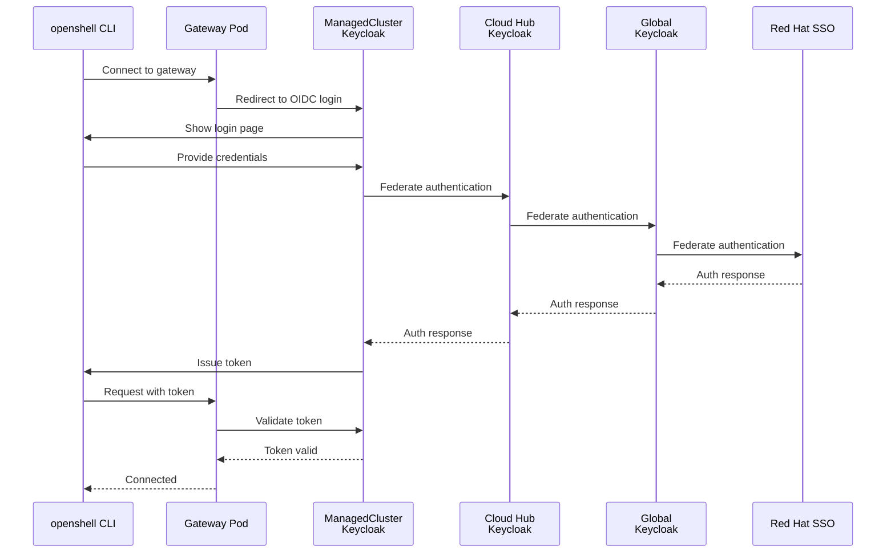
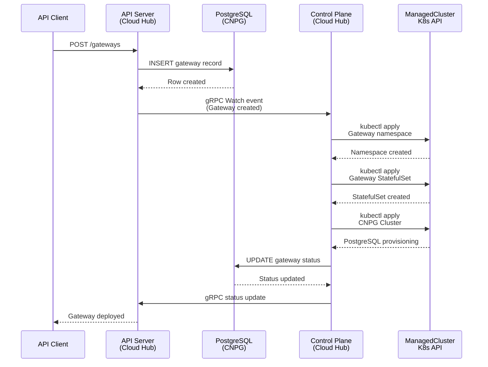
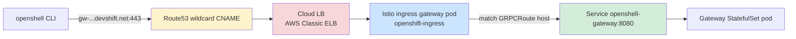
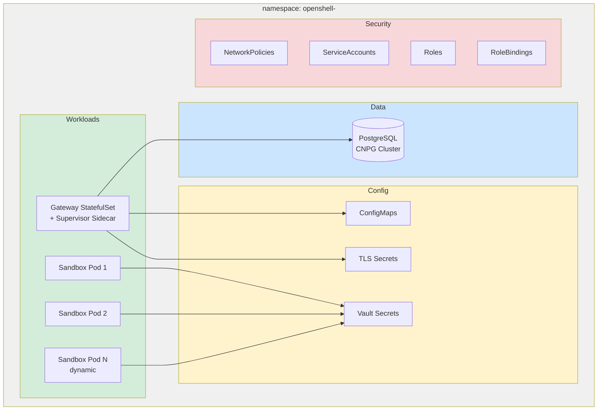
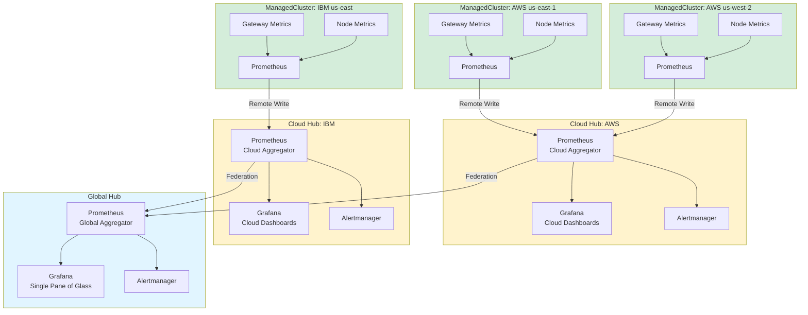

# Global Architecture

**Date:** 2026-08-14
**Status:** Active

## Overview

HyperShell deploys as a global fleet management platform spanning multiple clouds and regions. The architecture uses a **three-tier hub-and-spoke topology**: a Global Hub provides federated identity root, Cloud Hubs run the operational platform (API, control plane, databases), and ManagedClusters host gateway workloads. Every OpenShift cluster in the topology runs the full operator stack (ArgoCD, Vault, Keycloak, CNPG, Prometheus, Grafana) but serves different purposes at each tier.

## Three-Tier Topology

HyperShell uses a three-tier hub-and-spoke architecture. Each tier runs the full operator stack but serves distinct purposes.

```mermaid
graph TB
    subgraph Global["Global Hub (Identity Root)"]
        GK[Keycloak<br/>Federated to RH SSO]
        GV[Vault<br/>Reserved]
        GG[Grafana<br/>Cross-Cloud Dashboard]
    end

    subgraph AWS["Cloud Hub: AWS"]
        AK[Keycloak<br/>Federates to Global]
        AV[Vault<br/>Service Secrets]
        AArgo[ArgoCD<br/>Fleet GitOps]
        ADB[(PostgreSQL<br/>CNPG)]
        ACP[Control Plane]
        AAPI[API Server]
        AUI[Web UI]
        AP[Prometheus]
        AG[Grafana]
    end

    subgraph IBM["Cloud Hub: IBM Cloud"]
        IK[Keycloak<br/>Federates to Global]
        IV[Vault<br/>Service Secrets]
        IArgo[ArgoCD<br/>Fleet GitOps]
        IDB[(PostgreSQL<br/>CNPG)]
        ICP[Control Plane]
        IAPI[API Server]
        IUI[Web UI]
        IP[Prometheus]
        IG[Grafana]
    end

    subgraph MC1["ManagedCluster: AWS us-east-1"]
        M1K[Keycloak<br/>Gateway Clients]
        M1V[Vault<br/>Gateway Secrets]
        M1DB[(PostgreSQL<br/>CNPG)]
        M1P[Prometheus]
        M1GW[Gateway Namespaces]
    end

    subgraph MC2["ManagedCluster: AWS us-west-2"]
        M2K[Keycloak<br/>Gateway Clients]
        M2V[Vault<br/>Gateway Secrets]
        M2DB[(PostgreSQL<br/>CNPG)]
        M2P[Prometheus]
        M2GW[Gateway Namespaces]
    end

    subgraph MC3["ManagedCluster: IBM us-east"]
        M3K[Keycloak<br/>Gateway Clients]
        M3V[Vault<br/>Gateway Secrets]
        M3DB[(PostgreSQL<br/>CNPG)]
        M3P[Prometheus]
        M3GW[Gateway Namespaces]
    end

    GK -->|Federation| AK
    GK -->|Federation| IK
    AK -->|Federation| M1K
    AK -->|Federation| M2K
    IK -->|Federation| M3K
    
    ACP -->|Reconcile| M1GW
    ACP -->|Reconcile| M2GW
    ICP -->|Reconcile| M3GW
    
    M1P -->|Metrics| AP
    M2P -->|Metrics| AP
    M3P -->|Metrics| IP
    
    AP -->|Aggregate| GG
    IP -->|Aggregate| GG

    style Global fill:#e1f5ff
    style AWS fill:#fff3cd
    style IBM fill:#fff3cd
    style MC1 fill:#d4edda
    style MC2 fill:#d4edda
    style MC3 fill:#d4edda
```

### Tier 1: Global Hub

**Purpose**: Identity federation root and cross-cloud observability.

**Components**:
- Keycloak (federates to Red Hat SSO)
- Vault (reserved for future global secrets)
- Grafana (single-pane-of-glass aggregating metrics from all Cloud Hubs)

**Operational Role**: Provides the root of the Keycloak federation chain. Cloud Hubs federate to Global Keycloak, which federates to Red Hat SSO. Future: global monitoring dashboard.

### Tier 2: Cloud Hub

**Purpose**: Primary operational unit. One highly-available instance per cloud provider.

**Components**:
- API Server, Control Plane, Web UI (HA deployment)
- PostgreSQL (via CNPG) - source of truth for Fleet, Gateway, ManagedCluster resources
- ArgoCD - reconciles this cloud's infrastructure from Git
- Keycloak - federates to Global Keycloak, serves cloud services
- Vault - secrets for cloud hub services (API server, control plane)
- Prometheus - aggregates metrics from this cloud's ManagedClusters
- Grafana - cloud-level dashboards

**Operational Role**: The control plane watches the API server via gRPC and reconciles gateway resources into ManagedClusters. ArgoCD defines and provisions ManagedClusters.

### Tier 3: ManagedCluster

**Purpose**: Hosts gateway workloads. Multiple per cloud, deployed close to users (regional).

**Components**:
- Keycloak - federates to Cloud Hub Keycloak, holds OIDC clients for gateways on this cluster
- Vault - keystore for gateway secrets
- PostgreSQL (via CNPG) - gateway-specific databases
- Prometheus - local metrics (forwarded to Cloud Hub)
- Gateway namespaces (each contains: Gateway pod, Supervisor, Sandboxes, CNPG Cluster, TLS secrets, RBAC)

**Operational Role**: Runs gateway workloads. Users authenticate openshell CLI against Keycloak on the ManagedCluster where their gateway lives.

## Data Flows

### Keycloak Federation Chain

Identity flows from Red Hat SSO down through the tier hierarchy. Each Keycloak federates to the one above it.


**Federation Path**: Red Hat SSO → Global Keycloak → Cloud Keycloak → ManagedCluster Keycloak

**Client Registration**: Gateway OIDC clients are registered in the ManagedCluster Keycloak where the gateway runs.

### Gateway Authentication Flow

When a user authenticates their openshell CLI to a gateway:



### Control Plane Reconciliation Flow

The control plane on the Cloud Hub watches the API server and reconciles gateway resources into ManagedClusters.



**Key Points**:
- PostgreSQL on the Cloud Hub is the source of truth for all resource state
- Control Plane watches API server via gRPC streams
- Control Plane reconciles resources into ManagedClusters via kubeconfig secrets
- Gateway databases run as CNPG Clusters in the gateway namespace on the ManagedCluster


## Ingress Architecture

HyperShell utilizes a **dual-ingress strategy** on OpenShift clusters, separating platform management traffic from tenant gateway traffic. This ensures isolation, security, and optimal routing for different protocols.

### 1. Platform Services (Default OpenShift Ingress)

Traffic destined for HyperShell management services (API Server, Web Console, Keycloak) uses the default OpenShift routing tier.

- **Domain:** Standard OpenShift wildcard domain (e.g., `*.apps.rosa...`)
- **Load Balancer:** AWS Internal Network Load Balancer (NLB)
- **Routing Object:** OpenShift `Route` (HAProxy)
- **Mechanism:** The wildcard DNS resolves to the internal NLB, which forwards traffic to the OpenShift router pods. HAProxy uses hostname-based routing to direct traffic to the correct service.

### 2. Tenant Gateways (Kubernetes Gateway API)

Traffic destined for the actual managed gRPC gateways bypasses the default OpenShift router and uses a dedicated ingress path managed by the Kubernetes Gateway API (backed by Istio).

- **Domain:** Dedicated base domain (e.g., `*.openshell.stage.devshift.net`)
- **Load Balancer:** Dedicated AWS Classic ELB (provisioned by the Gateway API controller)
- **Routing Object:** `GRPCRoute` attached to a central `Gateway`
- **Mechanism:** A single shared `Gateway` object (`openshell-grpc-gateway`) in the `openshift-ingress` namespace terminates TLS using a wildcard certificate. When the control plane provisions a new gateway in a tenant namespace, it creates a `GRPCRoute` that automatically attaches to this shared `Gateway`. External DNS (e.g., Route53) manages the CNAME mapping the wildcard domain to the AWS ELB address.

This architecture allows the control plane to dynamically route traffic for new gateways without needing to provision individual load balancers or DNS records per tenant.

### Tenant gateway ingress is environment-adaptive (two modes)

Not every cluster can run the Gateway API. HyperShell is composable per
environment (see the deploy overlays), so the tenant-gateway ingress path is a
**selectable mode**, chosen by configuration, not by forking behavior:

| Mode | Routing object | When to use | Externally provisioned by |
|------|----------------|-------------|---------------------------|
| **`gateway-api`** (reference) | `GRPCRoute` → shared `Gateway` | Gateway API GA and functional (AWS/ROSA, OCP ≥ 4.19 with working CIO Istio) | Shared `Gateway` + wildcard cert + Route53 CNAME |
| **`route`** | OpenShift `Route` (`passthrough`) | Gateway API absent or non-functional (IBM Cloud ROKS - HyperShift-hosted, cannot pull OSSM images, IDMS owned by the HostedCluster) | Cluster's default router (HAProxy) on the platform wildcard |

Both modes converge on the **same** tenant workload: the gateway pod terminates
TLS with its per-tenant self-signed CA (`openshell-ca` → `openshell-server-tls`)
and performs client mTLS. In `route` mode the `Route` is `passthrough`, so the
router forwards the encrypted connection SNI-routed end-to-end - no wildcard
certificate, cert-manager `ClusterIssuer`, or external DNS integration is
required, and it works on the cloud's free ingress wildcard (e.g. IBM's
`*.containers.appdomain.cloud`). In `gateway-api` mode the shared `Gateway`
terminates the client's TLS and re-encrypts to the backend, validated by a
`BackendTLSPolicy`.

The mode is set by the control-plane env var `GATEWAY_INGRESS_MODE`
(`gateway-api` | `route` | `none`). When unset it is auto-detected from cluster
capabilities (`gateway-api` if the Gateway API is present, else `route` on
OpenShift). Because some platforms ship the Gateway API CRDs but cannot run it
(ROKS), those environments set `GATEWAY_INGRESS_MODE=route` explicitly via their
kustomize overlay (`deploy/ibm`). See "Requirement: Control Plane Ingress Mode".

### Tenant Gateway Ingress - Reference Implementation (verified on AWS)

> The following was captured live from the `hypershell-stage` deployment on the
> ROSA cluster `hcmais01ue1` (2026-08-15). It is the source-of-truth
> implementation that other clouds (IBM Cloud) must reach parity with. Values
> such as ELB hostnames and tenant hashes are environment-specific.

#### Component chain



The Gateway API implementation is **OpenShift's built-in support**, not a manual
Istio install. The Cluster Ingress Operator (CIO) installs and manages `istiod`
(Sail operator) and reconciles the `openshift-default` GatewayClass.

- **GatewayClass:** `openshift-default`
- **Controller:** `openshift.io/gateway-controller/v1` ("Handled by Istio controller"; `istiod v1.28.5` installed by CIO)
- **Gateway → LoadBalancer:** creating the `Gateway` causes the operator to create an Istio ingress `Deployment` + `Service` (`type: LoadBalancer`); the cloud CCM then provisions the external LB (AWS Classic ELB observed: `a1a663034da9843c3944de9cbdaceb98-536422505.us-east-1.elb.amazonaws.com`).

#### Manifest 1 - Shared Gateway (one per cluster, in `openshift-ingress`)

Created/owned by the control plane (`app.kubernetes.io/managed-by: hypershell-control-plane`).

```yaml
apiVersion: gateway.networking.k8s.io/v1
kind: Gateway
metadata:
  name: openshell-grpc-gateway
  namespace: openshift-ingress
  labels:
    app.kubernetes.io/name: openshell
    app.kubernetes.io/component: gateway
    app.kubernetes.io/managed-by: hypershell-control-plane
    hypershell.redhat.io/managed: "true"
    istio.io/rev: openshift-gateway
spec:
  gatewayClassName: openshift-default
  listeners:
    - name: grpc
      hostname: "*.openshell.stage.devshift.net"   # per-env base domain
      port: 443
      protocol: HTTPS
      allowedRoutes:
        kinds:
          - group: gateway.networking.k8s.io
            kind: GRPCRoute
        namespaces:
          from: All                                 # tenant namespaces attach cross-namespace
      tls:
        mode: Terminate
        certificateRefs:
          - kind: Secret
            name: wildcard-openshell-stage-devshift-tls
```

#### Manifest 2 - Per-tenant GRPCRoute (control plane creates one per gateway)

Lives in the tenant namespace (`openshell-<tenant-hash>`), attaches cross-namespace to the shared Gateway's `grpc` listener.

```yaml
apiVersion: gateway.networking.k8s.io/v1
kind: GRPCRoute
metadata:
  name: openshell-gateway
  namespace: openshell-<tenant-hash>
  labels:
    app.kubernetes.io/name: openshell
    app.kubernetes.io/component: gateway
    app.kubernetes.io/managed-by: hypershell-control-plane
    hypershell.redhat.io/managed: "true"
spec:
  hostnames:
    - "gw-openshell-<tenant-hash>.openshell.stage.devshift.net"
  parentRefs:
    - group: gateway.networking.k8s.io
      kind: Gateway
      name: openshell-grpc-gateway
      namespace: openshift-ingress
      sectionName: grpc
  rules:
    - backendRefs:
        - kind: Service
          name: openshell-gateway
          port: 8080
          weight: 1
```

#### Manifest 3 - Wildcard TLS certificate (cert-manager, in `openshift-ingress`)

```yaml
apiVersion: cert-manager.io/v1
kind: Certificate
metadata:
  name: wildcard-openshell-stage-devshift
  namespace: openshift-ingress
spec:
  secretName: wildcard-openshell-stage-devshift-tls
  dnsNames:
    - "*.openshell.stage.devshift.net"
  issuerRef:
    kind: ClusterIssuer
    name: letsencrypt-devshiftnet-dns
```

#### Manifest 4 - ClusterIssuer (ACME / Let's Encrypt, DNS-01 via Route53)

The `devshift.net` zone is centrally hosted in AWS Route53, so the DNS-01 solver
is Route53 **regardless of which cloud the cluster runs in**. This is the key that
lets an IBM Cloud cluster obtain a `*.devshift.net` certificate without any
IBM-native DNS integration.

```yaml
apiVersion: cert-manager.io/v1
kind: ClusterIssuer
metadata:
  name: letsencrypt-devshiftnet-dns
spec:
  acme:
    solvers:
      - selector:
          dnsZones: ["devshift.net"]
        dns01:
          route53:
            region: global
            hostedZoneID: Z05758033SZ8IESGUOY8E
            accessKeyIDSecretRef:
              name: certmgr-<cluster>-devshift-net-sa
              key: aws_access_key_id
            secretAccessKeySecretRef:
              name: certmgr-<cluster>-devshift-net-sa
              key: aws_secret_access_key
```

#### DNS record

There is **no `external-dns` controller** on the AWS cluster; the Gateway reports
`DNS management policy is set to Unmanaged`. The wildcard record is a static
Route53 entry:

```
*.openshell.stage.devshift.net.  CNAME  <cloud-LB-hostname>
```

resolving to the Gateway's provisioned LB. It must be created (once per cluster)
after the LB hostname is known.

#### Verified component summary

| Concern | AWS (verified) | Notes |
|---------|----------------|-------|
| Gateway API impl | `openshift-default` GatewayClass, CIO-managed Istio | Not a manual Istio install |
| Shared Gateway | `openshell-grpc-gateway` / `openshift-ingress` | one per cluster |
| Listener | `*.openshell.stage.devshift.net`, 443, HTTPS, TLS Terminate | GRPCRoute from All namespaces |
| External LB | AWS Classic ELB (auto-provisioned) | via `Service type: LoadBalancer` + CCM |
| Per-tenant route | `GRPCRoute` `openshell-gateway`, host `gw-openshell-<hash>...`, backend `Service openshell-gateway:8080` | created by control plane |
| Wildcard cert | cert-manager `Certificate` → secret `wildcard-openshell-stage-devshift-tls` | 90-day Let's Encrypt, auto-renew |
| Issuer | `letsencrypt-devshiftnet-dns` (ACME, DNS-01, Route53 zone `devshift.net`) | cloud-agnostic |
| DNS record | static Route53 wildcard CNAME → LB | no external-dns |

### IBM Cloud Cloud Hub - Route ingress mode (verified 2026-08-15)

IBM Cloud ROKS does **not** run the Gateway API, so the IBM Cloud Hub uses the
**`route` ingress mode** (see "environment-adaptive" above) rather than reaching
`gateway-api` parity. This is a deliberate, first-class configuration, not a
degraded fallback.

**Why Gateway API is unavailable on ROKS (exhaustively verified on `hysh-ibm-01`,
OCP 4.21.27, 2026-08-15):** the CRDs and feature gates are present, and creating
the `openshift-default` GatewayClass makes the CIO deploy `istiod`, but it
`ImagePullBackOff`s - the OSSM images (`registry.redhat.io/openshift-service-mesh/
istio-pilot-rhel9`, `istio-proxyv2-rhel9`) are not stocked in IBM's node mirror
and worker egress to `registry.redhat.io` is blocked. ROKS is **HyperShift-hosted**:
a `ValidatingAdmissionPolicy` named `mirror` denies creating
`ImageDigestMirrorSet`/`ImageTagMirrorSet` in the guest (node `registries.conf`
is owned by the HostedCluster), and CIO reverts any Deployment image patch within
~45s. OperatorHub is also broken (catalog pods `ImagePullBackOff`), so OLM install
of Sail/OSSM is unavailable too. The **only** supported way to make Gateway API
work on ROKS is an IBM-side change to the HostedCluster (mirror/allowlist), which
is out of our control. See [`ibm-cluster`](../../skills/deploy/ibm-cluster/SKILL.md).

Steps (Route mode on ROKS):

1. **Provision a ROKS cluster on OCP ≥ 4.19** (Cloud Hub `hysh-ibm-01`, OCP
   4.21.27). Registry storage must be a **ReadWriteOnce** PVC (IBM VPC block is
   RWO-only; the operator's default RWM PVC fails `VolumeCapabilitiesNotSupported`).
2. **Deploy the control plane with the IBM overlay** (`deploy/ibm`), which sets
   `GATEWAY_INGRESS_MODE=route` and `GATEWAY_API_BASE_DOMAIN` to the cluster's
   ingress subdomain (IBM's free `*.<ingress-subdomain>.containers.appdomain.cloud`
   wildcard). Route mode removes only the *ingress-layer* PKI - no wildcard
   certificate, cert-manager `ClusterIssuer`, Route53, or external DNS. It does
   **not** remove cert-manager itself: cert-manager (namespaced `Issuer` +
   per-tenant `Certificate`s minting the `openshell-ca` chain for the pod's own
   TLS + client mTLS) remains a **hard prerequisite in every ingress mode**
   (`reconcileCertManagerResources`; reconcile fails closed without it). On ROKS,
   OperatorHub is broken, so cert-manager is installed by mirroring its images into
   the internal registry (see [`ibm-cluster`](../../skills/deploy/ibm-cluster/SKILL.md)).
3. **Provision a test tenant gateway** with `route.enabled=true`. The control
   plane creates an OpenShift `Route` (`passthrough`) `openshell-gateway` in the
   tenant namespace with host `gw-<tenant>.<base-domain>`, backed by
   `Service openshell-gateway:8080`, plus the `openshell-gateway-allow-router`
   NetworkPolicy, and publishes `grpcs://<host>:443` as the gateway's route address.
   The tenant workload images (gateway, supervisor, gateway database) must be
   **node-reachable**; on ROKS they are mirrored into the internal registry and
   referenced by its in-cluster service address (see `ibm-cluster` Step 5).
4. **Verify:** the `Route` reports `Admitted=True`; the served passthrough
   certificate chains to the per-tenant `openshell-ca` and its SANs include
   `gw-<tenant>.<base-domain>` (the control plane injects the derived ingress
   hostname into the certificate SANs automatically - operators do not set it by
   hand). A client with that CA connects over `gw-<tenant>.<base-domain>:443`.

To later switch a cloud to `gateway-api` mode (e.g. if IBM fixes HostedCluster
mirroring), unset `GATEWAY_INGRESS_MODE` (or set it to `gateway-api`) and complete
the shared-Gateway bootstrap; the control plane then emits `GRPCRoute`s and cleans
up the Routes. The AWS reference (`gateway-api` mode) is unchanged.

### Requirements

#### Requirement: Tenant Gateway Ingress via Gateway API (`gateway-api` mode)

In `gateway-api` mode, tenant gateway traffic SHALL be routed through the
Kubernetes Gateway API using a single shared `Gateway` (`openshell-grpc-gateway`)
in the `openshift-ingress` namespace. In this mode tenant gateways SHALL NOT use
OpenShift `Route` objects for data-plane gRPC traffic.

##### Scenario: Gateway provisioning creates a GRPCRoute

- GIVEN a cluster in `gateway-api` mode with the `openshift-default` GatewayClass and the shared `openshell-grpc-gateway`
- WHEN the control plane provisions a new tenant gateway
- THEN it SHALL create a `GRPCRoute` in the tenant namespace with a `parentRef` to `openshell-grpc-gateway` (`sectionName: grpc`)
- AND the route hostname SHALL be `gw-<tenant>.<base-domain>` under the shared listener's wildcard
- AND it SHALL NOT create an OpenShift `Route` for gRPC data-plane traffic

#### Requirement: Tenant Gateway Ingress via OpenShift Route (`route` mode)

In `route` mode, tenant gateway traffic SHALL be exposed through an OpenShift
`Route` with `tls.termination: passthrough`, so the gateway pod's own TLS and
client mTLS are preserved end-to-end. In this mode the control plane SHALL NOT
require a shared `Gateway`, a wildcard certificate, or external DNS integration.

##### Scenario: Gateway provisioning creates a passthrough Route

- GIVEN a cluster in `route` mode (`GATEWAY_INGRESS_MODE=route`)
- WHEN the control plane provisions a new tenant gateway with ingress enabled
- THEN it SHALL create a `Route` `openshell-gateway` in the tenant namespace with `spec.tls.termination: passthrough` and `port.targetPort: grpc` to `Service openshell-gateway`
- AND the route hostname SHALL be `gw-<tenant>.<base-domain>` (or the gateway's explicit `route.host`)
- AND it SHALL publish `grpcs://<host>:443` as the gateway's route address
- AND it SHALL NOT create a `GRPCRoute`, shared `Gateway`, or `BackendTLSPolicy`

##### Scenario: Disabling ingress removes the mode's routing objects

- GIVEN a provisioned tenant gateway with a routing object for the active mode
- WHEN ingress is disabled (`route.enabled=false`) or the gateway is deleted
- THEN the control plane SHALL delete the tenant's `Route` (route mode) or `GRPCRoute`/`BackendTLSPolicy` (gateway-api mode) and the `openshell-gateway-allow-router` NetworkPolicy
- AND it SHALL clear the gateway's route address

#### Requirement: Cloud-Agnostic Gateway Manifests

The `Gateway`, `GRPCRoute`, `Certificate`, and `ClusterIssuer` manifests SHALL be
identical across clouds except for the per-environment base domain and TLS secret
name. The external load balancer SHALL be provisioned automatically by the cloud's
CCM from the operator-created `Service type: LoadBalancer`; no per-cloud load
balancer manifest SHALL be required.

##### Scenario: IBM Cloud provisions a VPC LB from the same Gateway

- GIVEN the shared `Gateway` manifest applied on a ROKS VPC Gen2 cluster
- WHEN the Cluster Ingress Operator reconciles it
- THEN IBM Cloud CCM SHALL provision a VPC Load Balancer (`*.lb.appdomain.cloud`)
- AND the `Gateway` status SHALL report `Programmed=True` with the LB hostname as its address

#### Requirement: Wildcard TLS via Central Route53 DNS-01

Wildcard certificates for the `devshift.net` base domain SHALL be issued by
cert-manager using the ACME DNS-01 challenge against the central Route53
`devshift.net` hosted zone, independent of the cluster's cloud provider.

#### Requirement: Control Plane Ingress Mode

The control plane's ingress mode (`gateway-api` vs `route`) SHALL be
configuration-driven, not cloud-hardcoded, so the same binary produces `GRPCRoute`s
or OpenShift `Route`s depending only on the selected mode. The mode SHALL be
selectable via the `GATEWAY_INGRESS_MODE` env var (`gateway-api` | `route` |
`none`), overridable per environment through a kustomize overlay
(`deploy/openshift` defaults to `gateway-api`; `deploy/ibm` sets `route`).

##### Scenario: Explicit mode overrides auto-detection

- GIVEN a cluster where the Gateway API CRDs are present but non-functional (ROKS)
- WHEN `GATEWAY_INGRESS_MODE=route` is set
- THEN the control plane SHALL provision OpenShift `Route`s and SHALL NOT attempt Gateway API resources

##### Scenario: Auto-detection when no mode is set

- GIVEN `GATEWAY_INGRESS_MODE` is unset
- WHEN the control plane reconciles a gateway
- THEN it SHALL select `gateway-api` if the Gateway API is detected, otherwise `route` on OpenShift, otherwise skip managed ingress

#### Requirement: cert-manager Is a Mode-Independent Prerequisite

Every tenant gateway SHALL depend on cert-manager for its per-tenant PKI: a
namespaced `Issuer` (`openshell-ca`) and `Certificate`s minting the gateway's own
server TLS, client mTLS, and CA. This is independent of the ingress mode - `route`
mode removes only the ingress-layer wildcard certificate/`ClusterIssuer`/Route53,
not the pod-TLS layer. The control plane SHALL fail closed when cert-manager is
absent.

##### Scenario: Reconcile blocks without cert-manager

- GIVEN a cluster without cert-manager installed (any ingress mode)
- WHEN the control plane reconciles a tenant gateway
- THEN it SHALL return an error and SHALL NOT deploy the gateway workload

#### Requirement: Gateway Server Certificate Covers the Ingress Hostname

Because both ingress modes carry the gateway pod's TLS through unmodified (Route
passthrough / Gateway API `BackendTLSPolicy`), the gateway server certificate
SHALL list the external ingress hostname (`gw-<tenant>.<base-domain>`, or an
explicit `route.host`) as a SAN. The control plane derives that hostname, so it
SHALL inject it into the certificate SANs itself, before cert-manager mints the
certificate - operators SHALL NOT be required to set `external_dns`/
`server_dns_names` by hand for the ingress hostname to be covered.

##### Scenario: Derived hostname appears in the served certificate

- GIVEN a tenant gateway with ingress enabled and `GATEWAY_API_BASE_DOMAIN` set
- WHEN the control plane provisions it
- THEN the per-tenant `openshell-server` `Certificate` SHALL include both the
  in-cluster service DNS name and `gw-<tenant>.<base-domain>` as SANs
- AND the certificate served over the ingress hostname SHALL verify against the
  per-tenant `openshell-ca` with hostname verification enabled

#### Requirement: Image References Support an In-Cluster Registry

Gateway image references (gateway, supervisor) SHALL accept a registry host that
carries an explicit port, as standard Docker references permit
(`host[:port]/path[:tag]`), so images mirrored into the cluster-internal registry
(`image-registry.openshift-image-registry.svc:5000/...`) - the only node-reachable
source on ROKS - pass validation. The per-tenant database image SHALL be
overridable via `HYPERSHELL_DATABASE_IMAGE` for the same reason, and the gateway's
`supervisor_image` SHALL be settable through the API (`PATCH`) so sandboxes pull
from a node-reachable registry.

#### Requirement: Agent Sandbox CRD Is a Sandbox Prerequisite

Tenant sandbox operations (`openshell sandbox list/create`) depend on the Agent
Sandbox CRD + controller (`sandboxes.agents.x-k8s.io`, the upstream
`kubernetes-sigs/agent-sandbox` project) being installed cluster-wide. The control
plane SHALL provision only the per-tenant sandbox RBAC (SA, Role/RoleBinding
against `agents.x-k8s.io`, and on OpenShift the privileged-SCC binding); it SHALL
NOT install the CRD/controller, which is a cluster prerequisite on par with
cert-manager. The gateway's Kubernetes compute driver watches this CRD; when it is
absent the sandbox RPCs surface as gRPC `Unimplemented` and the driver logs `no
supported Agent Sandbox API version is available`. The version installed SHALL
serve the API version the gateway requires (`v1beta1` for gateway 0.0.101; upstream
`v0.5.x`).

#### Requirement: Sandbox Base Image Supports an In-Cluster Registry

The base image tenant sandbox pods launch from (the gateway `default_image`) SHALL
be overridable via `GATEWAY_SANDBOX_IMAGE` (control-plane env), so that on clusters
whose nodes cannot reach `ghcr.io` (e.g. ROKS) it can be pointed at a mirror in the
cluster-internal registry. This mirrors the `HYPERSHELL_DATABASE_IMAGE` override for
the gateway database.

##### Scenario: Sandbox launch on a cluster without public egress

- GIVEN a cluster whose worker nodes cannot pull from `ghcr.io` or `registry.k8s.io`
- AND the Agent Sandbox CRD + controller and the sandbox base image have been mirrored into the internal registry
- WHEN `GATEWAY_SANDBOX_IMAGE` points the gateway `default_image` at the mirrored base image
- THEN a created Sandbox's pod SHALL pull the base image from the internal registry and reach Running
- AND the gateway compute driver SHALL watch `agents.x-k8s.io` without `Unimplemented` errors

### Open Questions (for implementer review)

1. **[RESOLVED] ROKS Gateway API availability.** Verified on 2026-08-15 across two clusters: on the old 4.17 cluster the CRDs were absent; on the new `hysh-ibm-01` (4.21.27) the CRDs and feature gates are present but the Gateway API is **non-functional** (CIO `istiod` cannot pull OSSM images; IDMS denied by the HostedCluster; CIO reverts patches; OperatorHub broken). **Decision:** the IBM Cloud Hub uses the `route` ingress mode (`deploy/ibm`, `GATEWAY_INGRESS_MODE=route`), not Gateway API. See "IBM Cloud Cloud Hub - Route ingress mode".
2. **IBM base domain.** What exact subdomain - e.g. `openshell.ibm-stage.devshift.net`?
   Confirm it is delegated within the Route53 `devshift.net` zone.
3. **[RESOLVED - BUG] Control-plane config surface.** Verified on 2026-08-15: The Go code reads `GATEWAY_API_BASE_DOMAIN` and `GATEWAY_API_GATEWAY_CLASS`. However, it **completely ignores** the gateway name and namespace config. `internal/gateway/reconciler.go` currently hardcodes the `GRPCRoute` `parentRefs` to `name: openshell-gateway` inside the tenant's own namespace. This is a severe bug that provisions one Load Balancer per tenant. This code must be patched to respect `GATEWAY_API_GATEWAY_NAME` and `GATEWAY_API_GATEWAY_NAMESPACE` to use the shared ingress gateway.
4. **DNS record creation.** Reproduce the AWS pattern (static Route53 wildcard
   CNAME, no external-dns), or introduce `external-dns` to automate it on IBM?
5. **Route53 credentials on IBM.** Provision the `certmgr-<cluster>-devshift-net-sa`
   secret (IAM user scoped to the `devshift.net` zone) on the IBM cluster.
6. **[RESOLVED] VPC LB scope.** Verified on 2026-08-15: The default OpenShift router on this IBM cluster uses a public VPC Load Balancer (`service.kubernetes.io/ibm-load-balancer-cloud-provider-ip-type: public`). We will match this public exposure for the Gateway API VPC LB.
7. **Legacy Route-based gateways.** The AWS cluster still has older tenants on
   `Route`/`passthrough` under `*.apps.rosa...`. Is a migration of existing tenants
   in scope, or parity for new tenants only?

## Tooling Stack

| Component | Tool | Purpose |
|-----------|------|---------|
| Database operator | CNPG (CloudNativePG) | PostgreSQL lifecycle (replaces per-gateway cloud databases) |
| GitOps | ArgoCD | Reconciles cluster state from Git |
| Secret management | Vault | Stores and rotates secrets with cloud-native drivers |
| Identity | Keycloak | OIDC authentication for gateways and console |
| Cluster provisioning | Terraform | VPC, subnet, and cluster provisioning |
| Installer | Tekton pipelines | Reproducible, deterministic deployment pipelines |
| Monitoring | Prometheus | Metrics collection on all clusters |
| Dashboards | Grafana | Centralized visualization on hub |

## Database Strategy: CNPG

CloudNativePG replaces per-gateway cloud-managed databases (RDS, Cloud SQL). CNPG runs PostgreSQL clusters as Kubernetes-native resources with automated failover, backup, and recovery.

### Requirements

#### Requirement: CNPG Operator Deployment

The CNPG operator SHALL be deployed on the hub cluster. Gateway databases SHALL be provisioned as CNPG Cluster resources in the gateway namespace.

##### Scenario: Gateway Database Provisioning via CNPG

- GIVEN a Gateway resource with a `database_id` referencing a ManagedDatabase
- WHEN the ManagedDatabase specifies `provider: cnpg`
- THEN the controller SHALL create a CNPG Cluster resource in the gateway namespace
- AND the CNPG operator SHALL provision a PostgreSQL instance with automated replication

#### Requirement: Database Lifecycle Independence

ManagedDatabase resources SHALL have an independent lifecycle from Gateways. A single CNPG cluster MAY serve multiple gateways within the same namespace.

## Namespace Strategy

Gateway and its sandboxes coexist in the same namespace as a scalable unit. Each gateway deployment gets its own namespace containing all required resources.



**Resources per Gateway Namespace**:
- **Workloads**: Gateway StatefulSet (with Supervisor sidecar), dynamic Sandbox pods
- **Data**: PostgreSQL (CNPG Cluster) provisioned by ManagedDatabase controller
- **Config**: ConfigMaps, TLS secrets (cert-manager or certgen), Vault-backed secrets
- **Security**: NetworkPolicies, ServiceAccounts, Roles, RoleBindings

This namespace-per-gateway strategy provides:
- Isolation boundary for RBAC and network policies
- Resource quotas per gateway
- Self-contained lifecycle (delete namespace = delete gateway)
- CNPG Cluster co-located with gateway workload

## Installer Pipeline

Tekton pipelines provide a reproducible installer for HyperShell deployments. The pipeline replaces manual bash scripts with deterministic, auditable steps.

### Requirements

#### Requirement: Deterministic Installation

HyperShell installation SHALL be performed via Tekton pipelines that execute idempotent steps. Manual `oc apply` or `kubectl` scripts SHALL NOT be the primary installation method in production.

##### Scenario: Fresh Cluster Installation

- GIVEN a bare OpenShift cluster with Tekton installed
- WHEN the HyperShell installer pipeline runs
- THEN it SHALL provision: CNPG operator, cert-manager, API server, controller, PostgreSQL, ArgoCD, Vault, Keycloak
- AND the installation SHALL be idempotent (safe to re-run)

#### Requirement: Cattle Not Pets

Infrastructure SHALL be treated as disposable. Any cluster can be torn down and rebuilt from the pipeline without manual intervention or state recovery.

## Monitoring Architecture

Prometheus runs on every cluster. Metrics flow from ManagedClusters → Cloud Hub → Global Hub.



### Requirements

#### Requirement: Managed Cluster Metrics

Every managed cluster SHALL run a Prometheus instance that scrapes gateway and node metrics. Metrics SHALL be forwarded to the regional or global hub.

#### Requirement: Hub Dashboards

The hub cluster SHALL run Grafana with dashboards for fleet-wide gateway health, resource utilization, and provisioning status across all managed clusters.

## Managed Cluster Flexibility

Managed clusters are not restricted to OpenShift. Standard Kubernetes distributions (EKS, GKE, vanilla K8s) are valid targets. The controller auto-detects cluster capabilities:

| Capability | Detection | Behavior when absent |
|------------|-----------|---------------------|
| OpenShift Routes | `route.openshift.io` API group | Use Gateway API or NodePort |
| cert-manager | `cert-manager.io` API group | Block deployment (required) |
| Gateway API | `gateway.networking.k8s.io/v1` GRPCRoute | Skip GRPCRoute/BackendTLSPolicy |
| Agent Sandbox CRD | `agents.x-k8s.io` | Sandbox creation blocked |

## GitOps Repository Structure

ArgoCD manages cluster state from a Git repository. Each cloud and region has its own overlay.

```
gitops-repo/
├── base/
│   ├── hypershell/
│   │   ├── api-server.yaml
│   │   ├── controller.yaml
│   │   └── postgres.yaml
│   ├── cnpg/
│   ├── cert-manager/
│   ├── vault/
│   └── keycloak/
├── overlays/
│   ├── ibm-us-east/
│   │   ├── kustomization.yaml
│   │   └── patches/
│   ├── aws-us-east/
│   │   ├── kustomization.yaml
│   │   └── patches/
│   └── aws-eu-west/
│       ├── kustomization.yaml
│       └── patches/
└── clusters/
    ├── ibm-hub.yaml        (ArgoCD Application)
    ├── aws-hub.yaml
    └── managed/
        ├── rosa-vteam.yaml
        └── eks-staging.yaml
```

## Design Decisions

| Decision | Rationale |
|----------|-----------|
| Three-tier topology | Separates concerns: Global (identity root), Cloud Hub (operations), ManagedCluster (workloads) |
| Cloud Hub as primary unit | One HA instance per cloud runs API/control-plane/database; cloud isolation for latency and compliance |
| Full operator stack on all tiers | Every cluster has ArgoCD, Vault, Keycloak, CNPG, Prometheus - but serves different purposes per tier |
| Federated Keycloak chain | RH SSO → Global → Cloud Hub → ManagedCluster - identity flows down, authentication bubbles up |
| Vault per tier with distinct purposes | Cloud Hub Vault: service secrets; ManagedCluster Vault: gateway keystores |
| CNPG on all clusters | Kubernetes-native lifecycle, portable across clouds, no vendor lock-in |
| PostgreSQL on Cloud Hub as source of truth | All Fleet/Gateway/ManagedCluster resource state lives in Cloud Hub database |
| ManagedClusters can be standard K8s | Maximizes deployment flexibility; only hubs need OpenShift |
| Tekton over bash scripts | Deterministic, auditable, cattle-not-pets infrastructure |
| ArgoCD on Cloud Hubs | Each Cloud Hub ArgoCD reconciles its own ManagedClusters from Git |
| Prometheus metrics hierarchy | ManagedCluster → Cloud Hub → Global Hub; supports cloud-level and cross-cloud dashboards |
| Namespace-per-gateway | Isolation boundary for RBAC, NetworkPolicy, resource quotas, and CNPG Cluster |
| Terraform for provisioning | IaC for VPC, subnet, and cluster lifecycle; cloud-agnostic |
| Gateway OIDC clients on ManagedCluster | openshell CLI authenticates against Keycloak where the gateway runs (low latency) |
| Shared Ingress Gateway for Tenant gRPC | A wildcard DNS record (`*.domain`) can only resolve to a single Load Balancer. A per-tenant gateway model (1 LB per tenant) fundamentally breaks wildcard routing, requiring per-tenant DNS automation and cert management. A shared Gateway allows N tenants to securely share 1 LB, 1 wildcard cert, and 1 static DNS record via `GRPCRoute` attachments. |
