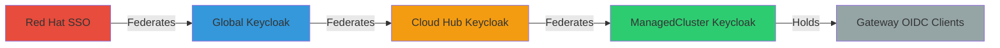
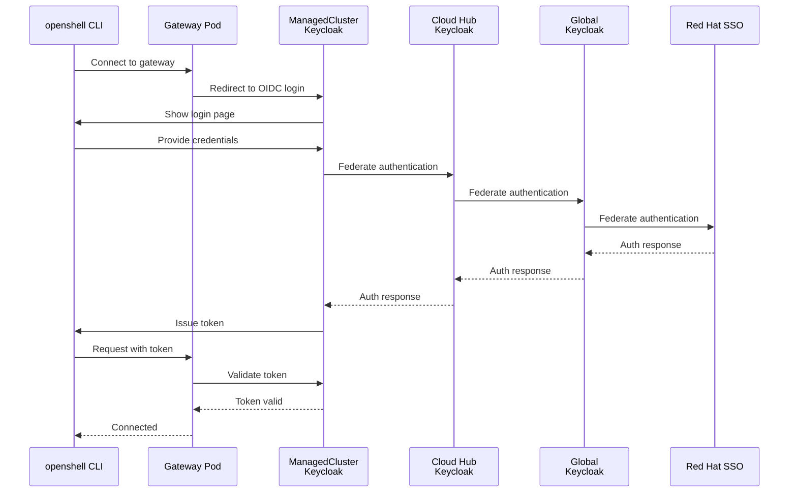
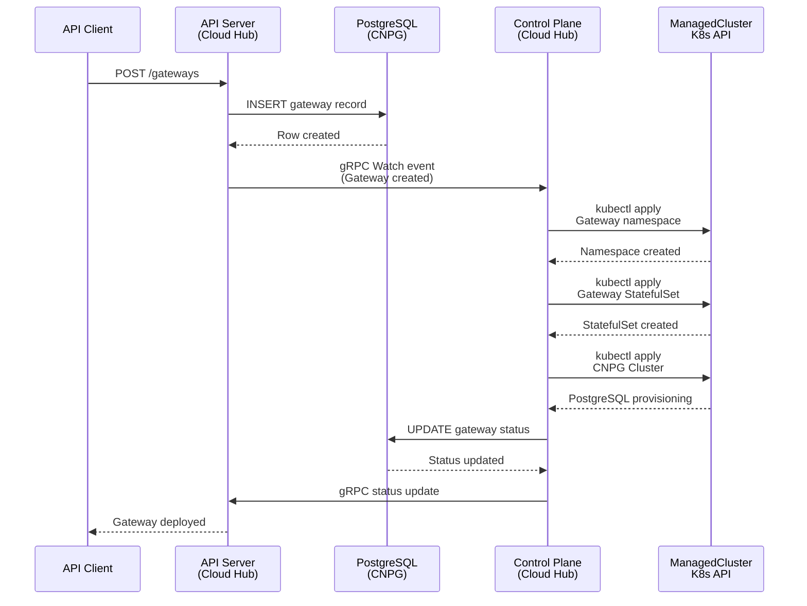
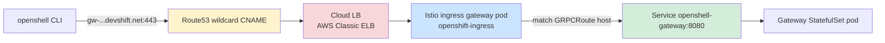
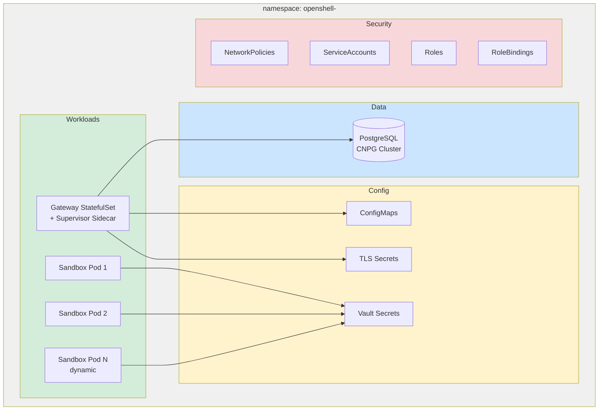
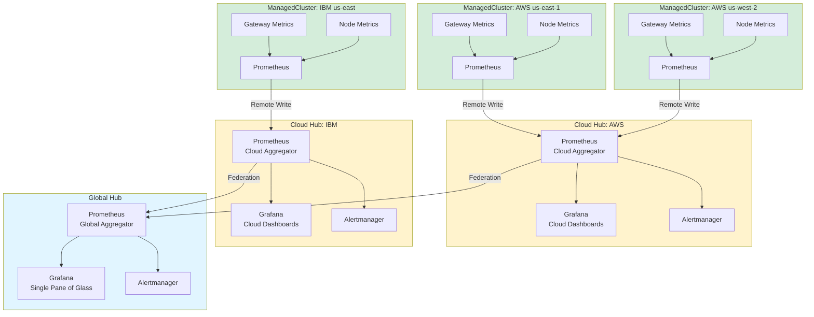

# Global Architecture

**Date:** 2026-08-14
**Status:** Active

## Overview

HyperShell deploys as a global fleet management platform spanning multiple clouds and regions. The architecture uses a **three-tier hub-and-spoke topology**: a Global Hub provides federated identity root, Cloud Hubs run the operational platform (API, control plane, databases), and ManagedClusters host gateway workloads. Every OpenShift cluster in the topology runs the full operator stack (ArgoCD, Vault, Keycloak, CNPG, Prometheus, Grafana) but serves different purposes at each tier.

## Three-Tier Topology

HyperShell uses a three-tier hub-and-spoke architecture. Each tier runs the full operator stack but serves distinct purposes.

```mermaid
graph TB
    subgraph Global["Global Hub (Identity Root)"]
        GK[Keycloak<br/>Federated to RH SSO]
        GV[Vault<br/>Reserved]
        GG[Grafana<br/>Cross-Cloud Dashboard]
    end

    subgraph AWS["Cloud Hub: AWS"]
        AK[Keycloak<br/>Federates to Global]
        AV[Vault<br/>Service Secrets]
        AArgo[ArgoCD<br/>Fleet GitOps]
        ADB[(PostgreSQL<br/>CNPG)]
        ACP[Control Plane]
        AAPI[API Server]
        AUI[Web UI]
        AP[Prometheus]
        AG[Grafana]
    end

    subgraph IBM["Cloud Hub: IBM Cloud"]
        IK[Keycloak<br/>Federates to Global]
        IV[Vault<br/>Service Secrets]
        IArgo[ArgoCD<br/>Fleet GitOps]
        IDB[(PostgreSQL<br/>CNPG)]
        ICP[Control Plane]
        IAPI[API Server]
        IUI[Web UI]
        IP[Prometheus]
        IG[Grafana]
    end

    subgraph MC1["ManagedCluster: AWS us-east-1"]
        M1K[Keycloak<br/>Gateway Clients]
        M1V[Vault<br/>Gateway Secrets]
        M1DB[(PostgreSQL<br/>CNPG)]
        M1P[Prometheus]
        M1GW[Gateway Namespaces]
    end

    subgraph MC2["ManagedCluster: AWS us-west-2"]
        M2K[Keycloak<br/>Gateway Clients]
        M2V[Vault<br/>Gateway Secrets]
        M2DB[(PostgreSQL<br/>CNPG)]
        M2P[Prometheus]
        M2GW[Gateway Namespaces]
    end

    subgraph MC3["ManagedCluster: IBM us-east"]
        M3K[Keycloak<br/>Gateway Clients]
        M3V[Vault<br/>Gateway Secrets]
        M3DB[(PostgreSQL<br/>CNPG)]
        M3P[Prometheus]
        M3GW[Gateway Namespaces]
    end

    GK -->|Federation| AK
    GK -->|Federation| IK
    AK -->|Federation| M1K
    AK -->|Federation| M2K
    IK -->|Federation| M3K
    
    ACP -->|Reconcile| M1GW
    ACP -->|Reconcile| M2GW
    ICP -->|Reconcile| M3GW
    
    M1P -->|Metrics| AP
    M2P -->|Metrics| AP
    M3P -->|Metrics| IP
    
    AP -->|Aggregate| GG
    IP -->|Aggregate| GG

    style Global fill:#e1f5ff
    style AWS fill:#fff3cd
    style IBM fill:#fff3cd
    style MC1 fill:#d4edda
    style MC2 fill:#d4edda
    style MC3 fill:#d4edda
```

### Tier 1: Global Hub

**Purpose**: Identity federation root and cross-cloud observability.

**Components**:
- Keycloak (federates to Red Hat SSO)
- Vault (reserved for future global secrets)
- Grafana (single-pane-of-glass aggregating metrics from all Cloud Hubs)

**Operational Role**: Provides the root of the Keycloak federation chain. Cloud Hubs federate to Global Keycloak, which federates to Red Hat SSO. Future: global monitoring dashboard.

### Tier 2: Cloud Hub

**Purpose**: Primary operational unit. One highly-available instance per cloud provider.

**Components**:
- API Server, Control Plane, Web UI (HA deployment)
- PostgreSQL (via CNPG) - source of truth for Fleet, Gateway, ManagedCluster resources
- ArgoCD - reconciles this cloud's infrastructure from Git
- Keycloak - federates to Global Keycloak, serves cloud services
- Vault - secrets for cloud hub services (API server, control plane)
- Prometheus - aggregates metrics from this cloud's ManagedClusters
- Grafana - cloud-level dashboards

**Operational Role**: The control plane watches the API server via gRPC and reconciles gateway resources into ManagedClusters. ArgoCD defines and provisions ManagedClusters.

### Tier 3: ManagedCluster

**Purpose**: Hosts gateway workloads. Multiple per cloud, deployed close to users (regional).

**Components**:
- Keycloak - federates to Cloud Hub Keycloak, holds OIDC clients for gateways on this cluster
- Vault - keystore for gateway secrets
- PostgreSQL (via CNPG) - gateway-specific databases
- Prometheus - local metrics (forwarded to Cloud Hub)
- Gateway namespaces (each contains: Gateway pod, Supervisor, Sandboxes, CNPG Cluster, TLS secrets, RBAC)

**Operational Role**: Runs gateway workloads. Users authenticate openshell CLI against Keycloak on the ManagedCluster where their gateway lives.

## Data Flows

### Keycloak Federation Chain

Identity flows from Red Hat SSO down through the tier hierarchy. Each Keycloak federates to the one above it.



**Federation Path**: Red Hat SSO → Global Keycloak → Cloud Keycloak → ManagedCluster Keycloak

**Client Registration**: Gateway OIDC clients are registered in the ManagedCluster Keycloak where the gateway runs.

### Gateway Authentication Flow

When a user authenticates their openshell CLI to a gateway:



### Control Plane Reconciliation Flow

The control plane on the Cloud Hub watches the API server and reconciles gateway resources into ManagedClusters.



**Key Points**:
- PostgreSQL on the Cloud Hub is the source of truth for all resource state
- Control Plane watches API server via gRPC streams
- Control Plane reconciles resources into ManagedClusters via kubeconfig secrets
- Gateway databases run as CNPG Clusters in the gateway namespace on the ManagedCluster


## Ingress Architecture

HyperShell utilizes a **dual-ingress strategy** on OpenShift clusters, separating platform management traffic from tenant gateway traffic. This ensures isolation, security, and optimal routing for different protocols.

### 1. Platform Services (Default OpenShift Ingress)

Traffic destined for HyperShell management services (API Server, Web Console, Keycloak) uses the default OpenShift routing tier.

- **Domain:** Standard OpenShift wildcard domain (e.g., `*.apps.rosa...`)
- **Load Balancer:** AWS Internal Network Load Balancer (NLB)
- **Routing Object:** OpenShift `Route` (HAProxy)
- **Mechanism:** The wildcard DNS resolves to the internal NLB, which forwards traffic to the OpenShift router pods. HAProxy uses hostname-based routing to direct traffic to the correct service.

### 2. Tenant Gateways (Kubernetes Gateway API)

Traffic destined for the actual managed gRPC gateways bypasses the default OpenShift router and uses a dedicated ingress path managed by the Kubernetes Gateway API (backed by Istio).

- **Domain:** Dedicated base domain (e.g., `*.openshell.stage.devshift.net`)
- **Load Balancer:** Dedicated AWS Classic ELB (provisioned by the Gateway API controller)
- **Routing Object:** `GRPCRoute` attached to a central `Gateway`
- **Mechanism:** A single shared `Gateway` object (`openshell-grpc-gateway`) in the `openshift-ingress` namespace terminates TLS using a wildcard certificate. When the control plane provisions a new gateway in a tenant namespace, it creates a `GRPCRoute` that automatically attaches to this shared `Gateway`. External DNS (e.g., Route53) manages the CNAME mapping the wildcard domain to the AWS ELB address.

This architecture allows the control plane to dynamically route traffic for new gateways without needing to provision individual load balancers or DNS records per tenant.

### Tenant Gateway Ingress — Reference Implementation (verified on AWS)

> The following was captured live from the `hypershell-stage` deployment on the
> ROSA cluster `hcmais01ue1` (2026-08-15). It is the source-of-truth
> implementation that other clouds (IBM Cloud) must reach parity with. Values
> such as ELB hostnames and tenant hashes are environment-specific.

#### Component chain



The Gateway API implementation is **OpenShift's built-in support**, not a manual
Istio install. The Cluster Ingress Operator (CIO) installs and manages `istiod`
(Sail operator) and reconciles the `openshift-default` GatewayClass.

- **GatewayClass:** `openshift-default`
- **Controller:** `openshift.io/gateway-controller/v1` ("Handled by Istio controller"; `istiod v1.28.5` installed by CIO)
- **Gateway → LoadBalancer:** creating the `Gateway` causes the operator to create an Istio ingress `Deployment` + `Service` (`type: LoadBalancer`); the cloud CCM then provisions the external LB (AWS Classic ELB observed: `a1a663034da9843c3944de9cbdaceb98-536422505.us-east-1.elb.amazonaws.com`).

#### Manifest 1 — Shared Gateway (one per cluster, in `openshift-ingress`)

Created/owned by the control plane (`app.kubernetes.io/managed-by: hypershell-control-plane`).

```yaml
apiVersion: gateway.networking.k8s.io/v1
kind: Gateway
metadata:
  name: openshell-grpc-gateway
  namespace: openshift-ingress
  labels:
    app.kubernetes.io/name: openshell
    app.kubernetes.io/component: gateway
    app.kubernetes.io/managed-by: hypershell-control-plane
    hypershell.redhat.io/managed: "true"
    istio.io/rev: openshift-gateway
spec:
  gatewayClassName: openshift-default
  listeners:
    - name: grpc
      hostname: "*.openshell.stage.devshift.net"   # per-env base domain
      port: 443
      protocol: HTTPS
      allowedRoutes:
        kinds:
          - group: gateway.networking.k8s.io
            kind: GRPCRoute
        namespaces:
          from: All                                 # tenant namespaces attach cross-namespace
      tls:
        mode: Terminate
        certificateRefs:
          - kind: Secret
            name: wildcard-openshell-stage-devshift-tls
```

#### Manifest 2 — Per-tenant GRPCRoute (control plane creates one per gateway)

Lives in the tenant namespace (`openshell-<tenant-hash>`), attaches cross-namespace to the shared Gateway's `grpc` listener.

```yaml
apiVersion: gateway.networking.k8s.io/v1
kind: GRPCRoute
metadata:
  name: openshell-gateway
  namespace: openshell-<tenant-hash>
  labels:
    app.kubernetes.io/name: openshell
    app.kubernetes.io/component: gateway
    app.kubernetes.io/managed-by: hypershell-control-plane
    hypershell.redhat.io/managed: "true"
spec:
  hostnames:
    - "gw-openshell-<tenant-hash>.openshell.stage.devshift.net"
  parentRefs:
    - group: gateway.networking.k8s.io
      kind: Gateway
      name: openshell-grpc-gateway
      namespace: openshift-ingress
      sectionName: grpc
  rules:
    - backendRefs:
        - kind: Service
          name: openshell-gateway
          port: 8080
          weight: 1
```

#### Manifest 3 — Wildcard TLS certificate (cert-manager, in `openshift-ingress`)

```yaml
apiVersion: cert-manager.io/v1
kind: Certificate
metadata:
  name: wildcard-openshell-stage-devshift
  namespace: openshift-ingress
spec:
  secretName: wildcard-openshell-stage-devshift-tls
  dnsNames:
    - "*.openshell.stage.devshift.net"
  issuerRef:
    kind: ClusterIssuer
    name: letsencrypt-devshiftnet-dns
```

#### Manifest 4 — ClusterIssuer (ACME / Let's Encrypt, DNS-01 via Route53)

The `devshift.net` zone is centrally hosted in AWS Route53, so the DNS-01 solver
is Route53 **regardless of which cloud the cluster runs in**. This is the key that
lets an IBM Cloud cluster obtain a `*.devshift.net` certificate without any
IBM-native DNS integration.

```yaml
apiVersion: cert-manager.io/v1
kind: ClusterIssuer
metadata:
  name: letsencrypt-devshiftnet-dns
spec:
  acme:
    solvers:
      - selector:
          dnsZones: ["devshift.net"]
        dns01:
          route53:
            region: global
            hostedZoneID: Z05758033SZ8IESGUOY8E
            accessKeyIDSecretRef:
              name: certmgr-<cluster>-devshift-net-sa
              key: aws_access_key_id
            secretAccessKeySecretRef:
              name: certmgr-<cluster>-devshift-net-sa
              key: aws_secret_access_key
```

#### DNS record

There is **no `external-dns` controller** on the AWS cluster; the Gateway reports
`DNS management policy is set to Unmanaged`. The wildcard record is a static
Route53 entry:

```
*.openshell.stage.devshift.net.  CNAME  <cloud-LB-hostname>
```

resolving to the Gateway's provisioned LB. It must be created (once per cluster)
after the LB hostname is known.

#### Verified component summary

| Concern | AWS (verified) | Notes |
|---------|----------------|-------|
| Gateway API impl | `openshift-default` GatewayClass, CIO-managed Istio | Not a manual Istio install |
| Shared Gateway | `openshell-grpc-gateway` / `openshift-ingress` | one per cluster |
| Listener | `*.openshell.stage.devshift.net`, 443, HTTPS, TLS Terminate | GRPCRoute from All namespaces |
| External LB | AWS Classic ELB (auto-provisioned) | via `Service type: LoadBalancer` + CCM |
| Per-tenant route | `GRPCRoute` `openshell-gateway`, host `gw-openshell-<hash>...`, backend `Service openshell-gateway:8080` | created by control plane |
| Wildcard cert | cert-manager `Certificate` → secret `wildcard-openshell-stage-devshift-tls` | 90-day Let's Encrypt, auto-renew |
| Issuer | `letsencrypt-devshiftnet-dns` (ACME, DNS-01, Route53 zone `devshift.net`) | cloud-agnostic |
| DNS record | static Route53 wildcard CNAME → LB | no external-dns |

### IBM Cloud Parity Plan

Goal: reproduce the exact tenant-gateway ingress path on the IBM Cloud Cloud Hub
(ROKS, VPC Gen2) so the control plane behaves identically across clouds. The
**only cloud-specific difference is the load balancer implementation** — the
Gateway API objects, cert-manager objects, and control-plane config are identical.

**Confirmed gap (verified on the IBM `hypershell-cluster`, 2026-08-15):** Gateway
API is **not installed** — `kubectl api-resources` returns no
`gateway.networking.k8s.io` types; tenant gateways currently fall back to
OpenShift `Route` objects (`passthrough`) on the IBM-managed
`*.containers.appdomain.cloud` domain. This is the configuration drift to close.

Steps (parity, not migration):

1. **Enable the OpenShift Gateway API feature.** Confirm the ROKS OpenShift
   version ships the CIO-managed Gateway API (`openshift-default` GatewayClass) and
   enable it. If the version predates GA support, this is a blocker — see open
   questions.
2. **Choose the IBM base domain.** e.g. `*.openshell.<ibm-env>.devshift.net`
   (a distinct subdomain from AWS, still under the Route53 `devshift.net` zone).
3. **Seed the Route53 credential secret** `certmgr-<cluster>-devshift-net-sa` in
   `openshift-ingress` and apply the **same** `ClusterIssuer`
   (`letsencrypt-devshiftnet-dns`, Route53 DNS-01). No IBM DNS integration needed.
4. **Apply the wildcard `Certificate`** for the IBM base domain
   (Manifest 3 pattern, new `dnsNames` + `secretName`).
5. **Apply the shared `Gateway`** (Manifest 1 pattern) with `gatewayClassName:
   openshift-default` and the IBM hostname. IBM Cloud CCM provisions a **VPC
   Load Balancer** (`*.lb.appdomain.cloud`) in place of the AWS ELB —
   automatically, no manifest change.
6. **Create the wildcard DNS record** `*.openshell.<ibm-env>.devshift.net CNAME
   <vpc-lb-hostname>` in Route53 once the LB hostname is known.
7. **Point the control plane at the Gateway.** Set the gateway/domain config so
   the IBM control plane emits `GRPCRoute`s (Manifest 2) instead of `Route`s
   (see Requirement: Control Plane Ingress Mode below).
8. **Verify:** `Gateway` `Programmed=True` with an address; a test tenant's
   `GRPCRoute` reports `Accepted`/`ResolvedRefs`; `openshell` CLI connects over
   `gw-...<ibm-env>.devshift.net:443`.

### Requirements

#### Requirement: Tenant Gateway Ingress via Gateway API

Tenant gateway traffic SHALL be routed through the Kubernetes Gateway API using a
single shared `Gateway` (`openshell-grpc-gateway`) in the `openshift-ingress`
namespace on every cluster that hosts gateways. Tenant gateways SHALL NOT use
OpenShift `Route` objects for data-plane gRPC traffic.

##### Scenario: Gateway provisioning creates a GRPCRoute

- GIVEN a cluster with the `openshift-default` GatewayClass and the shared `openshell-grpc-gateway`
- WHEN the control plane provisions a new tenant gateway
- THEN it SHALL create a `GRPCRoute` in the tenant namespace with a `parentRef` to `openshell-grpc-gateway` (`sectionName: grpc`)
- AND the route hostname SHALL be `gw-<tenant>.<base-domain>` under the shared listener's wildcard
- AND it SHALL NOT create an OpenShift `Route` for gRPC data-plane traffic

#### Requirement: Cloud-Agnostic Gateway Manifests

The `Gateway`, `GRPCRoute`, `Certificate`, and `ClusterIssuer` manifests SHALL be
identical across clouds except for the per-environment base domain and TLS secret
name. The external load balancer SHALL be provisioned automatically by the cloud's
CCM from the operator-created `Service type: LoadBalancer`; no per-cloud load
balancer manifest SHALL be required.

##### Scenario: IBM Cloud provisions a VPC LB from the same Gateway

- GIVEN the shared `Gateway` manifest applied on a ROKS VPC Gen2 cluster
- WHEN the Cluster Ingress Operator reconciles it
- THEN IBM Cloud CCM SHALL provision a VPC Load Balancer (`*.lb.appdomain.cloud`)
- AND the `Gateway` status SHALL report `Programmed=True` with the LB hostname as its address

#### Requirement: Wildcard TLS via Central Route53 DNS-01

Wildcard certificates for the `devshift.net` base domain SHALL be issued by
cert-manager using the ACME DNS-01 challenge against the central Route53
`devshift.net` hosted zone, independent of the cluster's cloud provider.

#### Requirement: Control Plane Ingress Mode

The control plane's ingress mode (Gateway API vs OpenShift Route) SHALL be
configuration-driven, not cloud-hardcoded, so the same binary produces `GRPCRoute`s
on any cluster where the shared Gateway and GatewayClass are present.

### Open Questions (for implementer review)

1. **[RESOLVED] ROKS Gateway API availability.** Verified on 2026-08-15: The `gateway.networking.k8s.io` CRDs do **not** exist by default on the current IBM cluster. The Gateway API must be explicitly enabled via the Cluster Ingress Operator or a FeatureGate before parity can be achieved.
2. **IBM base domain.** What exact subdomain — e.g. `openshell.ibm-stage.devshift.net`?
   Confirm it is delegated within the Route53 `devshift.net` zone.
3. **[RESOLVED - BUG] Control-plane config surface.** Verified on 2026-08-15: The Go code reads `GATEWAY_API_BASE_DOMAIN` and `GATEWAY_API_GATEWAY_CLASS`. However, it **completely ignores** the gateway name and namespace config. `internal/gateway/reconciler.go` currently hardcodes the `GRPCRoute` `parentRefs` to `name: openshell-gateway` inside the tenant's own namespace. This is a severe bug that provisions one Load Balancer per tenant. This code must be patched to respect `GATEWAY_API_GATEWAY_NAME` and `GATEWAY_API_GATEWAY_NAMESPACE` to use the shared ingress gateway.
4. **DNS record creation.** Reproduce the AWS pattern (static Route53 wildcard
   CNAME, no external-dns), or introduce `external-dns` to automate it on IBM?
5. **Route53 credentials on IBM.** Provision the `certmgr-<cluster>-devshift-net-sa`
   secret (IAM user scoped to the `devshift.net` zone) on the IBM cluster.
6. **[RESOLVED] VPC LB scope.** Verified on 2026-08-15: The default OpenShift router on this IBM cluster uses a public VPC Load Balancer (`service.kubernetes.io/ibm-load-balancer-cloud-provider-ip-type: public`). We will match this public exposure for the Gateway API VPC LB.
7. **Legacy Route-based gateways.** The AWS cluster still has older tenants on
   `Route`/`passthrough` under `*.apps.rosa...`. Is a migration of existing tenants
   in scope, or parity for new tenants only?

## Tooling Stack

| Component | Tool | Purpose |
|-----------|------|---------|
| Database operator | CNPG (CloudNativePG) | PostgreSQL lifecycle (replaces per-gateway cloud databases) |
| GitOps | ArgoCD | Reconciles cluster state from Git |
| Secret management | Vault | Stores and rotates secrets with cloud-native drivers |
| Identity | Keycloak | OIDC authentication for gateways and console |
| Cluster provisioning | Terraform | VPC, subnet, and cluster provisioning |
| Installer | Tekton pipelines | Reproducible, deterministic deployment pipelines |
| Monitoring | Prometheus | Metrics collection on all clusters |
| Dashboards | Grafana | Centralized visualization on hub |

## Database Strategy: CNPG

CloudNativePG replaces per-gateway cloud-managed databases (RDS, Cloud SQL). CNPG runs PostgreSQL clusters as Kubernetes-native resources with automated failover, backup, and recovery.

### Requirements

#### Requirement: CNPG Operator Deployment

The CNPG operator SHALL be deployed on the hub cluster. Gateway databases SHALL be provisioned as CNPG Cluster resources in the gateway namespace.

##### Scenario: Gateway Database Provisioning via CNPG

- GIVEN a Gateway resource with a `database_id` referencing a ManagedDatabase
- WHEN the ManagedDatabase specifies `provider: cnpg`
- THEN the controller SHALL create a CNPG Cluster resource in the gateway namespace
- AND the CNPG operator SHALL provision a PostgreSQL instance with automated replication

#### Requirement: Database Lifecycle Independence

ManagedDatabase resources SHALL have an independent lifecycle from Gateways. A single CNPG cluster MAY serve multiple gateways within the same namespace.

## Namespace Strategy

Gateway and its sandboxes coexist in the same namespace as a scalable unit. Each gateway deployment gets its own namespace containing all required resources.



**Resources per Gateway Namespace**:
- **Workloads**: Gateway StatefulSet (with Supervisor sidecar), dynamic Sandbox pods
- **Data**: PostgreSQL (CNPG Cluster) provisioned by ManagedDatabase controller
- **Config**: ConfigMaps, TLS secrets (cert-manager or certgen), Vault-backed secrets
- **Security**: NetworkPolicies, ServiceAccounts, Roles, RoleBindings

This namespace-per-gateway strategy provides:
- Isolation boundary for RBAC and network policies
- Resource quotas per gateway
- Self-contained lifecycle (delete namespace = delete gateway)
- CNPG Cluster co-located with gateway workload

## Installer Pipeline

Tekton pipelines provide a reproducible installer for HyperShell deployments. The pipeline replaces manual bash scripts with deterministic, auditable steps.

### Requirements

#### Requirement: Deterministic Installation

HyperShell installation SHALL be performed via Tekton pipelines that execute idempotent steps. Manual `oc apply` or `kubectl` scripts SHALL NOT be the primary installation method in production.

##### Scenario: Fresh Cluster Installation

- GIVEN a bare OpenShift cluster with Tekton installed
- WHEN the HyperShell installer pipeline runs
- THEN it SHALL provision: CNPG operator, cert-manager, API server, controller, PostgreSQL, ArgoCD, Vault, Keycloak
- AND the installation SHALL be idempotent (safe to re-run)

#### Requirement: Cattle Not Pets

Infrastructure SHALL be treated as disposable. Any cluster can be torn down and rebuilt from the pipeline without manual intervention or state recovery.

## Monitoring Architecture

Prometheus runs on every cluster. Metrics flow from ManagedClusters → Cloud Hub → Global Hub.



### Requirements

#### Requirement: Managed Cluster Metrics

Every managed cluster SHALL run a Prometheus instance that scrapes gateway and node metrics. Metrics SHALL be forwarded to the regional or global hub.

#### Requirement: Hub Dashboards

The hub cluster SHALL run Grafana with dashboards for fleet-wide gateway health, resource utilization, and provisioning status across all managed clusters.

## Managed Cluster Flexibility

Managed clusters are not restricted to OpenShift. Standard Kubernetes distributions (EKS, GKE, vanilla K8s) are valid targets. The controller auto-detects cluster capabilities:

| Capability | Detection | Behavior when absent |
|------------|-----------|---------------------|
| OpenShift Routes | `route.openshift.io` API group | Use Gateway API or NodePort |
| cert-manager | `cert-manager.io` API group | Block deployment (required) |
| Gateway API | `gateway.networking.k8s.io/v1` GRPCRoute | Skip GRPCRoute/BackendTLSPolicy |
| Agent Sandbox CRD | `agents.x-k8s.io` | Sandbox creation blocked |

## GitOps Repository Structure

ArgoCD manages cluster state from a Git repository. Each cloud and region has its own overlay.

```
gitops-repo/
├── base/
│   ├── hypershell/
│   │   ├── api-server.yaml
│   │   ├── controller.yaml
│   │   └── postgres.yaml
│   ├── cnpg/
│   ├── cert-manager/
│   ├── vault/
│   └── keycloak/
├── overlays/
│   ├── ibm-us-east/
│   │   ├── kustomization.yaml
│   │   └── patches/
│   ├── aws-us-east/
│   │   ├── kustomization.yaml
│   │   └── patches/
│   └── aws-eu-west/
│       ├── kustomization.yaml
│       └── patches/
└── clusters/
    ├── ibm-hub.yaml        (ArgoCD Application)
    ├── aws-hub.yaml
    └── managed/
        ├── rosa-vteam.yaml
        └── eks-staging.yaml
```

## Design Decisions

| Decision | Rationale |
|----------|-----------|
| Three-tier topology | Separates concerns: Global (identity root), Cloud Hub (operations), ManagedCluster (workloads) |
| Cloud Hub as primary unit | One HA instance per cloud runs API/control-plane/database; cloud isolation for latency and compliance |
| Full operator stack on all tiers | Every cluster has ArgoCD, Vault, Keycloak, CNPG, Prometheus - but serves different purposes per tier |
| Federated Keycloak chain | RH SSO → Global → Cloud Hub → ManagedCluster - identity flows down, authentication bubbles up |
| Vault per tier with distinct purposes | Cloud Hub Vault: service secrets; ManagedCluster Vault: gateway keystores |
| CNPG on all clusters | Kubernetes-native lifecycle, portable across clouds, no vendor lock-in |
| PostgreSQL on Cloud Hub as source of truth | All Fleet/Gateway/ManagedCluster resource state lives in Cloud Hub database |
| ManagedClusters can be standard K8s | Maximizes deployment flexibility; only hubs need OpenShift |
| Tekton over bash scripts | Deterministic, auditable, cattle-not-pets infrastructure |
| ArgoCD on Cloud Hubs | Each Cloud Hub ArgoCD reconciles its own ManagedClusters from Git |
| Prometheus metrics hierarchy | ManagedCluster → Cloud Hub → Global Hub; supports cloud-level and cross-cloud dashboards |
| Namespace-per-gateway | Isolation boundary for RBAC, NetworkPolicy, resource quotas, and CNPG Cluster |
| Terraform for provisioning | IaC for VPC, subnet, and cluster lifecycle; cloud-agnostic |
| Gateway OIDC clients on ManagedCluster | openshell CLI authenticates against Keycloak where the gateway runs (low latency) |
