# User flows

The page tables below describe possible fields and controls. **Who sees it** is presentation guidance, not an authorization rule. The API still decides what each user can read or change.

The application doesn't currently have a developer or non-developer permission. We need either a user preference, a profile attribute, or a layout that works without knowing that distinction.

Each HyperShell page is defined once, where it first appears. Tabs and dialogs are documented under their owning page. The OpenShell console is a separate application, so its internal fields aren't included here.

Some flows describe proposed product behavior. Team ownership, identity-provider group access, technical presentation preferences, and gateway diagnostics are discussion points here, not current authorization or page contracts.

## Personas

- [Individual non-developer](./personas/individual-non-developer.md)
- [Team non-developer](./personas/team-non-developer.md)
- [Individual developer](./personas/individual-developer.md)
- [Team developer](./personas/team-developer.md)
- [Platform administrator](./personas/admin.md)

## Viewing my gateways (list)

**user(s)**: Individual - non-developer, Team - non-developer, Individual - developer, Team - developer
**description**: User sees a list of their gateways

### Page: Login

| Field or control | Who sees it | Notes |
| --- | --- | --- |
| HyperShell product name and mark | All users | Confirms which application the user is entering |
| Sign in with Red Hat | All users | Starts the configured OIDC login flow |
| Session expired message | All users | Appears when the user needs to authenticate again |
| Authentication error | All users | Explains the failure and provides a retry action |

### Page: Home / landing page

The landing page is a friendly entry point for every authenticated user; the gateway list remains a separate page. A prominent Provision gateway hero card is the primary action for users with provisioning permission. System administrators also see an authorized Platform overview with concise platform-wide health and activity summaries. Developer or technical-user content is a proposed presentation preference and doesn't change access. The landing page shows the user's owned-gateway count, gateways that need attention, relevant cluster availability, recent changelog entries, and the configured Slack support channel.

| Area | Admin | Developer / technical user | Other user |
| --- | --- | --- | --- |
| Primary action | Provision a gateway or review platform health summary | Provision a gateway | Provision a gateway |
| Summary | Gateway count, failed provisioning, and cluster health | Gateway count, failed gateways, and service-account warnings | Gateway count and gateways needing attention |
| Platform overview | Authorized platform-wide gateway, cluster, sandbox, and incident summaries with dashboard links | Not shown unless explicitly authorized | Not shown unless explicitly authorized |
| Gateway list link | View all gateways | View my gateways | View my gateways |
| Needs attention | Failed or degraded gateways and platform incidents | Failed gateways, incomplete setup, and expiring service accounts | Gateways that are unavailable or still provisioning |
| Quick actions | Open dashboards, investigate, or delete a gateway | Create gateway, copy CLI command, or manage service accounts | Open console, request access, or contact the owner |
| Recent activity | Recent failures and gateway creation | Recently used gateways and automation identities | Recently opened gateways |
| Technical details | Owner, cluster, namespace, release, endpoint, and IDs | Endpoint, placement, release, and CLI commands | Hidden by default, with an option to show them |

The landing page should also provide these shared controls:

- View my gateways
- Clear status and recovery guidance
- Recent or frequently used gateways
- Notifications that require action
- Help and account controls

The admin summary should link to the operational and reliability dashboards instead of duplicating those dashboards on the landing page.

Admin presentation can follow the user's server-provided capabilities. Technical presentation shouldn't be inferred from RBAC - it should use an explicit saved preference or profile attribute. Other users get the straightforward view by default and can reveal technical details when needed.

#### Decisions for the first version

- All authenticated users land on Home / landing page after login, including administrators.
- The first version does not provide development, test, or production environment selection.
- The user's gateway count, gateways needing attention, relevant cluster availability, recent changelog entries, and Slack support contact are first-class landing-page content.
- Technical presentation remains capability- and preference-aware as described below; it does not change gateway authorization.

#### Gateway list fields

| Field or control | Who sees it | Notes |
| --- | --- | --- |
| Gateway name | All users | Links to gateway details |
| Status | All users | Shows provisioning, running, degraded, or failed state |
| Active sandbox count | All users | Gives a quick view of current gateway use |
| Cluster or placement | Developers and Admin | Useful for troubleshooting; optional for non-developers |
| Creation date | All users | Helps distinguish new and long-running gateways |
| Gateway endpoint | Developers and Admin | Non-developers can use the Open console action instead of the raw endpoint |
| Gateway owner | Team users and Admin | Individual users may not need this unless the gateway is shared |
| Created by | Team users and Admin | Gives shared-gateway and audit context |
| Admin indicator | Admin | Makes the platform-wide view clear |
| Open console | All users with gateway access | Available only when the gateway is ready |
| Copy CLI connection command | Developers | Available only when the gateway has complete connection values |
| Rename | Gateway owners | Hidden or disabled for viewers |
| Delete | Gateway owners and Admin | Admin can delete any gateway; other users need owner access |
| Search, sort, and pagination | All users | Most important for team users and Admin with larger gateway lists |
| Create gateway | Users with create permission | Hidden or disabled when the user can't create gateways |

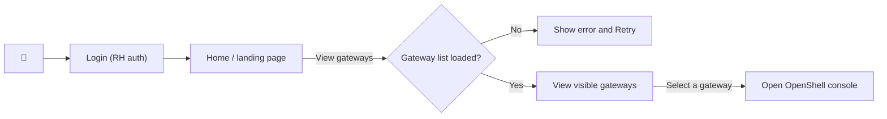

---

## Viewing gateways (admin list)

**user(s)**: Admin
**description**: User sees a list of all gateways.   

### questions
 - Do we need a filter to show only the user's gateways? 

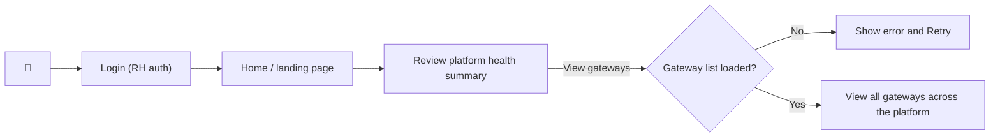

## Provisioning a personal gateway

**user(s)**: Individual - non-developer, Individual - developer
**description**: User creates a gateway for their own work and chooses the network visibility and cloud provider.

### questions
 - Should non-developers create their own gateways, or should someone provision gateways for them?
 - Do personal gateways need different defaults, quotas, or expiration rules?

### Page: Create gateway

| Field or control | Who sees it | Notes |
| --- | --- | --- |
| Gateway name | All users with create permission | Required and validated before submission |
| Intended use - personal or team | All users with create permission | Proposed; needed only if personal and team ownership become different product concepts |
| Network visibility - VPN or Public | All users with create permission | Required; unavailable choices explain why they can't be selected |
| Cloud provider - Amazon Web Services or IBM Cloud | All users with create permission | Required for managed placement; available providers depend on network visibility and placement availability |
| Local development - Use local-kind | Kind development users with no managed placement available | Replaces network and cloud-provider selection when the connected local-kind cluster is available |
| Placement availability | All users with create permission | Shows whether a matching cluster is available without exposing the selected cluster ID |
| Team owner | Team users | Proposed; current authorization is based on individual creator and gateway bindings |
| Initial team members | Team users | Proposed; group access and team membership are not yet defined |
| Validation and provisioning errors | All users with create permission | Keeps entered values and explains how to recover |
| Create gateway | All users with create permission | Submits the gateway name and placement intent |

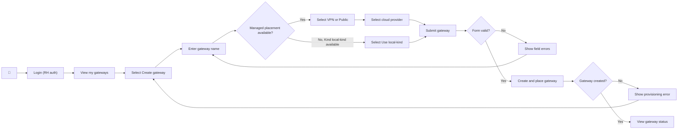

## Provisioning a team gateway

**user(s)**: Team - non-developer, Team - developer
**description**: User creates a gateway that will be shared by a team.

### questions
 - Who is allowed to create a gateway for a team?
 - Does the gateway belong to its creator or to the team?
 - Should the user add team members while provisioning the gateway or after it is ready?
 - This is a proposed team flow until team ownership and group access are defined.

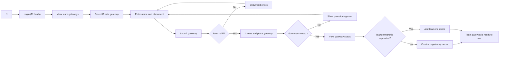

## Reviewing gateway status and details

**user(s)**: Individual - non-developer, Team - non-developer, Individual - developer, Team - developer
**description**: User reviews a gateway's status, placement, endpoint, creation date, and other operational details.

### questions
 - Which details are useful to non-developers?
 - How much troubleshooting information should gateway owners and viewers see?

### Page: Gateway details

| Area | Field or control | Who sees it | Notes |
| --- | --- | --- | --- |
| Header | Gateway name | All users with gateway access | Identifies the selected gateway |
| Header | Status | All users with gateway access | Shows current state and updates while the gateway is changing |
| Header | Gateway owner | Team users and Admin | Individual users may not need this unless the gateway is shared |
| Details tab | Created by | Team users and Admin | Gives shared-gateway and audit context |
| Header | Open gateway console | All users with gateway access | Available only when the gateway is ready and has a console URL |
| Header | Rename | Gateway owners | Part of the Actions menu |
| Header | Delete | Gateway owners and Admin | Requires confirmation and reflects the user's capability |
| Connection tab | Readiness guidance | All users with gateway access | Explains when connection actions aren't available yet |
| Connection tab | OpenShell CLI installation command | Developers | Includes the gateway-compatible CLI version |
| Connection tab | Gateway login command | Developers | Copyable `openshell gateway add` command built from authorized values |
| Connection tab | Provider setup command | Developers | Guides provider configuration without collecting cloud credentials in the browser |
| Connection tab | Sandbox creation command | Developers | Provides a working starting point for CPU, memory, provider, and agent settings |
| Service accounts tab | Name | Users with service-account capability | Identifies each automation identity |
| Service accounts tab | OpenShell role | Users with service-account capability | Shows user or admin access for the gateway |
| Service accounts tab | Status | Users with service-account capability | Shows provisioning, ready, revoked, or failed state |
| Service accounts tab | Expiration | Users with service-account capability | Makes upcoming credential replacement visible |
| Service accounts tab | Description, client ID, subject, and creation time | Users with service-account capability | Available in row details; never shows the client secret again |
| Service accounts tab | Create, view setup, revoke, and delete actions | Users with the matching capability | Uses server-provided capabilities instead of the user persona |
| Manage access tab | Access list (user name, user ID, role) | All users with gateway access | Lists who can access the gateway; read-only for viewers |
| Manage access tab | Find people... search and role filter | All users with gateway access | Filters the access list by name/user ID and by Owner/Admin/User |
| Manage access tab | Add users, inline role change, remove access | Gateway owners and admins | Manage who has access and at what role; only owners assign/remove owners, and the last owner is locked |
| Details tab | Active sandbox count | All users with gateway access | Shows current gateway use |
| Details tab | Cluster or placement | Developers and Admin | Useful for support and troubleshooting |
| Details tab | Endpoint | Developers and Admin | Raw value used by clients and support workflows |
| Details tab | Namespace and gateway release | Developers and Admin | Operational detail that most non-developers don't need |
| Details tab | Gateway ID | Developers and Admin | Useful when working with the API or support |
| Details tab | Creation date | All users with gateway access | Gives lifecycle context |
| Details tab | Failure reason and recovery guidance | Gateway owners and Admin | Shown when the gateway is degraded or failed |
| Details tab | Logs, events, traces, and runbook links | Admin initially; possibly gateway owners later | Proposed extension; depends on which diagnostics the platform can safely expose |

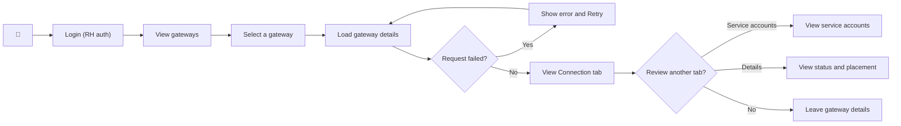

## Opening the OpenShell console

**user(s)**: Individual - non-developer, Team - non-developer, Individual - developer, Team - developer
**description**: User opens the OpenShell console for a gateway they can access and starts working with sandboxes.

### questions
 - Should the console open in the current tab or a new tab?
 - What guidance should appear when the gateway is not ready or the console URL is unavailable?

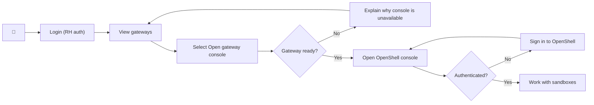

## Connecting to a gateway with the CLI

**user(s)**: Individual - developer, Team - developer
**description**: Developer installs the OpenShell CLI, adds the gateway, and signs in with their user identity.

### questions
 - Should the connection steps adapt to the developer's operating system and installed tools?
 - How should the user recover when authentication or gateway registration fails?

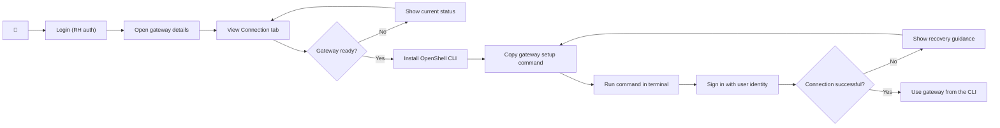

## Sharing a team gateway

**user(s)**: Team - non-developer, Team - developer
**description**: Gateway owner grants another user viewer or owner access to a shared gateway.

### decisions
 - Access is granted to **individual users** from the Keycloak realm directory. Identity-provider **group** access remains out of scope (see `platform/gateway-access-management.spec.md` Non-Goals).
 - **Gateway owners and gateway admins** can add, change, and remove access. Viewers see the list read-only.
 - Roles are **Owner**, **Admin**, and **User** (mapping to `gateway:owner`/`gateway:admin`/`gateway:viewer`), a hierarchy Owner > Admin > Viewer. Owners can delete the gateway and assign other owners; admins manage Admin/User only. A gateway always keeps at least one owner (the last owner cannot be removed or demoted). The creator is the first owner, marked for context.

### Page: Manage access

This is the **Manage access** tab on Gateway details (next to Connection). It is specified in `web-console/gateway-access-management.spec.md`; the API it consumes is in `platform/gateway-access-management.spec.md`.

| Field or control | Who sees it | Notes |
| --- | --- | --- |
| User name and user ID | Team users with gateway access | Shows each person's display name and username (the user ID column) |
| Find people... search | Team users with gateway access | Filters the access list by name or user ID |
| Role filter | Team users with gateway access | Filters the list to Admin or User |
| Role | Team users with gateway access | Shows Owner, Admin, or User; owners change any role, admins change Admin/User. The last owner's role is locked |
| Add users (directory picker) | Gateway owners and admins | Searches the Keycloak realm directory (including users who have never signed in) and opens a role modal |
| Remove access | Gateway owners and admins | Requires confirmation. Only owners remove owners; the last owner cannot be removed |
| Error and recovery guidance | Gateway owners and admins | Keeps the selected identity and role when a request fails |

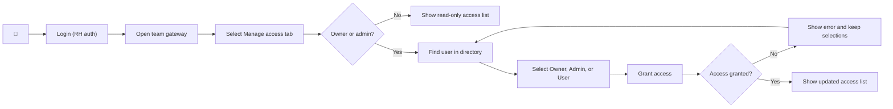

## Renaming a gateway

**user(s)**: Individual - non-developer, Team - non-developer, Individual - developer, Team - developer
**description**: Gateway owner changes the display name of a gateway without changing its endpoint or existing connections.

### questions
 - Should renaming a shared gateway notify other users?
 - Are there names or naming patterns that should be reserved?

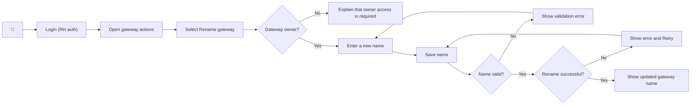

## Deleting an owned gateway

**user(s)**: Individual - non-developer, Team - non-developer, Individual - developer, Team - developer
**description**: Gateway owner deletes a gateway they no longer need after reviewing the impact and confirming the action.

### questions
 - Should a shared gateway require additional confirmation or approval before deletion?
 - Do we need a retention period or recovery option after deletion?

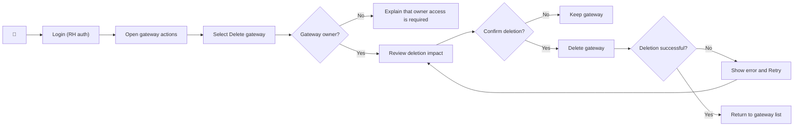

## Creating a service account for automation

**user(s)**: Individual - developer, Team - developer, other gateway owners or viewers with service-account capability
**description**: User with service-account capability creates a gateway-scoped service account and saves its one-time client credentials for a script or CI job.

### questions
 - Should individual and team automation use different naming or expiration defaults?
 - Where should we explain that the client secret cannot be viewed again?
 - Should users without a technical preference see this workflow, or should the product provide a guided version?

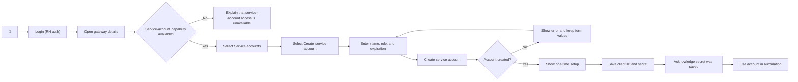

## Managing service account credentials

**user(s)**: Individual - developer, Team - developer, other gateway owners or viewers with service-account capability
**description**: User with service-account capability reviews, replaces, revokes, or deletes service accounts used by automation.

### questions
 - Who should receive a warning before a team service account expires?
 - Should replacement guide the user through updating the CI secret before revoking the old account?
 - Which service-account actions should be available to viewers versus owners?

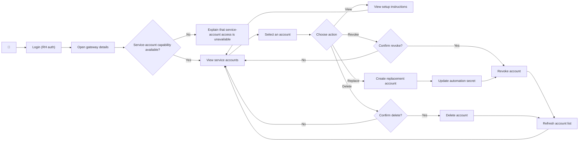

## Monitoring platform health

**user(s)**: Admin
**description**: Admin reviews gateway, sandbox, cluster, provisioning, and API reliability metrics to understand the health of the platform.

### questions
 - Which metrics should appear first when the platform has an active incident?
 - Do admins need saved dashboard layouts shared across the admin team?
 - What metrics need to be at a system wide level and what metrics are shown per hub cluster

### Page: Operational dashboard

| Area | Field or widget | Who sees it | Notes |
| --- | --- | --- | --- |
| Page header | Last refreshed | Admin | Shows the time of the last successful metrics refresh |
| Page header | Refresh | Admin | Reloads metrics without resetting the layout |
| Page header | Add widgets | Admin | Adds optional widgets to the current user's dashboard |
| Page header | Reset to default | Admin | Restores the standard dashboard layout |
| Platform adoption | Registered users | Admin | System-wide total with recent activity or trend when available |
| Platform adoption | Gateway count and status | Admin | System-wide healthy, provisioning, degraded, and failed counts |
| Platform adoption | Active sandboxes | Admin | System-wide current count with 24-hour and 7-day trends when available |
| Platform adoption | Gateway releases | Admin | System-wide gateway counts grouped by release |
| Hub cluster | CPU use | Admin | Current use, capacity, and 7-day trend for the selected hub cluster |
| Hub cluster | Memory use | Admin | Current use, capacity, and 7-day trend for the selected hub cluster |
| Hub cluster | Node status | Admin | Ready and not-ready nodes for the selected hub cluster |
| Hub cluster | Pod use and status | Admin | Used capacity plus running, pending, failed, succeeded, and unknown pods |
| Hub cluster | Gateway provisioning duration | Admin | Average, P50, and P95 provisioning time |
| Hub cluster | Gateway provisioning reliability | Admin | 24-hour success rate, success and failure counts, and hourly trend |
| Platform inventory | Managed cluster count | Admin | System-wide total and recently added clusters |
| Platform inventory | Cloud providers | Admin | System-wide managed cluster distribution by provider |
| Platform inventory | Regions | Admin | System-wide managed cluster distribution by region and provider |

### Page: Reliability dashboard

| Field or widget | Who sees it | Notes |
| --- | --- | --- |
| Last refreshed | Admin | Shows the time of the last successful metrics refresh |
| Refresh | Admin | Reloads reliability metrics |
| Request rate | Admin | Current API requests per second with a 24-hour trend |
| 5xx error rate | Admin | Current server-error percentage with a 24-hour trend |
| Median latency | Admin | Current median API latency with a 24-hour trend |
| Reliability summary | Admin | Shows request rate, error rate, latency, and meaningful trend direction in one place |
| Add widgets and reset layout | Admin | Supports the same personal dashboard layout behavior as the operational dashboard |

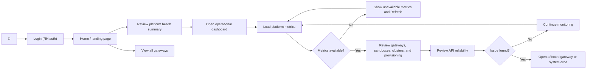

## Investigating a degraded or failed gateway

**user(s)**: Admin
**description**: Admin finds a degraded or failed gateway, reviews its status and placement, and gathers enough context to troubleshoot the problem.

### questions
 - Which logs, events, traces, or runbooks should be available from the gateway details page?
 - When should the admin contact the gateway owner instead of taking action directly?

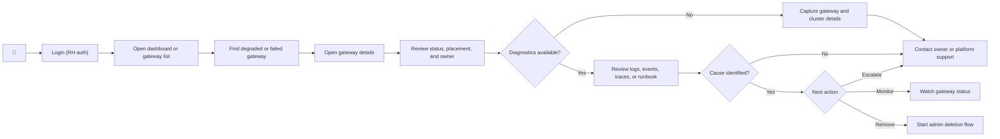

## Deleting any gateway

**user(s)**: Admin
**description**: Admin deletes an abandoned, unsafe, or unrecoverable gateway after confirming the gateway and its owner.

### questions
 - Should the owner receive a notification before or after an admin deletes their gateway?
 - Which reasons should require an audit note or support reference?

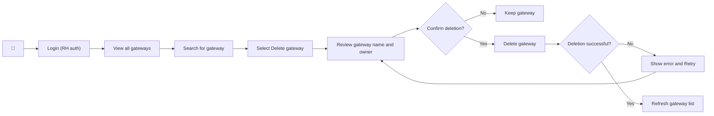
